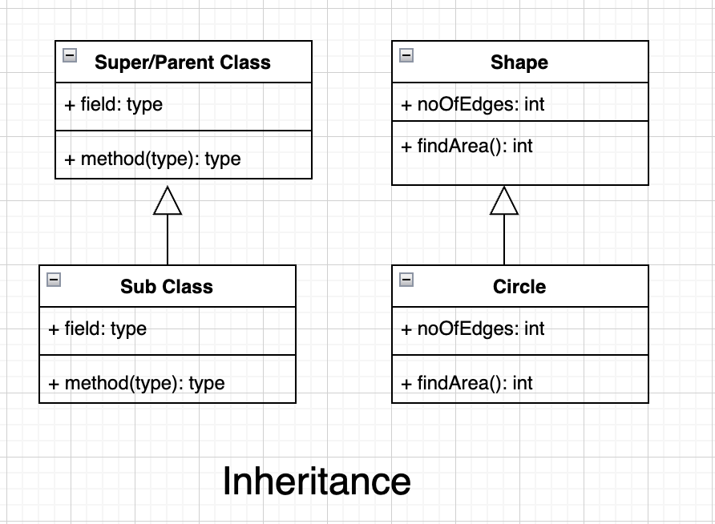
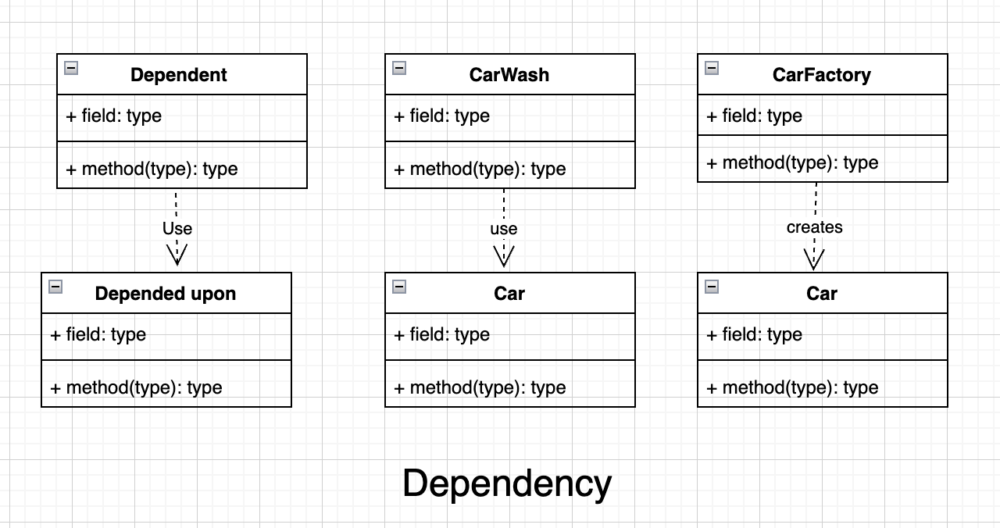

# Relationships in Object-Oriented Programming
To build a flexible and robust system, we need to understand the fundamental relationships between classes in object-oriented programming. 

Basically there are four types of relationships which are the building blocks of the class interactions from strongest to weak bonding, which are Composition, Aggregation, Association and Inheritance.

## Types of Relationships

1) Association (uses-a, has-a)
2) Aggregation (has-a)
3) Composition (has-a, part-of)
4) Inheritance (is-a)

----

### Association

Association is the most commonly used relationship between two independent classes. It will not indicate any ownership between the classes (whole class and the parts class). It is a general form of a relationship where one object uses or interacts with the other. A class only uses functionalities of another class but does not change its life cycle state. One object leverages the functionality or data of another object.

Association may be uni-directional or bidirectional and can exist in several forms, one to one, one to many, many to one and many to many.

The classic examples of association are Driver and Car, Person and Passport, Bank and Employee, Book and Library, Student and Teacher relationships respectively.

In UML, Association is represented by a solid line with an arrow indicates its one direction is unidirectional, two-way arrow or with no arrow indicates the bidirectional relationship.

#### UML Representation

----

### Aggregation

Aggregation is a special type of association in which one class, the whole class contains the collection of other classes, the parts; here, the lifecycle of the parts doesn’t depend on the whole, which means the parts class can sustain independently of the whole class.

Here the whole class is called aggregating or aggregate class and the parts class is called the aggregated class. Here the whole class contains the instance of the parts class as one of its member. Aggregation is a type of “has-a” relationship.

The classic examples of aggregation are Library and Books, Department and Employee relationships.

In UML, Aggregation is represented by a hollow diamond attached to the solid line with empty diamond is towards the whole (container/aggregated) class and the solid line connects to the parts (contained/aggregating) class at the other end.  It is a unidirectional association i.e. a one-way relationship.

#### UML Representation

----

### Composition

Composition is a special type of aggregation. It is a strong type of aggregation in which contained class objects’ lifecycle is strongly associated with the container class objects’  lifecycle. This means that the parts are created when the whole is created and destroyed when the whole is destroyed.

This kind of association can be said to be a “part-of” relationship and denote that contained class is object is strongly associated with the containing class, the whole. The parts cannot be without the whole. Here the entities are highly dependent on each other.  Composition is a type of “has-a” relationship.

The classic example of composition are House and Rooms, Book and Pages relationships.

In UML, a filled diamond is attached to an aggregating class (parts) to denote the composition relationship with an aggregated class (whole).

#### UML Representation

----

### Inheritance

This is also called Generalization. In object-oriented programming, inheritance allows to a new class (subclass) to inherit or re-use the properties and methods from an existing class (parent/super class) with a hierarchical relationship between classes. 

This type of relationship can be said to be "is-a" relationship. Inheritance is a parent-child relationship where we create a subclass by using an existing parent class and teh subclass then override or extend the inherited properties, but also it can have its own properties or methods. 

The classic example of Inheritance is Car and Sedan, Shape and Circle relationships.

In UML, A solid line with a hollow (unfilled) arrowhead (Arrow) is drawn from the subclass to the superclass.

#### UML Representation

----

### Dependency

Dependency is one of the weakest type of relationships between two classes. In object-oriented programming, dependency exists when one class "uses" another class in which changes to one class (independent) may affect the semantics of the other class (dependent).
This means there is no conceptual link between the two objects within the system domain. The two objects belong to different contexts or domains, but one uses the other to perform a task.

"Uses" relationship:
A dependency indicates that one class "uses" another. This usage can manifest in several ways:
* Method parameters: A method in one class accepts an object of another class as a parameter.
* Local variables: A method creates a local instance of another class.
* Method calls: A class directly calls methods of another class.

The classic example of dependency is The CarWash performs a service on a Car, making the CarWash class dependent on the Car class.
The Car object could initiate the request for a wash from a CarWash service, treating the CarWash as a temporary utility.

In UML, A dependency is depicted as a dashed line with an open arrow pointing from the client class (the one that depends) to the supplier class (the one being depended upon).
* The dashed line can be optionally labeled with a stereotype, such as «use», «call», «instantiate», or «parameter», to provide more specific information about the nature of the dependency.

#### UML Representation

----