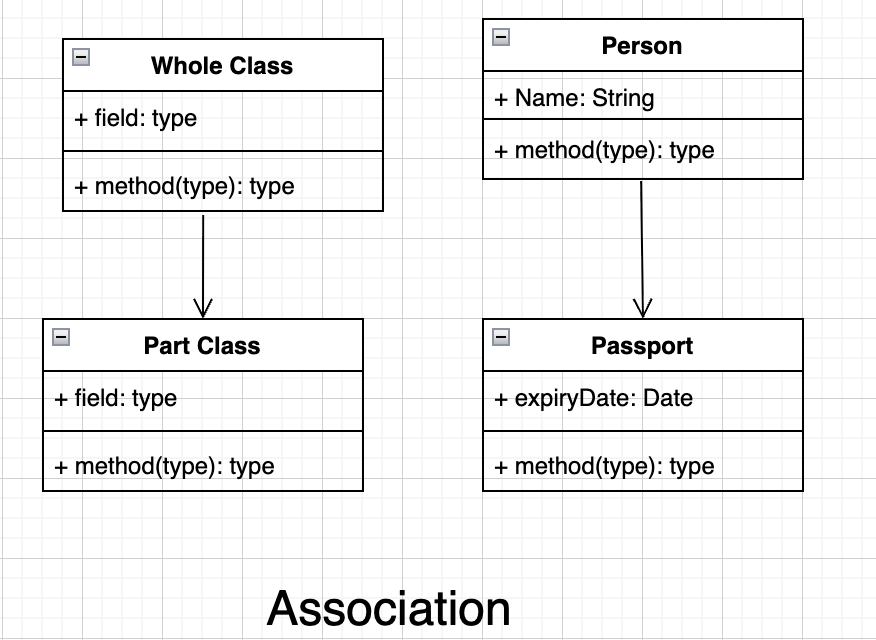
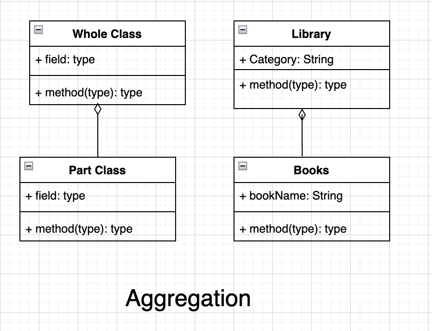
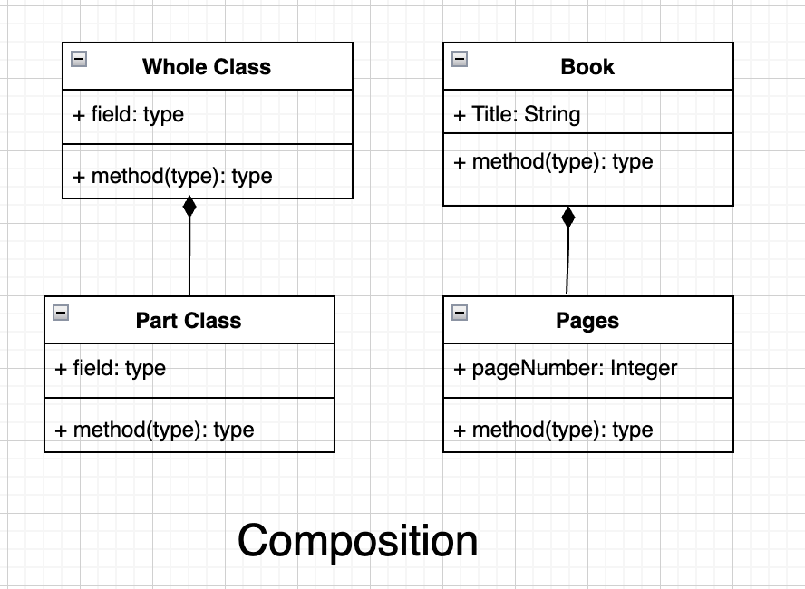

# Relationships in Object-Oriented Programming
To build a flexible and robust system, we need to understand the fundamental relationships between classes in object-oriented programming. 

Basically there are three types of relationships which are the building blocks of the class interactions from strongest to weak bonding, which are Composition, Aggregation and Association.

## Types of Relationships

1) Association (has-a)
2) Aggregation (has-a)
3) Composition (has-a)

----

### Association

Association is the most commonly used relation =ship between two independent classes. It will not indicate any ownership between the classes (whole class and the parts class). It is a general form of a relationship where one object uses or interacts with the other. A class only uses functionalities of another class but does not change its life cycle state.

Association may be uni-directional or bidirectional and can exist in several forms, one to one, one to many, many to one and many to many.

The classic examples of association are Person and Passport, Bank and Employee, Book and Library, Student and Teacher relationships respectively.

In UML, Association is represented by a solid line with an arrow indicates its one direction is unidirectional, two-way arrow or with no arrow indicates the bidirectional relationship.

#### UML Representation

----

### Aggregation

Aggregation is a special type of association in which one class, the whole class contains the collection of other classes, the parts; here, the lifecycle of the parts doesn’t depend on the whole, which means the parts class can sustain independently of the whole class.

Here the whole class is called aggregating or aggregate class and the parts class is called the aggregated class. Here the whole class contains the instance of the parts class as one of its member. Aggregation is a type of “has-a” relationship.

The classic examples of aggregation are Library and Books, Department and Employee relationships.

In UML, Aggregation is represented by a hollow diamond attached to the solid line with empty diamond is towards the whole (container/aggregated) class and the solid line connects to the parts (contained/aggregating) class at the other end.  It is a unidirectional association i.e. a one-way relationship.

#### UML Representation

----

### Composition

Composition is a special type of aggregation. It is a strong type of aggregation in which contained class objects’ lifecycle is strongly associated with the container class objects’  lifecycle. This means that the parts are created when the whole is created and destroyed when the whole is destroyed.

This kind of association can be said to be a “part-of” relationship and denote that contained class is object is strongly associated with the containing class, the whole. The parts cannot be without the whole. Here the entities are highly dependent on each other.  Composition is a type of “has-a” relationship.

The classic example of composition are House and Rooms, Book and Pages relationships.

In UML, a filled diamond is attached to an aggregating class (parts) to denote the composition relationship with an aggregated class (whole).

#### UML Representation

----
