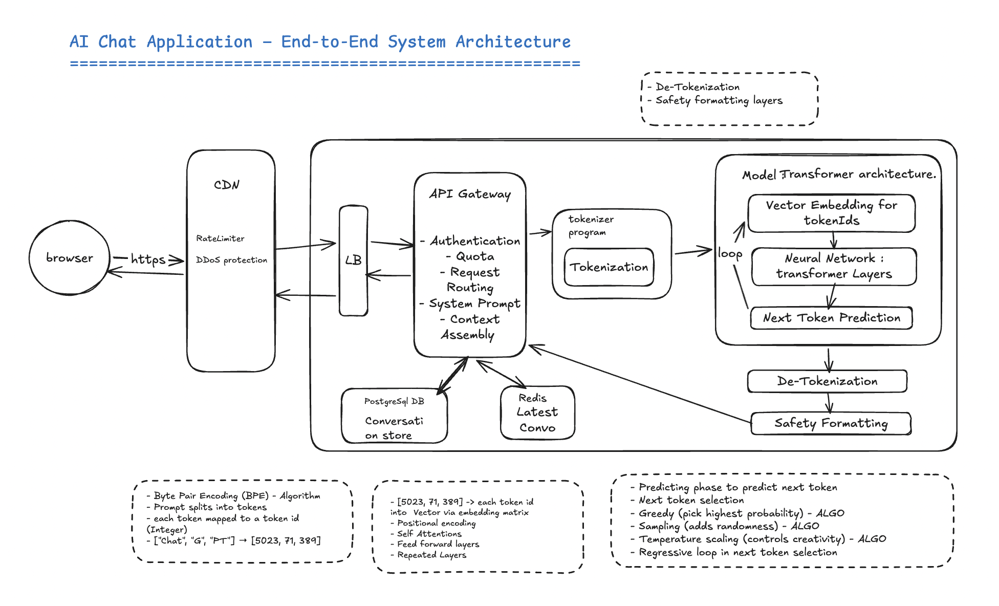

# AI Chat Application — End-to-End System Architecture

---

## Table of Contents

1. [Overview](#overview)
2. [Infrastructure & Network Layer](#section-1-infrastructure--network-layer)
3. [API Gateway Layer](#section-2-api-gateway-layer)
4. [Storage Layer](#section-3-storage-layer)
5. [Tokenizer Program](#section-4-tokenizer-program)
6. [Model — Transformer Architecture](#section-5-model--transformer-architecture)
7. [Post-Processing Layer](#section-6-post-processing-layer)
8. [Internal Model Algorithms](#section-7-internal-model-algorithms)
9. [Production Technology Stack](#section-8-recommended-production-technology-stack)

---

## Overview

This document provides a comprehensive technical reference for every component depicted in the AI Chat Application architecture diagram. Each component is described with its architectural role, recommended production-grade tools and technologies, real-time implementation scenarios, and the internal algorithmic mechanisms used by the language model.

The architecture follows the **LLM Inference Pipeline** pattern — the same structural pattern used by production AI chat systems including Claude, ChatGPT, and Google Gemini. A request originates in the browser, traverses a network and application layer that enforces security and assembles context, is processed by a transformer model on GPU hardware, and is returned to the client as a streamed response.

---

---

## Section 1: Infrastructure & Network Layer

The infrastructure and network layer forms the outermost boundary of the system, responsible for receiving client requests, enforcing traffic policies, and routing to backend services. These components operate at the network and transport layers and have no awareness of application-level semantics such as user identity or message content.

---

### 1.1 Content Delivery Network (CDN)

**Architectural Layer:** Network Edge — First point of contact for all incoming requests.

The CDN is the first component that receives an HTTPS request from the browser. It operates at a global network of edge nodes geographically distributed close to end users, serving three primary functions: TLS termination, DDoS mitigation, and IP-based rate limiting. The CDN has no knowledge of user identity or request content — it operates purely on network-level signals such as IP address, request volume, and geographic origin.

**Recommended Tools & Technologies:** Cloudflare, AWS CloudFront, Akamai, Fastly. TLS 1.3 termination is handled at this tier. DDoS mitigation is achieved via Anycast routing and traffic scrubbing centres.

**Real-Time Implementation Scenario:** Deploy Cloudflare in front of the origin API. Configure rate limiting rules at the edge — for example, a maximum of 1,000 requests per second per IP address. Enable TLS 1.3 termination at the edge node geographically closest to the end user, reducing round-trip latency. All traffic beyond the rate threshold is rejected with HTTP `429` before reaching any backend service.

**Real-World Context:** Anthropic, OpenAI, and Google Gemini all sit behind CDN layers that absorb DDoS traffic and terminate TLS at global edge nodes, ensuring the origin servers never handle raw internet traffic directly.

---

### 1.2 Load Balancer (LB)

**Architectural Layer:** Internal Network Layer — Traffic distribution across inference pods.

The load balancer receives decrypted traffic from the CDN edge and distributes it across a pool of available inference service pods. It operates at Layer 7 (application layer), enabling health-check-aware routing and connection draining during deployments. The load balancer has no awareness of user identity, conversation state, or request semantics.

**Recommended Tools & Technologies:** AWS Application Load Balancer (ALB), NGINX, HAProxy, Kubernetes Ingress with the NGINX controller. Layer 7 load balancing with active health check probes on each backend pod.

**Real-Time Implementation Scenario:** Configure an AWS ALB with a target group of N inference service pods. Set health check intervals at 10 seconds — any pod failing three consecutive checks is removed from rotation automatically. Use a least-connections algorithm so newly arriving long-running inference requests do not pile onto an already-busy pod. Enable connection draining to allow in-flight streaming responses to complete before a pod is deregistered.

**Real-World Context:** Kubernetes deployments at scale use the NGINX Ingress Controller with a Horizontal Pod Autoscaler. When GPU utilisation exceeds 80%, new pods are provisioned and automatically registered with the load balancer target group without manual intervention.

---

## Section 2: API Gateway Layer

The API Gateway is the first component within the backend that operates at the application layer. It is responsible for all business-logic concerns that must be resolved before a request can proceed to the inference pipeline. It is the only component with simultaneous access to user identity, conversation state, system configuration, and the incoming request payload — which is precisely why Context Assembly is performed here rather than in any earlier layer.

---

### 2.1 Authentication

**Architectural Layer:** API Gateway Sub-Component — Identity verification.

Authentication resolves the anonymous incoming HTTP request to a verified internal user identity. Every subsequent operation in the pipeline — quota enforcement, history retrieval, and context assembly — depends on the user ID established at this step.

**Recommended Tools & Technologies:** JWT (JSON Web Tokens) with RS256 signing, OAuth 2.0, API Key validation via hashed key lookup. Libraries: Spring Security, Auth0, AWS Cognito.

**Real-Time Implementation Scenario:** On each incoming request, extract the Bearer token from the `Authorization` header. Validate the JWT signature against the public key, verify the expiry claim, and resolve the user ID from the token payload. 

---

### 2.2 Quota Enforcement

**Architectural Layer:** API Gateway Sub-Component — Per-user usage control.

Quota enforcement ensures that no single user or API client can exhaust shared inference resources. It operates on the resolved user identity established during authentication and applies limits based on the user's subscription plan. Unlike the CDN's IP-based rate limiting, quota enforcement is user-aware and tracks consumption in both request count and token volume.

**Recommended Tools & Technologies:** Redis with sliding window counters, token bucket algorithm. AWS API Gateway usage plans. Spring Boot with the Bucket4j library for in-process rate limiting.

**Real-Time Implementation Scenario:** Implement a sliding window rate limiter in Redis. On each request, increment an atomic counter keyed by user ID with a TTL matching the rate window — for example, 60 seconds. If the counter exceeds the plan limit (e.g., 100,000 tokens per minute on a Pro plan), return HTTP `429` with a `Retry-After` header indicating the reset time. Token consumption is tracked separately for input tokens and output tokens, as both contribute to billing and resource consumption.

---

### 2.3 Request Routing

**Architectural Layer:** API Gateway Sub-Component — Model and version selection.

Request routing directs the validated request to the appropriate inference cluster based on the requested model identifier, the user's plan, and any active feature flags. It enables canary deployments, A/B testing of model versions, and gradual rollouts without system downtime.

**Recommended Tools & Technologies:** Spring Cloud Gateway, AWS API Gateway, Kong, NGINX with Lua routing rules. Feature flags via LaunchDarkly or Unleash.

**Real-Time Implementation Scenario:** Inspect the `model` field in the request body (e.g., `claude-sonnet-4-6` or `claude-opus-4-6`) and route to the corresponding inference cluster. Implement canary routing by directing a configurable percentage of traffic — for example, 5% — to a new model version while the remainder continues to the stable version. Use feature flags to enable experimental models for specific user segments without a full deployment.

---

### 2.4 System Prompt Management

**Architectural Layer:** API Gateway Sub-Component — Static instruction injection.

The system prompt is a hidden instruction set that is prepended to every request before tokenization. It defines the model's identity, safety boundaries, behavioural guidelines, available tools, and contextual information such as the current date.

**Recommended Tools & Technologies:** AWS Secrets Manager, HashiCorp Vault, or application configuration files loaded at startup. Cached in JVM heap memory as an immutable string. Versioned via Git and deployed through the standard CI/CD pipeline.

**Real-Time Implementation Scenario:** Load the system prompt at application startup from a secure configuration store. Store it as an immutable field in a Spring `@Configuration` bean so zero I/O is required per request. Version the system prompt in Git and deploy updates through the standard CI/CD pipeline — a new deployment is required to change the active system prompt in production, ensuring all changes go through code review and rollback is trivially achievable.

**Real-World Context:** The Claude.ai system prompt includes the current date, safety guidelines, personality instructions, and tool definitions. It is prepended to every request without database access, keeping the per-request latency contribution of this step at zero milliseconds.

---

### 2.5 Context Assembly

**Architectural Layer:** API Gateway Sub-Component — Full prompt construction prior to tokenization.

Context assembly is the process of constructing the complete input string that will be sent to the tokenizer. It combines the system prompt, the full conversation history for the current session, and the user's current message into a single ordered string, then appends an assistant turn start signal that instructs the model to begin generating from that point. This is the most critical orchestration step in the entire pipeline — the quality and completeness of the assembled context directly determines the quality of the model's response.

**Recommended Tools & Technologies:** Custom Spring `@Service` component. Conversation history retrieved from PostgreSQL via Spring Data JPA, with Redis as a look-aside cache using Spring Cache abstraction (`@Cacheable`). Spring AI's `ChatMemory` abstraction provides a production-ready implementation of this pattern.

**Real-Time Implementation Scenario:** On each request, retrieve the conversation history for the authenticated user from Redis (cache hit, ~1ms) or PostgreSQL (cache miss, ~50ms). Prepend the system prompt, append all prior conversation turns in role-tagged format, append the current user message, and append the assistant turn start signal. After the model responds, persist both the user message and the model reply to PostgreSQL and update the Redis cache entry for subsequent requests.

**Real-World Context:** Spring AI's `ChatMemory` abstraction implements this pattern out of the box. The `InMemoryChatMemory` and `CassandraChatMemory` implementations provide pluggable history backends, with the assembled context automatically passed to the `ChatClient` on each invocation.

---

## Section 3: Storage Layer

The storage layer provides durable and performant persistence for conversation history. It operates as a dual-tier architecture — a persistent relational database as the source of truth, and an in-memory cache for low-latency reads during context assembly. Neither tier alone is sufficient: the database alone is too slow for per-request reads at scale, and the cache alone cannot survive restarts or serve cross-device access.

---

### 3.1 PostgreSQL — Persistent Conversation Store

**Architectural Layer:** Storage Layer — Source of truth for all conversation history.

PostgreSQL is the authoritative store for every message exchanged in the system. It persists conversation data durably across server restarts, pod failures, and scaling events. It is the foundation for the conversation history sidebar in the UI, cross-device continuity, and account-level usage reporting.

**Recommended Tools & Technologies:** PostgreSQL 15+, AWS RDS for PostgreSQL, Amazon Aurora PostgreSQL. ORM: Spring Data JPA with Hibernate. Connection pooling: HikariCP (the default in Spring Boot).

**Real-Time Implementation Scenario:** Create a `messages` table with columns for message ID, conversation ID, user ID, role (`user`/`assistant`), content text, token count, and timestamp. Index on `(user_id, conversation_id, created_at)` for efficient history retrieval. Configure HikariCP with a pool size appropriate for expected concurrency. After every model response, persist both the user message and the assistant reply in a single transaction before returning the response to the client.

**Real-World Context:** Every message in Claude.ai, ChatGPT, and equivalent systems is persisted to a relational database. Cross-device continuity, the conversation history sidebar, and account-level usage reporting are all features that depend entirely on this durable persistence layer.

---

### 3.2 Redis — Conversation Cache

**Architectural Layer:** Storage Layer — High-speed cache for recent conversation turns.

Redis serves as the performance optimisation layer over PostgreSQL. Because context assembly reads the conversation history on every single request, querying PostgreSQL on every message would multiply database load linearly with the number of active conversations. Redis holds the most recent N turns of each active conversation in memory, serving the vast majority of context assembly reads in under one millisecond.

**Recommended Tools & Technologies:** Redis 7+, AWS ElastiCache for Redis, Redis Cloud. Spring Cache abstraction with `@Cacheable` and `@CachePut` annotations. Serialisation via Jackson JSON.

**Real-Time Implementation Scenario:** Cache the most recent N messages per conversation using a Redis List structure keyed by conversation ID. Set a TTL of 30 minutes on each key, refreshed on every access. On context assembly, attempt a Redis `GET` first. On cache miss, query PostgreSQL and warm the cache before returning. On every new message, use `@CachePut` to append the new turn without invalidating the entire cached entry. Always write to PostgreSQL first — Redis is never the primary record.

**Real-World Context:** Without a cache layer, a conversation with 50 prior turns requires a PostgreSQL query on every single message, multiplying database load linearly with conversation length across all concurrent users. Redis absorbs this read load, keeping database utilisation stable regardless of conversation depth.

---

## Section 4: Tokenizer Program

**Architectural Layer:** Inference Layer — Bidirectional text-to-integer converter, runs on CPU.

The tokenizer is a compiled C++ or Rust library that converts between human-readable text and the integer token ID sequences that the model operates on. It uses the Byte Pair Encoding (BPE) algorithm with a fixed vocabulary of approximately 100,000 subword entries. The tokenizer is bidirectional: on the request path it encodes text to token IDs, and on the response path it decodes token IDs back to text. It runs on CPU as part of the inference service runtime, not on the GPU, and is loaded once at service startup with zero I/O per request.

**Recommended Tools & Technologies:** Custom compiled tokenizer linked to the inference runtime. The `tiktoken` library (OpenAI, open source) is representative of this class. Hugging Face `tokenizers` library provides a Python-accessible equivalent. In Spring AI applications, tokenization is handled automatically by the `ChatClient` abstraction.

**Real-Time Implementation Scenario:** The assembled context string from the API gateway is passed to the BPE encoder, which produces an integer array (e.g., `[5023, 71, 389, ...]`). This array is the direct input to the GPU-resident model. On the response path, the integer array output by the model is passed to the BPE decoder, which reconstructs the plain text string. For streaming responses, decoding executes incrementally — each newly generated token ID is decoded and pushed to the Server-Sent Events stream immediately rather than buffering the full response.

**Real-World Context:** Streaming de-tokenization is the mechanism behind the word-by-word appearance of text in Claude.ai. Each token is decoded and pushed to the SSE stream as soon as it is generated by the GPU, creating the characteristic progressive rendering effect seen in all major LLM chat interfaces.

---

## Section 5: Model — Transformer Architecture

The transformer model is the core neural network that processes the tokenized input and generates output token IDs. It runs entirely on GPU hardware and operates through three sequential stages: vector embedding, repeated transformer layers, and next token prediction. The model has no persistent state between requests — all context must be supplied in the input on every invocation.

---

### 5.1 Vector Embedding

**Architectural Layer:** Model Internal — First layer of the transformer, runs on GPU VRAM.

Each integer token ID from the tokenizer is used as an index into the embedding weight matrix — a learned parameter matrix of shape `[vocabulary_size × embedding_dimension]` stored in GPU VRAM. The result is a dense floating-point vector (e.g., 4,096 floats for a mid-size model) encoding the semantic meaning of that token as learned during training. This lookup is a simple matrix index operation that executes in microseconds on GPU hardware.

**Real-Time Implementation Scenario:** For a 100,000-token vocabulary with a 4,096-dimensional embedding space, the embedding matrix occupies approximately 1.6 GB of GPU VRAM. Inference frameworks such as vLLM manage VRAM allocation to ensure the embedding matrix and all transformer layer weights fit within the available GPU memory, with tensor parallelism used to distribute the model across multiple GPUs when a single GPU's VRAM is insufficient.

---

### 5.2 Transformer Layers

**Architectural Layer:** Model Internal — Repeated N times (e.g., 32–96 layers depending on model size).

Each transformer layer applies three operations sequentially. Positional encoding injects token order information. Self-attention computes pairwise relationships between every token in the sequence. The feed-forward network transforms each token's representation independently. These three operations together constitute the fundamental building block of all modern large language models.

**Recommended Tools & Technologies:** CUDA kernels via PyTorch, FlashAttention for memory-efficient attention computation, tensor parallelism across multiple GPUs for large models. Inference frameworks: vLLM, NVIDIA Triton Inference Server, TensorRT-LLM.

**Real-Time Implementation Scenario:** A production inference deployment using vLLM runs continuous batching — multiple user requests are grouped into a single GPU forward pass, dramatically improving throughput without increasing per-user latency. The KV Cache stores the computed Key and Value matrices from prior autoregressive steps, eliminating redundant computation on the growing prefix sequence with each new token generated.

---

### 5.3 Next Token Prediction

**Architectural Layer:** Model Internal — Final output layer, produces a probability distribution over the vocabulary.

After the final transformer layer, a linear projection maps the output vector of the last token position to the full vocabulary size, producing raw logit scores for every possible next token. A softmax function normalises these logits into a probability distribution. A decoding algorithm then selects the next token ID from this distribution, appends it to the input sequence, and triggers the next iteration of the autoregressive loop.

**Real-Time Implementation Scenario:** For a 100,000-token vocabulary and a model generating 500 output tokens, the softmax computation executes 500 times sequentially — once per generated token. The selected token ID at each step is immediately de-tokenized and streamed to the client, so the user begins receiving output within milliseconds of the first token being generated rather than waiting for the full response.

---

## Section 6: Post-Processing Layer

The post-processing layer operates after the model completes token generation. It runs on CPU within the inference service and is entirely separate from the GPU-resident model. Its two responsibilities are converting model output back to human-readable text and applying safety and formatting transformations before the response reaches the client.

---

### 6.1 De-Tokenization

**Architectural Layer:** Post-Processing — Runs on CPU in the inference service, outside the model boundary.

The sequence of integer token IDs produced by the model's autoregressive generation loop is passed to the BPE decoder, which maps each ID back to its subword string and concatenates the result into a plain text response. For streaming responses, de-tokenization executes incrementally — each token ID is decoded immediately upon generation and pushed to the Server-Sent Events stream without buffering.

**Real-World Context:** De-tokenization is the step that makes streamed output possible. Were the system to buffer the complete token sequence before decoding, users would experience a long pause followed by the entire response appearing instantaneously — an inferior experience compared to the progressive word-by-word rendering that streaming de-tokenization enables.

---

### 6.2 Safety and Formatting Layer

**Architectural Layer:** Post-Processing — Content filtering and output formatting, outside the model boundary.

The de-tokenized text is passed through a content safety classifier that flags or filters outputs violating policy guidelines. A formatting pass then processes model-generated markdown syntax — headers, code blocks, bold text, and lists — into structured output appropriate for the client renderer. For API consumers, the raw markdown is preserved; for UI rendering, it may be pre-processed. The validated and formatted string is wrapped in the response JSON envelope and returned to the API gateway for transmission to the client.

---

## Section 7: Internal Model Algorithms

The following algorithms govern how the transformer model processes input and generates output tokens. Each algorithm represents a distinct mechanism with specific trade-offs between output quality, diversity, determinism, and computational cost. In production APIs, several of these parameters are exposed as configurable options.

---

### 7.1 Byte Pair Encoding (BPE)

**Category:** Tokenization Algorithm — Pre-processing and post-processing.

BPE constructs a vocabulary of subword units by iteratively merging the most frequent adjacent byte pairs in a training corpus until the vocabulary reaches a target size — typically 50,000 to 100,000 entries. At inference time, input text is split into the longest matching vocabulary entries, producing a compact integer sequence. Common words are represented as single tokens, while rare or compound words are decomposed into meaningful subword components, eliminating out-of-vocabulary failures entirely regardless of input language or domain.

**Real-World Impact:** BPE enables the model to handle any input text regardless of language or domain. A technical term like `photosynthesis` tokenises to `['photo', 'syn', 'thesis']` — three meaningful subwords that the model has encountered in training — allowing it to reason about the term even if the full word appeared rarely during pre-training.

---

### 7.2 Positional Encoding

**Category:** Transformer Layer Sub-Algorithm — Sequence order injection.

Positional encoding injects information about each token's position within the sequence into its embedding vector, compensating for the fact that self-attention is inherently position-agnostic. Modern large language models use Rotary Position Embedding (RoPE), which encodes position as a rotation applied to the Query and Key vectors in each attention head. RoPE encodes relative positions rather than absolute positions, which generalises more effectively to sequences longer than those encountered during training.

**Real-World Impact:** Without positional encoding, the model would treat `"dog bites man"` and `"man bites dog"` as identical sequences, since self-attention considers all token pairs simultaneously with no inherent notion of order. Positional encoding is the mechanism that allows the model to distinguish syntactic roles and directional relationships based on token position.

---

### 7.3 Self-Attention Mechanism

**Category:** Core Transformer Algorithm — Contextual relationship modelling.

Self-attention allows every token in the input sequence to attend to every other token simultaneously. Each token embedding is projected into three vectors — Query (Q), Key (K), and Value (V) — via learned weight matrices. Attention weights are computed as the softmax of the scaled dot product `QKᵀ / √d_k`, where `d_k` is the key dimension. The output for each token is the weighted sum of all Value vectors, where the weights reflect contextual relevance. Multi-head attention runs H independent attention computations in parallel and concatenates their outputs, allowing the model to attend to different types of relationships simultaneously.

**Real-World Impact:** Self-attention is the mechanism that enables the model to resolve pronouns, understand long-range syntactic dependencies, and maintain coherent reasoning across thousands of tokens. A pronoun at the end of a long paragraph can attend with full weight to its antecedent at the beginning, regardless of the distance between them in the sequence.

---

### 7.4 Feed-Forward Network (FFN)

**Category:** Transformer Layer Sub-Algorithm — Token-level representation transformation.

The feed-forward network applies two learned linear transformations with a non-linear activation function between them — `FFN(x) = W₂ · GELU(W₁ · x + b₁) + b₂` — independently to each token position. The intermediate dimension is typically four times the model's embedding dimension, creating a large parameter space. Unlike self-attention, the FFN has no cross-token interaction — it transforms each token's representation in isolation, and its weights are believed to store the factual knowledge learned during pre-training.

**Real-World Impact:** FFN layers account for approximately two-thirds of a transformer model's total parameter count. Research suggests that factual knowledge — knowing that Paris is the capital of France, for example — is stored primarily in the FFN weights, while self-attention handles relational reasoning between the tokens present in the current context.

---

### 7.5 Greedy Decoding

**Category:** Token Selection Algorithm — Deterministic maximum-probability selection.

Greedy decoding selects the token with the highest probability from the softmax output distribution at every generation step, without considering alternative choices. It is the simplest and fastest decoding strategy, requiring no additional hyperparameters. Because it always selects the single most probable next token, greedy decoding is fully deterministic — identical inputs always produce identical outputs. However, locally optimal token choices do not guarantee globally optimal sequences, which can lead to repetitive or suboptimal outputs in long-form generation.

**Real-World Impact:** Greedy decoding is appropriate for tasks requiring deterministic, reproducible outputs — code generation, structured data extraction, or classification.

---

### 7.6 Temperature Scaling

**Category:** Token Selection Algorithm — Probability distribution shaping.

Temperature scaling modifies the sharpness of the softmax probability distribution before token sampling by dividing raw logit scores by a temperature parameter T: `P_i = softmax(logits_i / T)`. A temperature of `1.0` leaves the distribution unchanged. Values below `1.0` sharpen the distribution, concentrating probability mass on higher-ranked tokens and producing more conservative, predictable outputs. Values above `1.0` flatten the distribution, increasing the probability of lower-ranked tokens and producing more diverse and creative outputs.

**Real-World Impact:** Temperature is the primary control for the creativity-coherence trade-off in language model outputs. A temperature of `0.2` is appropriate for factual question-answering or code generation where correctness is paramount. A temperature of `0.9` is appropriate for creative writing or brainstorming where diversity and novelty are valued over strict determinism.

---

### 7.7 Top-P Nucleus Sampling

**Category:** Token Selection Algorithm — Adaptive vocabulary truncation with stochastic selection.

Top-P sampling — also known as nucleus sampling — selects the smallest set of tokens whose cumulative probability mass exceeds a threshold P (e.g., `0.9`), discarding all tokens outside this nucleus. A token is then sampled randomly from the nucleus according to the renormalised probability distribution. Unlike top-K sampling, which truncates to a fixed number of candidates, top-P adapts dynamically: when the model is highly confident, the nucleus may contain only two or three tokens; when the model is uncertain, it may contain hundreds.

**Real-World Impact:** Top-P sampling is the most widely used production decoding strategy in large language models because it balances output quality with diversity more effectively than either greedy decoding or fixed top-K sampling.

---

### 7.8 Autoregressive Generation Loop

**Category:** Generation Strategy — Sequential token-by-token output production.

Autoregressive generation is the fundamental mechanism by which transformer models produce variable-length outputs. After the initial forward pass over the full input sequence, one token is selected via the active decoding algorithm and appended to the input sequence. The entire transformer forward pass then executes again on the extended sequence to produce the next token. This loop continues until an end-of-sequence token is generated or the maximum token limit is reached. The **KV Cache** optimisation stores the computed Key and Value matrices from previous steps, avoiding redundant computation on the growing prefix at each iteration.

**Real-World Impact:** The sequential nature of autoregressive generation is why inference latency scales with output length — generating 500 tokens requires 500 sequential forward passes. This constraint is the primary bottleneck in LLM inference throughput, and the primary motivation for optimisation techniques including speculative decoding, continuous batching, and KV cache management in production inference systems.

---

## Section 8: Recommended Production Technology Stack

The following table provides a consolidated reference mapping every architectural component to its recommended production technology and the corresponding Spring or Java equivalent, for teams building LLM-powered applications on the JVM.

| Component         | Recommended Technology                 | Spring / Java Equivalent                        |
|-------------------|----------------------------------------|-------------------------------------------------|
| CDN               | Cloudflare / AWS CloudFront            | External — no Spring equivalent                 |
| Load Balancer     | AWS ALB / NGINX / Kubernetes Ingress   | Spring Cloud Gateway (internal routing)         |
| API Gateway       | Spring Cloud Gateway + Spring Security | `@RestController` + `@Service` + filter chain   |
| Authentication    | JWT + Spring Security OAuth2           | `@PreAuthorize` + `JwtDecoder`                  |
| Rate Limiting     | Redis + Bucket4j                       | `@RateLimiter` (Spring AOP)                     |
| System Prompt     | AWS Secrets Manager / config file      | `@ConfigurationProperties` loaded at startup    |
| Context Assembly  | Spring AI `ChatMemory`                 | Custom `@Service` + `@Cacheable`                |
| PostgreSQL        | AWS RDS PostgreSQL + HikariCP          | Spring Data JPA + `@Repository`                 |
| Redis Cache       | AWS ElastiCache for Redis              | Spring Cache + `@Cacheable` / `@CachePut`       |
| Tokenizer         | BPE compiled Rust/C++ library          | Handled automatically by Spring AI `ChatClient` |
| Inference Service | vLLM / NVIDIA Triton Inference Server  | Spring AI `ChatClient` abstraction              |
| Model             | Claude via Anthropic API               | `spring-ai-anthropic-spring-boot-starter`       |
| Streaming         | Server-Sent Events (SSE)               | `SseEmitter` / `Flux<String>` (WebFlux)         |
| De-Tokenization   | BPE decode within inference runtime    | Handled internally by Spring AI                 |
| Safety Layer      | Anthropic Constitutional AI            | Handled server-side by Anthropic                |

---

*This document reflects the architecture as depicted in the AI Chat Application hand-drawn architecture diagram. All technology recommendations are based on production-proven tools. Implementation details may vary based on organisational constraints, cloud provider preferences, and scale requirements.*
