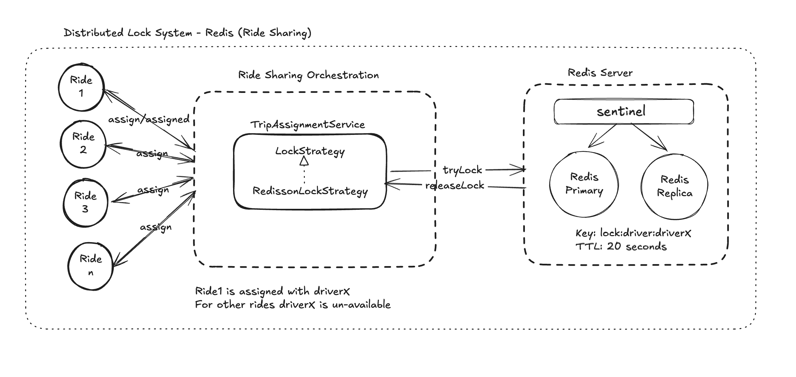

# Distributed Lock System — Redis (Ride Sharing)

**Version:** 1.0
**Scope:** Distributed locking mechanism preventing double driver assignment in a ride-sharing platform using Redis and Spring Boot

---

## Table of Contents

1. [Overview](#1-overview)
2. [The Problem — Race Condition in Driver Assignment](#2-the-problem--race-condition-in-driver-assignment)
3. [Why Distributed Locking Is Necessary](#3-why-distributed-locking-is-necessary)
4. [Architecture](#4-architecture)
5. [Design Patterns Applied](#5-design-patterns-applied)
6. [Component Design](#6-component-design)
7. [Redis Lock Internals](#7-redis-lock-internals)
8. [Redis Infrastructure — Sentinel Setup](#8-redis-infrastructure--sentinel-setup)
9. [Implementation Stack](#9-implementation-stack)
10. [Configuration](#10-configuration)
11. [Proof of Correctness — Redis MONITOR Output](#11-proof-of-correctness--redis-monitor-output)
12. [Trade-offs and Limitations](#12-trade-offs-and-limitations)
13. [Production Upgrade Path — Redlock](#13-production-upgrade-path--redlock)
14. [Industry Distributed Locking Systems](#14-industry-distributed-locking-systems)

---

## 1. Overview

In a ride-sharing platform, multiple matching service instances run simultaneously across a horizontally scaled fleet. When a rider requests a trip, the matching service identifies the nearest available driver and attempts to assign them. Without coordination between service instances, two riders can simultaneously receive the same driver assignment — a condition known as double assignment — which leaves one rider stranded and wastes the driver's time.

This document describes the distributed locking mechanism that prevents double assignment by ensuring that only one matching service instance can assign a specific driver at any given moment, regardless of how many instances are operating concurrently.

The implementation uses Redis as the shared lock store, Redisson as the Java client library that executes the lock acquisition atomically, and the Strategy design pattern to decouple the locking mechanism from the assignment business logic. The Facade design pattern ensures that the locking complexity remains completely invisible to callers of the trip assignment API.

---

## 2. The Problem — Race Condition in Driver Assignment

A race condition occurs when two or more processes read the same shared state, make a decision based on that state, and then write back — with neither process aware that the other performed the same read before either write completed.

In the ride-sharing context, the shared state is the driver's availability status. The sequence that produces the double assignment problem is as follows.

```
Instance 1:   READ driver_X status → available
Instance 2:   READ driver_X status → available
                                      ↑ gap between read and write
Instance 1:   WRITE driver_X → assigned to Rider A
Instance 2:   WRITE driver_X → assigned to Rider B

Final state:  driver_X assigned to Rider B (Rider A's assignment overwritten)
              Both Rider A and Rider B believe driver_X is coming 
              driver_X receives two trip requests 
```

The check-before-write approach — reading the status and only writing if available — does not solve this problem. Both instances can complete their read before either completes their write, meaning both see the driver as available and both proceed with the assignment. The gap between the read and the write is where the race condition lives, and closing that gap requires an atomic operation that combines the check and the write into a single indivisible step.

---

## 3. Why Distributed Locking Is Necessary

Java's built-in synchronisation mechanisms — the `synchronized` keyword and `ReentrantLock` — coordinate threads within a single JVM by using shared memory. When the application scales horizontally across multiple machines, each JVM has its own independent memory. A lock acquired in Instance 1's JVM is completely invisible to Instance 2's JVM, making single-process synchronisation ineffective across a distributed fleet.

A distributed lock solves this by moving the lock state into a shared external store — Redis — that all service instances can see and coordinate through simultaneously. The shared store must provide an atomic check-and-set operation that combines the existence check and the key creation into a single indivisible step, with no gap between them that another instance can exploit.

Redis provides this through its atomic Lua script execution model. The Redisson client library wraps this complexity behind a familiar Java `RLock` interface that behaves identically to `ReentrantLock` from the application code's perspective, while enforcing correct distributed semantics under the hood.

---

## 4. Architecture

The distributed locking system is organised into three tiers: the caller tier, the orchestration tier, and the Redis infrastructure tier.

```
Caller Tier:
   Ride 1, Ride 2, Ride 3 ... Ride N
   Multiple riders simultaneously
   requesting the same driver

Orchestration Tier:
   TripAssignmentService
   └── LockStrategy (interface)
          └── RedissonLockStrategy (implementation)

Redis Infrastructure Tier:
   Sentinel (monitoring process)
   Redis Primary (lock store)
   Redis Replica (standby)

   Key: lock:driver:driverX
   TTL: 20 seconds
```

---


Repository: https://github.com/nagachary/distributed-lock-app.git
---

The orchestration tier is entirely hidden from callers. Riders interact only with the trip assignment API. Whether the lock was acquired through Redis, a database, or Zookeeper is irrelevant to the caller — the Strategy pattern ensures this implementation detail never leaks through the interface boundary.

---

## 5. Design Patterns Applied

### Strategy Pattern

The Strategy pattern decouples the locking algorithm from the business logic that uses it. `TripAssignmentService` depends on the `LockStrategy` interface rather than on any concrete implementation. This means the locking mechanism can be replaced — from Redisson to Zookeeper, or from single-node Redis to Redlock — without modifying a single line of business logic.

```
LockStrategy (interface)
   acquireLock(resourceId, ownerId) → boolean
   releaseLock(resourceId, ownerId) → void

RedissonLockStrategy implements LockStrategy
   Uses Redisson RLock internally
   Executes atomic Lua script on Redis
   Manages TTL automatically via watchdog thread
```

In a production ride-sharing system, the Strategy pattern enables a `RedissonRedLockStrategy` to be introduced for high-stakes financial operations — such as payment processing — without any change to the services that use it. The new implementation is a single class addition.

### Facade Pattern

The `TripAssignmentController` acts as a Facade, exposing a simple HTTP endpoint to callers while hiding the internal complexity of lock acquisition, retry logic, and fallback behaviour. Callers submit a trip assignment request and receive a response indicating whether the driver was assigned or unavailable. The existence of Redis, Redisson, and the locking mechanism is completely invisible.

This reflects the fundamental principle that a well-designed system hides its correctness mechanisms from its callers. If a caller must know about the distributed lock to use the API correctly, the API is poorly designed.

---

## 6. Component Design

### LockStrategy Interface

The interface defines the contract that all locking implementations must fulfil. Two methods are required: acquiring the lock atomically and releasing it safely with owner verification.

```java
public interface LockStrategy {
    boolean acquireLock(String resourceId, String ownerId);
    void releaseLock(String resourceId, String ownerId);
}
```

The `resourceId` parameter identifies what is being locked — in the ride-sharing context this is the driver identifier. The `ownerId` parameter identifies who is acquiring the lock — the trip identifier — ensuring that only the instance that acquired the lock can release it.

### RedissonLockStrategy

The concrete implementation of `LockStrategy` using Redisson. The lock key is constructed from the resource identifier using the namespaced format `lock:driver:{resourceId}`, making all driver locks identifiable and distinguishable from other lock categories in Redis.

The `tryLock` call is configured with a wait time of zero — meaning the instance does not wait if the lock is already held — and a lease time driven by the externally configured TTL value. This configuration reflects the ride-sharing requirement that a failed lock acquisition must immediately trigger fallback to the next available driver rather than blocking the request thread.

The `isHeldByCurrentThread()` check before `unlock()` ensures owner-only release. If a lock has already expired and been acquired by another instance, the releasing instance will find that it no longer owns the lock and will skip the release, preventing it from disrupting another instance's critical section.

### TripAssignmentService

The service contains the complete assignment business logic. It acquires the lock, performs the assignment within the protected section, and releases the lock in a `finally` block that executes regardless of whether the assignment succeeded or threw an exception. The `finally` block placement guarantees that the lock is never held permanently due to an unexpected error.

```
1. Acquire lock on driver
2. If not acquired → return false (try next driver)
3. If acquired → perform assignment (try block)
4. Always release lock (finally block)
```

### TripAssignmentController

The REST controller receives trip assignment requests, generates a server-side trip identifier using UUID, delegates to `TripAssignmentService`, and returns a structured response containing the assignment status, trip identifier, driver identifier, rider identifier, and a descriptive message. The controller contains no business logic and no awareness of the locking mechanism — it is a pure Facade.

### AssignmentStatus Enum

A type-safe enumeration with two values — `ASSIGNED` and `UNAVAILABLE` — replaces plain string status values. The enum prevents typos at compile time, enables IDE autocomplete, and makes the response self-documenting.

---

## 7. Redis Lock Internals

When `lock.tryLock()` is called on a Redisson `RLock`, Redisson does not issue a simple `SET NX` command. It executes a Lua script atomically on Redis. Lua scripts in Redis are executed as a single atomic unit — no other command can execute between any two statements in the script, eliminating the gap that a two-step check-and-set approach would introduce.

The Lua script checks whether the lock key exists. If it does not exist, the script creates a Redis Hash entry recording the owner's thread and process identity, sets the TTL, and returns nil to indicate success. If the key already exists and is owned by a different thread, the script returns the remaining TTL to indicate failure.

```
Redis MONITOR output during test:

EVAL lua_script lock:driver:driverX 20000 thread:87
→ exists lock:driver:driverX → 0 (does not exist)
→ hincrby lock:driver:driverX thread:87 1
→ pexpire lock:driver:driverX 20000
→ nil returned (success)

EVAL lua_script lock:driver:driverX 20000 thread:86
→ exists lock:driver:driverX → 1 (exists)
→ hexists lock:driver:driverX thread:86 → 0 (not owner)
→ pttl lock:driver:driverX returned (failure)
```

The use of a Redis Hash rather than a simple String value allows Redisson to store the owner's identity alongside the lock count, enabling reentrant locking — the same thread can acquire the same lock multiple times without deadlocking itself.

On release, Redisson executes a second Lua script that decrements the lock count, and only deletes the key when the count reaches zero. It then publishes a notification to a Redis pub/sub channel so that any waiting subscribers — other instances with wait time greater than zero — can be notified immediately rather than polling.

---

## 8. Redis Infrastructure — Sentinel Setup

### Redis Primary and Replica

Redis Primary is the active node that processes all write operations. The lock acquisition and release Lua scripts execute against the Primary. Redis Replica receives an asynchronous stream of the Primary's write-ahead log and maintains a near-current copy of the data. The Replica serves as a standby that can be promoted to Primary if the Primary fails.

### Sentinel — The Monitoring Process

Redis Sentinel is a separate process — not a data node — that runs alongside the Redis nodes. It is responsible for three functions: monitoring the health of the Primary and Replica nodes through periodic PING commands, coordinating with other Sentinel instances through a voting mechanism to agree on whether the Primary is genuinely down, and orchestrating automatic failover by promoting the Replica to Primary and notifying all connected clients of the new Primary address.

Sentinel itself requires a quorum of three instances to prevent false failover decisions caused by network partitions. A single Sentinel instance could mistakenly declare the Primary down if only its own network connectivity is impaired. Three Sentinels vote — and a majority of two out of three is required before any failover action is taken.

The application connects to the Sentinel cluster rather than directly to the Redis Primary. When Sentinel completes a failover and promotes a new Primary, it notifies all connected clients through a Redis pub/sub channel. Redisson subscribes to this channel and automatically reconnects to the new Primary address without any application restart or manual intervention.

```
Application → connects to → Sentinel Cluster
Sentinel Cluster → monitors → Redis Primary and Replica
Sentinel Cluster → notifies → Application on Primary change
Application → reconnects → New Primary automatically
```

---

## 9. Implementation Stack

```
Framework:        Spring Boot 3.2.x
Language:         Java 21
Lock Client:      Redisson 3.27.0 (redisson-spring-boot-starter)
Redis:            Redis 7.2 (Docker for local development)
Tracing:          Micrometer with OpenTelemetry bridge
Health Check:     Spring Boot Actuator
Build Tool:       Maven with mvnw wrapper
```

### Key Dependencies

| Dependency                          | Purpose                 |
|-------------------------------------|-------------------------|
| spring-boot-starter-web             | REST API layer          |
| spring-boot-starter-data-redis      | Redis connectivity      |
| redisson-spring-boot-starter 3.27.0 | Distributed lock client |
| spring-boot-starter-actuator        | Health check endpoints  |
| micrometer-tracing-bridge-otel      | Distributed tracing     |

---

## 10. Configuration

All configuration values are externalised to `application.properties` following the Twelve-Factor App methodology, ensuring no values are hardcoded in the application source code. The configuration covers four concern areas: application identity and server port, Redis connection details including host, port, and timeout, distributed lock behaviour including the TTL duration, and observability settings including logging pattern with trace ID propagation, Micrometer sampling probability, and Actuator health endpoint exposure.

### TTL Design Rationale

The lock TTL is set to 20 seconds — 15 seconds for the driver acceptance window and 5 seconds of safety buffer. If the matching service instance crashes after acquiring the lock but before releasing it, Redis automatically expires the key after 20 seconds. The platform detects the expiry, queries the database to determine whether the assignment was written before the crash, and either confirms the assignment or reroutes the rider to the next available driver.

The TTL is externalised to `application.properties` rather than hardcoded, enabling the operations team to adjust the dispatch window without a code change or redeployment.

---

## 11. Proof of Correctness — Redis MONITOR Output

The following Redis MONITOR output was captured during the concurrent test execution, with two threads simultaneously attempting to acquire the lock on `driverX`.

```
# Thread 87 acquires the lock
EVAL lua_acquire_script lock:driver:driverX 20000 thread:87
→ exists lock:driver:driverX → 0
→ hincrby lock:driver:driverX thread:87 1
→ pexpire lock:driver:driverX 20000
→ nil (success — lock acquired)

# Thread 86 attempts and fails (271 microseconds later)
EVAL lua_acquire_script lock:driver:driverX 20000 thread:86
→ exists lock:driver:driverX → 1
→ hexists lock:driver:driverX thread:86 → 0
→ pttl lock:driver:driverX (failure — lock held by thread:87)

# Thread 87 verifies ownership before release
HEXISTS lock:driver:driverX thread:87 → 1 (owner confirmed)

# Thread 87 releases the lock
EVAL lua_release_script lock:driver:driverX thread:87
→ hexists lock:driver:driverX thread:87 → 1
→ hincrby lock:driver:driverX thread:87 -1 (count = 0)
→ del lock:driver:driverX (key deleted)
→ PUBLISH redisson_lock_channel 0 (notify waiters)
```

The output confirms three correctness guarantees. The lock acquisition is atomic — no other command executed between the existence check and the key creation. The lock is owner-exclusive — Thread 86 could not acquire a lock held by Thread 87. The lock release is safe — the key was deleted only after owner verification, and all waiting threads were notified through the pub/sub channel.

---

## 12. Trade-offs and Limitations

**Single Node Vulnerability**
The current implementation uses a single Redis Primary node. If the Primary fails after a lock is acquired but before the lock is replicated to the Replica, the newly promoted Replica will not be aware of the lock. Another instance can acquire the same lock on the new Primary, producing a brief window of double assignment. This risk is mitigated by the TTL — the lock will expire on the old Primary within 20 seconds regardless — but the window exists.

**Network Partitions**
If the connection between the matching service and Redis is temporarily interrupted after a lock is acquired, the matching service cannot release the lock explicitly. The TTL will eventually expire the key, but during the partition window the driver is effectively unavailable to other instances.

**Clock Drift**
The TTL-based expiry depends on Redis's server-side clock. The Redisson watchdog thread renews the TTL every 10 seconds while the lock is held, which mitigates the risk of expiry during normal operation. However, significant clock drift between nodes in a Redlock setup could affect validity time calculations.

**Wait Time of Zero**
The lock is configured with a wait time of zero, meaning failed acquisition immediately returns false and the caller must try the next available driver. This is correct for the ride-sharing use case where blocking a request thread for several seconds would produce an unacceptably slow user experience. In a different domain — such as document editing where a brief wait is acceptable — a non-zero wait time might be appropriate.

---

## 13. Production Upgrade Path — Redlock

For production deployments where driver assignment correctness must be guaranteed even during Redis Primary failure, the Redlock algorithm provides a stronger guarantee by acquiring the lock on a majority of five independent Redis nodes simultaneously.

The Strategy pattern makes this upgrade a single class addition. A `RedissonRedLockStrategy` implementation of the `LockStrategy` interface replaces `RedissonLockStrategy` with no changes to `TripAssignmentService` or any other component. With Redlock, one node failing does not affect lock correctness because the lock is held on the remaining majority. No Sentinel is required for Redlock nodes because there is no replication relationship between them — each node is completely independent, and the majority quorum itself handles node failures.

---

## 14. Industry Distributed Locking Systems

The following systems provide distributed locking capabilities and are used in production environments across the industry today. Each addresses the same fundamental problem — coordinating exclusive access to a shared resource across multiple processes — but differs in consistency guarantees, operational complexity, and the use cases they are optimised for.

**Redis with Redisson**
The approach used in this implementation. Atomic lock acquisition via Lua script, TTL-based automatic expiry, and owner-only release via watchdog thread. Best suited for high-throughput systems such as ride-sharing, gaming, and real-time matching where sub-millisecond lock acquisition is critical. Used in production by Uber, Twitter, and Instagram.

**Apache Zookeeper**
A distributed coordination service that implements locking through ephemeral znodes — temporary nodes that disappear automatically when the client session expires or the process crashes. Zookeeper is a CP system that guarantees strong consistency and is widely used for leader election and distributed consensus. It is operationally more complex than Redis, requiring a quorum ensemble of three or five nodes. Used historically by Apache Kafka for broker coordination and by Hadoop for cluster management.

**etcd**
A strongly consistent distributed key-value store that implements locking through lease-based mechanisms. etcd uses the Raft consensus algorithm, which guarantees that all nodes agree on the current state before any write is acknowledged. It is the backing store for Kubernetes cluster state and is the natural locking choice for cloud-native applications operating within the Kubernetes ecosystem.

**Apache Curator**
A high-level Java client library for Zookeeper that provides recipes for distributed locking, leader election, and distributed queues. It sits above Zookeeper in the same relationship that Redisson sits above Redis — abstracting the low-level protocol details behind a clean Java API. Used extensively in the Hadoop and HBase ecosystems.

**PostgreSQL — SELECT FOR UPDATE**
Row-level pessimistic locking available natively in PostgreSQL. A transaction that issues `SELECT FOR UPDATE` holds an exclusive lock on the selected rows until the transaction commits or rolls back. No additional infrastructure is required — the lock mechanism is built into the database. Best suited for financial transactions and inventory management where the data being locked already resides in PostgreSQL. Used in production by payment processing systems and e-commerce platforms.

**MySQL — GET_LOCK()**
Named advisory locks available as a built-in MySQL function. A named lock is acquired by calling `GET_LOCK('lock_name', timeout)` and released by calling `RELEASE_LOCK('lock_name')`. Advisory locks are session-scoped — they are automatically released when the database connection closes, providing a safety mechanism equivalent to Redis TTL expiry. Best suited for applications already operating on MySQL where introducing additional infrastructure is undesirable.

**AWS DynamoDB — Conditional Writes**
DynamoDB's conditional expression `attribute_not_exists(lockKey)` provides an atomic check-and-write operation that succeeds only if the specified attribute does not exist. Combined with DynamoDB's TTL feature for automatic lock expiry, this approach requires no additional infrastructure for AWS-native applications. Used in production by serverless architectures operating entirely within the AWS ecosystem.

**Google Cloud Spanner**
A globally distributed relational database with true serialisable isolation — the strongest consistency guarantee available in a distributed system. Spanner's distributed transactions can span multiple rows, tables, and geographic regions, making it appropriate for global financial systems where a lock must be enforced across data centres simultaneously. Operationally the most expensive option but provides correctness guarantees that no other system can match at global scale.

**Hazelcast**
An in-memory data grid for Java applications that provides distributed locking through its `ILock` interface. Hazelcast embeds directly into the application JVM rather than running as an external process, which simplifies deployment at the cost of coupling the locking mechanism to the application's memory space. Used in enterprise Java applications where a standalone Redis deployment is not desirable and the application fleet is relatively small.

**Summary Comparison**

| System                       | Consistency     | Speed           | Complexity | Best For               |
|------------------------------|-----------------|-----------------|------------|------------------------|
| Redis + Redisson             | Strong normally | Sub-ms          | Low        | High throughput        |
| Redis Redlock                | Strong          | Sub-ms          | Medium     | Financial critical     |
| Zookeeper                    | Always strong   | Milliseconds    | High       | Leader election        |
| etcd                         | Always strong   | Milliseconds    | Medium     | Kubernetes native      |
| PostgreSQL SELECT FOR UPDATE | Always strong   | Milliseconds    | Low        | Financial transactions |
| MySQL GET_LOCK               | Strong          | Milliseconds    | Low        | Existing MySQL apps    |
| DynamoDB Conditional         | Strong          | Single-digit ms | Low        | AWS serverless         |
| Google Spanner               | Strongest       | Tens of ms      | High       | Global finance         |
| Hazelcast                    | Strong          | Sub-ms          | Medium     | Enterprise Java        |

