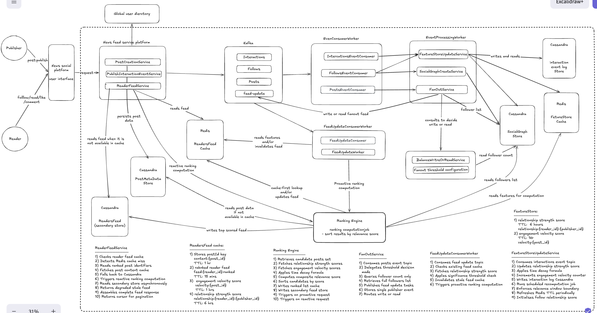

# Distributed News Feed System — System Design

**Scope:** Distributed personalised news feed platform serving one billion users across a globally distributed social media application

---

## Table of Contents

1. [Executive Summary](#1-executive-summary)
2. [System Context](#2-system-context)
3. [Functional Requirements](#3-functional-requirements)
4. [Non-Functional Requirements](#4-non-functional-requirements)
5. [Architecture Overview](#5-architecture-overview)
6. [Component Design and Technology Selection](#6-component-design-and-technology-selection)
7. [Data Models](#7-data-models)
8. [Service Actions, Background Jobs, TTL Expiry and Cache Refresh](#8-service-actions-background-jobs-ttl-expiry-and-cache-refresh)
9. [Latency and Throughput Analysis](#9-latency-and-throughput-analysis)
10. [Spring Boot Implementation Stack](#10-spring-boot-implementation-stack)
11. [Error Scenarios and Failure Handling](#11-error-scenarios-and-failure-handling)
12. [Back-of-Envelope Calculations](#12-back-of-envelope-calculations)
13. [Acknowledged Omissions](#13-acknowledged-omissions)
14. [Trade-offs and Limitations](#14-trade-offs-and-limitations)

---

## 1. Executive Summary

The Distributed News Feed System is a continuously operating, event-driven platform that assembles and delivers a personalised, ranked stream of content to one billion registered users on a global social platform. When a user opens the application, the system must retrieve a ranked list of the most relevant recent posts from the accounts they follow and return it within one hundred milliseconds — a latency target that governs every storage, caching, and processing decision in the architecture.

The system is architecturally distinct from a notification system in one defining way: it does not merely deliver events — it ranks them. Every feed response is a personalised, scored, and sorted selection from a much larger candidate set, determined by a ranking engine that evaluates relationship strength, content engagement velocity, recency, and historical behavioural signals for the specific reader at the specific moment of the request.

The design prioritises read performance above all other concerns, because feed latency is the most directly user-visible quality characteristic of a social platform. Every architectural decision — the pre-ranked feed cache, the hybrid fan-out model, the feature store, and the dual-write pattern — exists in service of ensuring that the overwhelming majority of feed requests are served from pre-computed, in-memory data within a single-digit millisecond retrieval window.

---

## 2. System Context

The news feed system serves a social platform where two categories of actor interact through content. Publishers create posts — articles, images, videos, and status updates — that are distributed to their followers' feeds. Readers open the application and consume a personalised timeline assembled from the recent posts of the accounts they follow. The same user may act as both publisher and reader at different moments within the same session.

The system is not a journalism or content management platform. It has no involvement in editorial decisions, content scheduling, or subscription management. Its responsibility begins when a publisher submits a post and ends when a ranked feed response reaches a reader's device. Content creation, moderation, and monetisation are outside its scope.

The platform is comparable in nature and scale to LinkedIn or Instagram, where user activity is continuous across all time zones, posting frequency varies from a few times per week for casual users to hundreds of times per day for high-engagement accounts, and the follower distribution follows a pronounced power law — the vast majority of users have small follower counts while a small number of celebrity accounts have hundreds of millions of followers. This distribution is the root cause of the fan-out problem that the hybrid model is designed to solve.

---

## 3. Functional Requirements

**Personalised Feed Assembly.** The system must assemble a ranked, personalised feed for each reader on every request, drawing from the recent posts of the accounts they follow. The feed must reflect the reader's individual interaction history and the current engagement patterns of candidate content, not merely the chronological order of publication.

**Hybrid Fan-out Model.** When a publisher creates a post, the system must propagate it to the feeds of their followers through a strategy determined by the publisher's follower count. Publishers below a dynamically configurable threshold receive write-time fan-out — their followers' feed caches are updated proactively. Publishers above the threshold receive read-time fan-out — a single event record is stored and follower feeds incorporate the post at read time. The threshold must be adjustable in real time without a deployment.

**Feature Store Maintenance.** The system must maintain relationship strength scores between every active reader-publisher pair, derived from historical interaction frequency and weighted by recency through a time-decay formula. It must additionally maintain engagement velocity scores for every recently published post, reflecting the rate of interaction accumulation since publication. Both feature categories must be available to the ranking engine within single-digit millisecond latency on every computation request.

**Ranking and Scoring.** The system must score every candidate post in a reader's feed using a composite formula incorporating relationship strength, engagement velocity, content recency, and content type preference. Candidates must be sorted by composite score and the highest-scoring results returned as the feed response. The ranking computation must complete within the overall feed retrieval latency budget.

**Infinite Scroll Pagination.** The system must support arbitrarily deep feed queries through cursor-based pagination, where the cursor encodes the absolute position of the last retrieved post rather than a relative page number. This ensures that new posts arriving at the top of the feed during a reader's scrolling session do not shift the positions of posts the reader has already seen, maintaining a stable and coherent reading experience.

**Secondary Store for Degraded Response.** The system must maintain a durable, persistent record of the most recently computed ranked feed for each reader in a Cassandra secondary store. When the primary Redis feed cache is unavailable or has expired without a proactive refresh, the system must serve this secondary record as a degraded response while triggering a background ranking computation to restore the primary cache.

---

## 4. Non-Functional Requirements

**Latency.** Feed requests must complete within one hundred milliseconds end-to-end. Under warm cache conditions — which represent the overwhelming majority of requests — server-side processing must complete within eight to fifteen milliseconds. Under cold cache conditions, a degraded response from the secondary store must be returned within twenty milliseconds while the background ranking computation repopulates the primary cache.

**Throughput.** The system must sustain sixty thousand feed requests per second at peak load and absorb viral event bursts reaching six hundred thousand events per second at the fan-out and feature update layers without degrading feed retrieval latency for unaffected readers.

**Availability.** The feed retrieval path must remain available during infrastructure failures. Cache misses fall back to the secondary store. Feature store unavailability falls back to default scoring weights. The system accepts reduced feed personalisation quality during partial infrastructure degradation rather than returning errors.

**Consistency.** The system operates on an eventual consistency model for feed content. A reader may see a feed that is fifteen minutes old if no significant new content has triggered a proactive cache refresh during that window. This eventual consistency is an explicit and accepted trade-off in exchange for the read performance delivered by the pre-computed cache model.

**Scalability.** All stateless components — the PostCreationService, FanOutService, FeedUpdateWorker, and Ranking Engine — must scale horizontally by adding instances behind a load balancer without coordination overhead. The stateful Redis and Cassandra clusters must scale through node addition within their respective distributed architectures.

---



---

## 5. Architecture Overview

The architecture is organised around five guiding principles that collectively ensure the system meets its latency, throughput, and personalisation requirements simultaneously.

The first principle is pre-computation over on-demand calculation. The ranking computation — the most expensive operation in the feed assembly pipeline — is executed proactively when new content arrives and reactively when a cache miss is detected, ensuring that the reader almost always receives a pre-computed result rather than waiting for computation to complete in the critical path.

The second principle is event-driven decoupling. Every state change in the system — post creation, user interaction, follow relationship establishment — is expressed as a Kafka event that downstream consumers process independently. No service calls another service synchronously for operations that can be expressed as events, eliminating tight coupling and enabling each processing pipeline to scale and fail independently.

The third principle is layered storage. Every data access pattern is served from the fastest available storage tier — Redis for sub-millisecond cached results, Cassandra for durable persistent records, and PostgreSQL for relational data requiring transactional integrity. No single storage technology is asked to serve access patterns it is not optimised for.

The fourth principle is conditional fan-out. The computational cost of distributing a post to follower feeds is calibrated to the publisher's follower count through the hybrid model, preventing any single post creation event from consuming a disproportionate share of the system's write capacity.

The fifth principle is feature separation. The signals used for ranking — relationship strength and engagement velocity — are computed and stored independently of the feed assembly process, allowing the ranking computation to retrieve all necessary features through fast in-memory lookups rather than deriving them from raw data at request time.

---

## 6. Component Design and Technology Selection

### 6.1 News Feed Service Platform

The News Feed Service Platform is the application tier through which all external interactions with the system occur. It comprises three distinct services with non-overlapping responsibilities.

The PostCreationService receives post submission requests from publishers, validates content, assigns a Snowflake ID as the unique post identifier, persists the post content to the Cassandra PostMetaData Store, and publishes a PostCreated event to the Kafka Posts topic. The write to Cassandra precedes the Kafka publication in all cases, ensuring that the post content is available for retrieval before any fan-out consumer generates feed update tasks that reference the post by identifier.

The PublishInteractionEventService receives all reader interactions — likes, comments, shares, saves, follows, and unfollows — and publishes them as typed events to the appropriate Kafka topic. It does not process these events directly; it acts as the entry point for interaction signals that downstream consumers translate into social graph updates, feature store updates, and feed invalidation decisions.

The ReaderFeedService assembles and returns the feed response on every reader request. It performs a cache-first retrieval of the pre-ranked post identifier list from the Redis ReadersFeed Cache, executes a cache-first batch lookup of post content for the retrieved identifiers, assembles the complete feed payload, and returns it with a pagination cursor encoding the position of the last returned post. On detecting a cache miss, it serves a degraded response from the Cassandra secondary store while submitting an asynchronous ranking request to the Ranking Engine. It is implemented on Spring WebFlux with Project Reactor to support non-blocking I/O composition across the multi-step retrieval pipeline.

**Design Choice.** Separating the PostCreationService, PublishInteractionEventService, and ReaderFeedService into distinct services rather than a single monolithic feed service enables each to be scaled independently based on its specific load profile. Post creation volume is write-heavy and bursty. Interaction volume is extremely high and continuous. Feed retrieval volume is the highest of all three and the most latency-sensitive. Independent scaling prevents the resource contention that would result from co-locating these workloads.

**Advantage.** Independent scaling, independent deployment, and independent failure isolation. A deployment of the ReaderFeedService does not affect the PostCreationService, and a spike in interaction volume does not consume resources allocated to feed retrieval.

**Trade-off.** Distributed deployment increases operational complexity and requires distributed tracing to maintain observability across service boundaries.

---

### 6.2 Apache Kafka — Event Streaming Backbone

Kafka serves as the decoupling backbone between all producer and consumer components in the system. Four topics serve distinct event categories. The Interactions topic receives all reader engagement events. The Follows topic receives follow and unfollow events. The Posts topic receives post creation events. The feed-update topic receives fan-out tasks generated by the FanOutService for individual reader feed updates.

The producer-consumer model ensures that no service is directly dependent on any other service's availability. When the FeatureStoreUpdateService experiences a brief outage, interaction events accumulate in the Interactions topic and are processed in order when the service recovers, with no data loss. When the FanOutService generates forty thousand feed update tasks for a publisher with forty thousand followers, those tasks are durably stored in the feed-update topic and consumed at the FeedUpdateConsumerWorker's processing rate, providing natural back-pressure without requiring the FanOutService to wait for all tasks to be processed before completing its own processing.

**Design Choice.** Kafka is preferred over direct service-to-service communication for all asynchronous operations because its log-based retention model allows consumers to replay events for debugging, recovery, and backfill scenarios. A FeedUpdateWorker deployment that processes events incorrectly can be corrected and the relevant partition replayed from a prior offset, restoring consistency without requiring a separate recovery mechanism.

**Advantage.** Complete decoupling between producers and consumers, durable event retention for replay, independent consumer group scaling, and natural back-pressure during load spikes through topic consumer lag absorption.

**Trade-off.** Kafka introduces additional end-to-end latency relative to synchronous service calls — typically two to five milliseconds per publish-consume cycle. This latency is acceptable for all asynchronous operations in the feed pipeline but would not be acceptable for the synchronous feed retrieval path, which is served directly from Redis rather than through Kafka.

---

### 6.3 EventConsumerWorker and EventProcessingWorker

The EventConsumerWorker boundary groups the three Kafka consumer services — InteractionsEventConsumer, FollowsEventConsumer, and PostsEventConsumer — that receive raw events from their respective topics and route them to the appropriate processing services. The EventProcessingWorker boundary groups the processing services — FeatureStoreUpdateService, SocialGraphCreateService, and FanOutService — that translate raw events into system state changes.

This two-layer grouping reflects the separation of event reception from event processing. The consumer layer is responsible for reliable event consumption and routing. The processing layer is responsible for the business logic of translating events into storage writes and downstream actions. The separation allows the consumer layer to be scaled based on Kafka partition throughput and the processing layer to be scaled based on the computational cost of each processing operation independently.

---

### 6.4 SocialGraphCreateService — Social Graph Maintenance

The SocialGraphCreateService receives FollowCreated and FollowRemoved events from the FollowsEventConsumer and maintains the bidirectional adjacency list representation of the social graph in the Cassandra SocialGraph Store. On a FollowCreated event, it writes two rows — one adding the publisher to the reader's following list and one adding the reader to the publisher's follower list. On a FollowRemoved event, it deletes the corresponding rows.

The SocialGraph Store is partitioned by user identifier, co-locating each user's complete following and follower lists on the same Cassandra nodes and enabling single-partition reads for both the fan-out follower list retrieval and the ranking engine's social graph queries.

**Design Choice.** Cassandra is selected for social graph storage rather than a dedicated graph database because the access patterns — retrieve all followers of a publisher, retrieve all followed accounts of a reader — are partition-key-targeted range scans that Cassandra serves efficiently without requiring multi-hop graph traversal. A graph database would add operational complexity without providing meaningful query capability advantages for these specific access patterns.

**Advantage.** Single-partition Cassandra reads for follower list retrieval, linear write scalability as the platform grows, and operational familiarity for teams already operating Cassandra for other system components.

**Trade-off.** The adjacency list model does not support multi-hop graph traversal — finding friends-of-friends or computing graph centrality metrics requires either a separate graph processing pipeline or a dedicated graph database. For the news feed's specific requirements, this limitation is not a constraint.

---

### 6.5 FeatureStoreUpdateService — Feature Pipeline

The FeatureStoreUpdateService is the most operationally complex service in the architecture, operating in three distinct modes simultaneously.

In its event-driven mode, it consumes InteractionsCreatedEvents from the Interactions Kafka topic. For each event, it performs two operations: it applies an incremental update to the relationship strength score between the interacting reader and the post's publisher in the Redis FeatureStore Cache, and it appends a raw interaction record to the Cassandra interaction event log store for use by the background recomputation job. Relationship strength updates use an atomic Redis increment operation weighted by interaction type — a comment contributes a larger increment than a like, reflecting its higher signal strength as an indicator of genuine engagement. Engagement velocity updates use a time-decay weighted increment that reflects the post's current interaction rate rather than its cumulative interaction count.

In its scheduled background recomputation mode, it runs a six-hour job that queries the Cassandra interaction event log for all reader-publisher pairs with at least one interaction within the ninety-day relevance window, recomputes relationship strength scores from the full interaction history using the time-decay formula, and writes the corrected scores to Redis with refreshed TTLs. This recomputation corrects drift that accumulates through the incremental event-driven updates and ensures that scores for dormant pairs expire naturally when they are no longer included in the recomputation.

In its relevance window enforcement mode, it uses the Cassandra interaction log query to identify pairs whose most recent interaction predates the ninety-day relevance window. These pairs are excluded from the recomputation, their Redis scores are not refreshed, and the six-hour TTL expiry removes their scores from the feature store, preventing stale relationship signals from continuing to influence ranking for publisher-reader relationships that have become inactive.

The Cassandra interaction event log store is a dedicated table distinct from the SocialGraph Store and PostMetaData Store, partitioned by the composite key of reader_id and publisher_id, clustered by occurred_at in descending order, and configured with a ninety-day table-level TTL that automatically expires records beyond the relevance window without requiring an explicit deletion job.

**Design Choice.** The dual-write pattern — updating Redis incrementally for immediate feature freshness and appending to Cassandra for durable historical record — ensures that feature scores remain accurate during normal operation through the event-driven path and are periodically corrected to first-principles accuracy through the recomputation path. Neither mechanism alone is sufficient: event-driven increments without periodic recomputation allow scoring errors to accumulate, while recomputation without event-driven increments would leave feature scores stale for up to six hours between recomputation cycles.

**Advantage.** Real-time feature freshness for recently interacted pairs, periodic correction of scoring drift, and natural expiry of inactive relationship scores through the TTL mechanism without requiring explicit deletion operations.

**Trade-off.** The six-hour recomputation job is computationally expensive at scale, requiring distributed job partitioning across multiple FeatureStoreUpdateService instances to complete within the six-hour window. ShedLock is required to prevent duplicate job execution across the horizontally scaled service fleet.

---

### 6.6 FanOutService and BalanceWriteOrReadService

The FanOutService receives PostCreated events from the PostsEventConsumer and orchestrates the distribution of new posts to follower feeds through the hybrid fan-out model. It delegates the routing decision to the BalanceWriteOrReadService, which queries the Cassandra SocialGraph Store for the publisher's follower count and compares it against the configured threshold to determine whether write-time or read-time fan-out is appropriate.

If write-time fan-out is decided, the FanOutService retrieves the publisher's complete follower list from the SocialGraph Store and publishes one feed-update task per follower to the Kafka feed-update topic. If read-time fan-out is decided, the FanOutService stores a single publisher event record and publishes no per-follower tasks, deferring feed assembly to the read path.

The threshold value is externalised to the configuration service rather than hardcoded, enabling the operations team to adjust it dynamically in response to changing infrastructure load without a deployment. During viral traffic events, lowering the threshold routes more publishers to read-time fan-out, reducing write amplification and protecting the Cassandra cluster from saturation.

**Design Choice.** Separating the threshold decision into the BalanceWriteOrReadService rather than embedding it within the FanOutService enforces the single responsibility principle and enables the threshold logic to be tested and modified independently of the fan-out execution logic.

**Advantage.** Dynamic threshold adjustment without deployment, write amplification prevention for celebrity accounts, and clean separation between decision-making and execution.

**Trade-off.** The hybrid model introduces a read-time merge operation for readers who follow both regular users and celebrity accounts, adding modest complexity to the feed assembly path and introducing a small additional latency for the celebrity event queries at read time.

---

### 6.7 FeedUpdateConsumerWorker

The FeedUpdateConsumerWorker receives feed-update tasks from the Kafka feed-update topic through the FeedUpdateConsumer and processes them through the FeedUpdateWorker. For each task, the worker reads the relationship strength score for the reader-publisher pair from the Redis FeatureStore Cache and evaluates whether the score exceeds the significance threshold — typically 0.70 — that governs whether a new post warrants immediate cache invalidation. If the threshold is exceeded, the worker invalidates the reader's existing ranked feed cache and triggers a proactive ranking computation request to the Ranking Engine. If the threshold is not exceeded, the post is allowed to enter the reader's feed at the next natural cache expiry without immediate action.

This significance threshold prevents the FeedUpdateWorker from triggering a Ranking Engine computation for every feed-update task it receives, which at sixty thousand events per second would produce an unsustainable computation load. By filtering to only the reader-publisher pairs with a strong relationship signal, the worker ensures that the Ranking Engine's computational capacity is directed toward the feed updates most likely to produce a meaningful change in the ranked output.

**Design Choice.** The significance threshold is a business rule that expresses the platform's prioritisation of strongly connected relationships. A reader's close connections' posts are surfaced immediately, while posts from weakly connected accounts are incorporated at the next natural refresh cycle. This reflects the same principle that governs the ranking computation itself — relationship strength is the primary determinant of feed relevance.

**Advantage.** Reduces Ranking Engine load by filtering the feed-update stream to the subset of updates most likely to produce meaningful ranking changes, enabling the system to sustain higher throughput without proportional scaling of the Ranking Engine fleet.

**Trade-off.** Readers with strong connections receive near-real-time feed updates while readers with weak connections experience up to fifteen minutes of delay. This asymmetry is a deliberate product decision rather than a technical limitation.

---

### 6.8 Ranking Engine

The Ranking Engine is the centralised computation service responsible for all ranked feed generation. It is invoked through two distinct paths — proactively by the FeedUpdateWorker when a significant new post triggers a cache invalidation, and reactively by the ReaderFeedService when a cache miss is detected during a reader's feed request.

On each invocation, the Ranking Engine retrieves the reader's following list from the Cassandra SocialGraph Store, queries the Cassandra PostMetaData Store for recent posts from each followed account within a forty-eight-hour recency window, fetches relationship strength scores and engagement velocity scores for all candidates from the Redis FeatureStore Cache through a batched MGET operation, applies the time-decay weighted composite scoring formula across all candidates, sorts the results by composite score in descending order, and writes the ranked list of post identifiers to both the Redis ReadersFeed Cache and the Cassandra ReadersFeed secondary store.

The dual-write output ensures that the primary Redis cache provides sub-millisecond retrieval performance for the overwhelming majority of feed requests, while the Cassandra secondary store provides a durable fallback that is always available regardless of Redis cache state.

**Design Choice.** The Ranking Engine is a separate service rather than a library embedded within the ReaderFeedService because its computational resource requirements — substantial CPU for scoring and sorting across eighty candidate posts — are independent of the I/O-bound resource requirements of the feed retrieval path. Separating them enables independent scaling: Ranking Engine instances are added when computation throughput is constrained, while ReaderFeedService instances are added when request-handling concurrency is constrained.

**Advantage.** Independent scaling of the computation and retrieval layers, clean separation of ranking business logic from feed assembly orchestration, and the ability to update ranking algorithms independently of the feed retrieval pipeline.

**Trade-off.** Network latency between the ReaderFeedService and the Ranking Engine adds a small overhead to the reactive ranking computation path. This overhead is acceptable because reactive computation occurs as a background operation rather than in the reader's critical path.

---

### 6.9 Redis — Multi-Purpose In-Memory Store

The Redis cluster serves four distinct key spaces within a single infrastructure instance, distinguished by key prefix conventions. The ranked reader feed cache under `feed:{reader_id}:ranked` stores the pre-ranked ordered list of post identifiers for each reader with a fifteen-minute TTL. The post content cache under `content:{post_id}` stores the serialised post content — text, author metadata, media URLs, and engagement counts — for recently accessed posts with a one-hour TTL. The relationship strength feature store under `relationship:{reader_id}:{publisher_id}` stores the pre-computed relationship score for each active reader-publisher pair with a six-hour TTL. The engagement velocity feature store under `velocity:{post_id}` stores the current time-decay weighted interaction rate for each recent post with a one-hour TTL.

All four key spaces coexist within the same Redis cluster through the key prefix convention rather than requiring separate infrastructure instances, reducing operational overhead and enabling the cluster's memory capacity to be allocated dynamically across key spaces based on current load rather than statically partitioned at provisioning time.

**Design Choice.** Redis is selected over Memcached for all caching requirements because its support for atomic operations — INCR, INCRBYFLOAT, SET NX EX — enables the engagement velocity increments and idempotency key checks required by the feature update pipeline. Memcached's simpler key-value model does not support these operations natively.

**Advantage.** Sub-millisecond read latency, atomic operation support, TTL-based automatic expiry without explicit deletion, and a single operational footprint for all four key spaces.

**Trade-off.** All four key spaces compete for the same Redis cluster memory. A sudden spike in engagement velocity key creation — during a viral event where thousands of posts simultaneously accumulate high interaction rates — increases memory pressure across all key spaces simultaneously rather than being isolated to the velocity key space alone.

---

### 6.10 Cassandra — Distributed Persistent Storage

Cassandra serves as the durable persistent storage layer for four distinct datasets, each in a dedicated table designed around its specific access pattern.

The PostMetaData Store holds the content of every post on the platform, partitioned by post_id. Every post creation event results in a write to this table, and every feed retrieval that misses the Redis post content cache falls back to a batch read from this table. The table is configured with appropriate compaction strategy and bloom filter settings to minimise read amplification for point lookups by post identifier.

The SocialGraph Store holds the following and follower adjacency lists for every user, partitioned by user_id and clustered by the identifier of the followed or follower account. Fan-out follower list retrieval and ranking engine social graph queries both target single partitions, enabling fast range scans without cross-partition coordination.

The ReadersFeed secondary store holds the most recently computed ranked feed snapshot for each reader, partitioned by reader_id and clustered by computed_at in descending order. The system retains the last three snapshots per reader, enabling fallback to earlier snapshots if the most recent computation was affected by partial feature store unavailability.

The interaction event log store holds the raw interaction history for all active reader-publisher pairs within the ninety-day relevance window, partitioned by the composite key of reader_id and publisher_id. The FeatureStoreUpdateService background recomputation job queries this table to derive relationship strength scores from historical interaction data, and the table's ninety-day table-level TTL automatically expires records beyond the relevance window.

**Design Choice.** Cassandra is selected for all four persistent storage requirements because its linear write scalability, single-partition read model, and native TTL support align with the write-heavy, time-series, and large-scale characteristics of each dataset. PostgreSQL would provide greater query flexibility but cannot sustain the write throughput required for post creation, interaction logging, and feed snapshot persistence at social platform scale.

**Advantage.** Linear write scalability through consistent hashing, single-partition reads for all primary access patterns, automatic record expiry through table-level TTL, and no single point of failure in the storage layer.

**Trade-off.** Cassandra's query model constrains access patterns to those defined at schema design time. Ad-hoc administrative queries that cross partition boundaries — for example, finding all posts liked by a specific reader across all publishers — require a full cluster scan and are not operationally viable on production Cassandra clusters at this scale.

---

## 7. Data Models

---

### 7.1 Cassandra Schema

Cassandra serves four distinct tables in the news feed system, each designed exclusively around a specific access pattern. Every schema decision — partition key selection, clustering key order, TTL configuration, and column set — is a direct consequence of the query that the table must serve. No table is designed for general-purpose access; each is optimised for exactly one primary query path.

---

#### 7.1.1 Post Metadata Store

This table is the authoritative content record for every post published on the platform. It is written once at post creation time and read by the Ranking Engine during candidate retrieval and by the ReaderFeedService on post content cache misses.

The partition key is post_id alone, because the primary access pattern is a point lookup or batch lookup by post identifier. The Ranking Engine issues a multi-partition batch query using a set of post identifiers retrieved from the ranked feed cache, and the PostMetaData Store must serve each identifier lookup independently from its respective partition. A compound partition key would co-locate posts by publisher, which is useful for candidate retrieval by publisher but would require a secondary index for the primary point-lookup pattern, introducing read amplification. The simpler post_id-only partition key is the correct choice for a table whose primary consumer retrieves posts by identifier rather than by publisher.

```sql
CREATE TABLE posts (
    post_id          UUID,
    publisher_id     UUID        NOT NULL,
    title            TEXT,
    content          TEXT,
    media_url        TEXT,
    post_type        TEXT        NOT NULL,
    -- article | image | video | status
    like_count       COUNTER,
    comment_count    COUNTER,
    share_count      COUNTER,
    created_at       TIMESTAMP   NOT NULL,
    updated_at       TIMESTAMP,
    PRIMARY KEY (post_id)
) WITH default_time_to_live = 7776000
-- 90 days in seconds
AND compaction = {
    'class': 'LeveledCompactionStrategy'
};

-- Secondary index for Ranking Engine
-- candidate retrieval by publisher
CREATE INDEX idx_posts_publisher
    ON posts (publisher_id);
```

The ninety-day TTL is aligned with the interaction event log retention window, ensuring that posts older than the relevance window expire automatically from both stores simultaneously. LeveledCompactionStrategy is selected over SizeTieredCompactionStrategy because the primary access pattern is point reads — LeveledCompactionStrategy minimises read amplification at the cost of higher write amplification, which is the correct trade-off for a read-heavy post metadata workload.

---

#### 7.1.2 Social Graph Store — Following List

This table serves the Ranking Engine's social graph query: given a reader, retrieve all publisher accounts they follow. The access pattern is always a single-partition range scan by reader_id, making reader_id the natural partition key.

```sql
CREATE TABLE following_list (
    reader_id        UUID,
    publisher_id     UUID,
    followed_at      TIMESTAMP   NOT NULL,
    PRIMARY KEY (reader_id, publisher_id)
) WITH CLUSTERING ORDER BY (publisher_id ASC);
```

The clustering key is publisher_id in ascending order, which supports efficient range scans across the full following list for a given reader. The followed_at timestamp is stored to support relationship strength initialisation — when a new follow relationship is created, the FeatureStoreUpdateService reads the followed_at value to set the initialisation timestamp for the corresponding feature store entry.

There is no TTL on this table because following relationships are permanent until explicitly removed through an unfollow event. Unfollows are handled as explicit deletes rather than TTL expiry, because the system must distinguish between a relationship that has never existed and one that existed and was terminated.

---

#### 7.1.3 Social Graph Store — Follower List

This table serves the FanOutService's follower retrieval query: given a publisher, retrieve all reader accounts who follow them. It is the mirror of the following_list table, with the partition key and clustering key swapped to support the opposite retrieval direction.

```sql
CREATE TABLE follower_list (
    publisher_id     UUID,
    reader_id        UUID,
    followed_at      TIMESTAMP   NOT NULL,
    PRIMARY KEY (publisher_id, reader_id)
) WITH CLUSTERING ORDER BY (reader_id ASC);
```

The partition key is publisher_id, co-locating all of a publisher's followers on the same Cassandra nodes. The FanOutService retrieves this entire partition for write-time fan-out, paginating through the result set in configurable batch sizes to prevent memory exhaustion when processing publishers with very large follower counts. The BalanceWriteOrReadService issues a COUNT query against this partition to obtain the follower count for the threshold decision — a lightweight operation that Cassandra serves from the partition index without reading all rows.

---

#### 7.1.4 Readers Feed Secondary Store

This table holds the durable persistent snapshot of the most recently computed ranked feed for each reader. It is the fallback data source when the primary Redis feed cache is unavailable or has expired. Retaining the last three snapshots per reader enables fallback to an earlier computation if the most recent snapshot was produced under degraded feature store conditions.

```sql
CREATE TABLE reader_feed_snapshot (
    reader_id          UUID,
    computed_at        TIMESTAMP,
    snapshot_version   BIGINT      NOT NULL,
    ranked_post_ids    FROZEN<LIST<UUID>> NOT NULL,
    computation_source TEXT        NOT NULL,
    -- proactive | reactive
    PRIMARY KEY (reader_id, computed_at)
) WITH CLUSTERING ORDER BY (computed_at DESC)
AND default_time_to_live = 604800;
-- 7 days in seconds
```

The partition key is reader_id, and the clustering key is computed_at in descending order, so the most recently computed snapshot is the first row in physical storage order. The ReaderFeedService retrieves the most recent snapshot with a single-row read using LIMIT 1, which Cassandra serves with a single sequential disk read from the head of the partition. The FROZEN<LIST<UUID>> type for ranked_post_ids preserves the ranking order as an atomic value — Cassandra treats the entire list as a single column value, preventing partial updates that would corrupt the ranking sequence.

The seven-day TTL is shorter than the ninety-day post retention window, reflecting that feed snapshots older than seven days are stale enough to be operationally useless as a degraded response fallback. A reader returning after more than seven days of absence receives a cold-start response — the system triggers a fresh ranking computation and serves a default chronological feed until the computation completes.

---

#### 7.1.5 Interaction Event Log Store

This table is the durable historical record of every engagement interaction between reader-publisher pairs, used exclusively by the FeatureStoreUpdateService background recomputation job. Its access pattern is always a single-partition range scan for all interactions between a specific reader-publisher pair within the ninety-day relevance window.

```sql
CREATE TABLE reader_publisher_interactions (
    reader_id          UUID,
    publisher_id       UUID,
    occurred_at        TIMESTAMP,
    interaction_id     UUID,
    interaction_type   TEXT        NOT NULL,
    -- like | comment | share | save | view_complete
    post_id            UUID        NOT NULL,
    weight             FLOAT       NOT NULL,
    -- interaction weight: comment=1.0, like=0.3,
    -- share=0.8, save=0.6, view_complete=0.4
    PRIMARY KEY (
        (reader_id, publisher_id),
         occurred_at DESC,
         interaction_id
    )
) WITH CLUSTERING ORDER BY (
    occurred_at DESC,
    interaction_id DESC
)
AND default_time_to_live = 7776000;
-- 90 days in seconds
```

The composite partition key of (reader_id, publisher_id) is the central design decision. It co-locates every interaction between a specific reader-publisher pair on the same Cassandra nodes, making the background recomputation job's query — retrieve all interactions for this pair within the past ninety days — a single-partition range scan. The weight column stores the pre-determined interaction type weight at write time rather than computing it at query time, reducing the complexity of the background recomputation job and ensuring consistent weighting even if the weight configuration changes after the interaction was recorded.

The ninety-day table-level TTL automatically expires records beyond the relevance window, aligning the interaction log's retention with the FeatureStoreUpdateService's relevance window configuration. Records that expire are excluded from the recomputation job's result set without requiring explicit deletion, eliminating tombstone accumulation from cleanup operations.

---

### 7.2 Redis Key Space Reference

All four Redis key spaces coexist within a single Redis cluster, distinguished by key prefix conventions. No separate Redis instances are required — memory capacity is allocated dynamically across key spaces based on current load rather than statically partitioned at provisioning time.

---

#### 7.2.1 Ranked Feed Cache

This key space stores the pre-ranked ordered list of post identifiers for each reader, produced by the Ranking Engine and consumed by the ReaderFeedService on every feed request.

```
Key format:    feed:{reader_id}:ranked
Value type:    Serialised JSON array of UUID strings
               ["post_9999", "post_892", "post_445", ...]
TTL:           900 seconds (15 minutes)
Writer:        Ranking Engine (both proactive and reactive paths)
Reader:        ReaderFeedService
Invalidator:   FeedUpdateWorker (DEL on significance threshold exceeded)

Example:
Key:   feed:550e8400-e29b-41d4-a716-446655440000:ranked
Value: ["7f3a9c2d-4b8e-4f1a-9d6c-2e8f3a7b5c1d",
        "3d6e9f12-8c4a-4b2e-a1d5-9f7c3e5b2d8a",
        "1a2b3c4d-5e6f-7a8b-9c0d-1e2f3a4b5c6d"]
TTL:   900
```

The fifteen-minute TTL represents the maximum staleness the system accepts for a reader's ranked feed under the assumption that no significant new post arrived from a strongly connected publisher during the window. When such a post does arrive, the FeedUpdateWorker issues a DEL command to invalidate the cache before the TTL expires, triggering an immediate proactive re-ranking. Under warm traffic conditions with active publishers, most readers' caches are refreshed well within the fifteen-minute window through proactive invalidation rather than TTL expiry.

---

#### 7.2.2 Post Content Cache

This key space stores the serialised post content for recently published and recently accessed posts, serving as the primary data source for the ReaderFeedService's post content retrieval step and absorbing the majority of read load from the Cassandra PostMetaData Store.

```
Key format:    content:{post_id}
Value type:    Serialised JSON object containing full post content
TTL:           3600 seconds (1 hour)
Writer:        PostCreationService (at post creation time)
               ReaderFeedService (on Cassandra fallback read)
               Ranking Engine (on Cassandra fallback read)
Reader:        ReaderFeedService, Ranking Engine

Example:
Key:   content:7f3a9c2d-4b8e-4f1a-9d6c-2e8f3a7b5c1d
Value: {
    "post_id":       "7f3a9c2d-4b8e-4f1a-9d6c-2e8f3a7b5c1d",
    "publisher_id":  "publisher-uuid",
    "publisher_name":"John Smith",
    "title":         "Leadership Lessons From Engineering",
    "content":       "Full article text...",
    "media_url":     null,
    "post_type":     "article",
    "like_count":    1247,
    "comment_count": 89,
    "created_at":    "2026-04-25T09:05:00Z"
}
TTL:   3600
```

The one-hour TTL aligns with the period of highest read demand for any given post — the first hour after publication when engagement velocity is at its peak and the post appears prominently across many readers' ranked feeds simultaneously. The multiple-writer model — PostCreationService populating at creation time, ReaderFeedService and Ranking Engine repopulating on cache misses — ensures the cache is always available for the first wave of readers without requiring a dedicated warming job.

---

#### 7.2.3 Relationship Strength Feature Store

This key space stores the pre-computed relationship strength score between every active reader-publisher pair, serving as the primary personalisation signal for the Ranking Engine and as the significance filter for the FeedUpdateWorker.

```
Key format:    relationship:{reader_id}:{publisher_id}
Value type:    Float (normalised score between 0.0 and 1.0)
TTL:           21600 seconds (6 hours)
Writer:        FeatureStoreUpdateService
               (event-driven increments and scheduled recomputation)
Reader:        Ranking Engine, FeedUpdateWorker

Example:
Key:   relationship:readerA-uuid:publisherB-uuid
Value: 0.87
TTL:   21600

Initialisation value on FollowCreated: 0.10
Significance threshold for cache invalidation: 0.70
Increment weights by interaction type:
  comment:       +0.05
  share:         +0.04
  save:          +0.03
  like:          +0.015
  view_complete: +0.02
  view_partial:  +0.005
```

The six-hour TTL is calibrated to the scheduled recomputation job interval — the background job rewrites every active pair's score before the TTL expires, preventing expiry for active relationships while allowing dormant relationships to expire naturally when they are no longer included in the recomputation. The significance threshold of 0.70 is the boundary above which a new post from a publisher triggers immediate cache invalidation in the reader's feed rather than waiting for the natural TTL expiry.

---

#### 7.2.4 Engagement Velocity Feature Store

This key space stores the current time-decay weighted interaction rate for each recently published post, reflecting the post's current engagement momentum at the time of the ranking computation.

```
Key format:    velocity:{post_id}
Value type:    Float (normalised score between 0.0 and 1.0)
TTL:           3600 seconds (1 hour), reset on each interaction
Writer:        FeatureStoreUpdateService (event-driven on each interaction)
Reader:        Ranking Engine

Example:
Key:   velocity:7f3a9c2d-4b8e-4f1a-9d6c-2e8f3a7b5c1d
Value: 0.78
TTL:   3600

Time-decay formula applied at each update:
  new_velocity = (previous_velocity * decay_factor)
               + (interaction_weight / time_since_publish_hours)
  decay_factor = 0.95 per hour elapsed since last update
```

The one-hour TTL is reset on every interaction event, meaning the velocity score for a post that is actively accumulating interactions never expires during its active period. For posts whose interaction rate has slowed to zero, the TTL expires naturally after one hour of inactivity, removing the score from the feature store. The Ranking Engine treats an absent velocity score as a value of zero, correctly representing the absence of current momentum without requiring an explicit zero-value entry. This behaviour ensures that aging posts with high cumulative interaction counts but low current interaction rates are not artificially boosted in rankings based on stale velocity signals.

---

#### 7.2.5 WebSocket Connection Registry

This key space stores the mapping from each reader's identifier to the specific WebSocket server instance currently holding their active connection, enabling the FeedUpdateWorker to publish proactive feed update signals to the correct server without direct server-to-server communication.

```
Key format:    ws:connected:{reader_id}
Value type:    String (WebSocket server instance identifier)
TTL:           300 seconds (5 minutes), refreshed by heartbeat every 60s
Writer:        WebSocket server (on connection establishment and heartbeat)
Reader:        FeedUpdateWorker (to locate active connection before pub/sub)
Deleter:       WebSocket server (on clean disconnection)

Example:
Key:   ws:connected:readerA-uuid
Value: "ws-server-47"
TTL:   300

Redis pub/sub channel for feed update signals:
Key:   ws:feed:{reader_id}
Publisher:  FeedUpdateWorker
Subscriber: WebSocket server holding reader's connection
Payload:    {"signal": "feed_updated", "new_post_count": 3}
```

The five-minute TTL with sixty-second heartbeat refresh is a failure detection mechanism rather than a staleness boundary. Under normal operation, the heartbeat continuously prevents expiry. The TTL fires only when a reader disconnects abnormally — a server crash, a network partition, or a client that disappears without sending a close frame — at which point the registry entry expires after five minutes with no further heartbeats, and the FeedUpdateWorker stops publishing WebSocket signals for that reader until a new connection is established.

---

### 7.3 Data Model Summary

The following table provides a consolidated reference for all persistent data stores in the system, their technologies, primary access patterns, and retention policies.

| Store | Technology | Partition Key | Primary Query | TTL |
|---|---|---|---|---|
| PostMetaData Store | Cassandra | post_id | Point lookup by post_id | 90 days |
| Following List | Cassandra | reader_id | All publishers followed by reader | None |
| Follower List | Cassandra | publisher_id | All followers of publisher | None |
| ReadersFeed Snapshot | Cassandra | reader_id | Most recent snapshot for reader | 7 days |
| Interaction Event Log | Cassandra | (reader_id, publisher_id) | All interactions for pair in window | 90 days |
| Ranked Feed Cache | Redis | feed:{reader_id}:ranked | Pre-ranked feed for reader | 15 minutes |
| Post Content Cache | Redis | content:{post_id} | Post content by identifier | 1 hour |
| Relationship Strength | Redis | relationship:{r}:{p} | Score for reader-publisher pair | 6 hours |
| Engagement Velocity | Redis | velocity:{post_id} | Current momentum for post | 1 hour |
| Connection Registry | Redis | ws:connected:{reader_id} | WebSocket server for reader | 5 minutes |

---

## 8. Service Actions, Background Jobs, TTL Expiry and Cache Refresh

The news feed system operates through a combination of event-driven real-time actions, scheduled background jobs, and automatic TTL-based expiry mechanisms. Understanding which service performs which action, what triggers it, and what its downstream effect is provides the complete operational picture of how the system maintains data freshness, correctness, and memory hygiene simultaneously without requiring manual intervention under normal operating conditions.

---

### 8.1 PostCreationService — Actions on Post Submission

**Trigger:** Publisher submits a new post through the user interface.

**Actions performed:**

The PostCreationService generates a Snowflake ID as the unique post identifier, ensuring global uniqueness without cross-service coordination. It persists the complete post content to the Cassandra PostMetaData Store synchronously before taking any further action, ensuring the content is durable and retrievable before any downstream consumer references the post by identifier. It writes the post content simultaneously to the Redis post content cache under `content:{post_id}` with a one-hour TTL, pre-populating the cache for the first wave of readers whose feeds will be updated by the fan-out pipeline. It then publishes a PostCreated event to the Kafka Posts topic with the post identifier, publisher identifier, post type, and creation timestamp.

**What it does not do:** The PostCreationService does not perform fan-out, does not update any reader's feed, and does not interact with the social graph store. Its responsibility ends the moment the Kafka event is published.

---

### 8.2 PublishInteractionEventService — Actions on Reader Interactions

**Trigger:** Reader performs any engagement action — like, comment, share, save, follow, unfollow, or view completion.

**Actions performed:**

The PublishInteractionEventService receives the interaction request, validates the reader's identity and the target entity, and publishes a typed event to the appropriate Kafka topic. Follow and unfollow events are published to the Kafka Follows topic. All engagement interactions — likes, comments, shares, saves, and view completions — are published to the Kafka Interactions topic. The service records no state itself and performs no downstream processing. It is a pure event publisher whose sole responsibility is translating user actions into durable Kafka events.

**What it does not do:** The PublishInteractionEventService does not update the social graph, does not update the feature store, and does not modify any feed cache. All of these responsibilities belong to the downstream consumer services that react to the events it publishes.

---

### 8.3 SocialGraphCreateService — Actions on Follow Events

**Trigger:** FollowCreated or FollowRemoved event consumed from the Kafka Follows topic.

**Actions performed on FollowCreated:**

The SocialGraphCreateService writes two rows to the Cassandra social graph store atomically — one row to the following_list table partitioned by the reader's identifier, recording the publisher as a newly followed account, and one row to the follower_list table partitioned by the publisher's identifier, recording the reader as a new follower. The followed_at timestamp is recorded in both rows. Neither row has a TTL — following relationships are permanent until explicitly removed.

**Actions performed on FollowRemoved:**

The service issues delete commands for the corresponding rows in both the following_list and follower_list tables. These deletes generate Cassandra tombstones, which are acceptable in this context because follow removal is an infrequent operation relative to the total write volume, and the tombstones are compacted away within the gc_grace_seconds window without accumulating to problematic levels.

**Downstream effect:** After a FollowCreated event is processed, the publisher's future posts will appear in the reader's fan-out task stream. The FeatureStoreUpdateService, which also subscribes to the Follows topic, simultaneously initialises the relationship strength score for the new pair.

---

### 8.4 FeatureStoreUpdateService — Event-Driven Actions

**Trigger:** InteractionsCreatedEvent consumed from the Kafka Interactions topic, or FollowCreatedEvent consumed from the Kafka Follows topic.

**Actions performed on InteractionsCreatedEvent:**

The service applies an incremental update to the relationship strength score for the reader-publisher pair in Redis. It issues an INCRBYFLOAT command weighted by the interaction type — comment increments by 0.05, share by 0.04, save by 0.03, like by 0.015, and view completion by 0.02 — and immediately resets the TTL on the affected key to six hours. Concurrently, it applies a time-decay weighted increment to the engagement velocity score for the post in Redis, resets that key's TTL to one hour, and appends a raw interaction record to the Cassandra interaction event log store with the interaction type, weight, post identifier, and occurred_at timestamp.

**Actions performed on FollowCreatedEvent:**

The service initialises a new relationship strength key in Redis under `relationship:{reader_id}:{publisher_id}` with an initial value of 0.10 and a six-hour TTL. This initialisation ensures that the new publisher's posts receive a modest but non-zero ranking boost in the reader's feed from the moment the follow relationship is established, reflecting the explicit intent expressed by the follow action itself.

**TTL behaviour:** Every event-driven update resets the TTL on the affected Redis key to its full duration — six hours for relationship strength, one hour for engagement velocity. This means that active reader-publisher pairs whose interactions generate frequent events never experience TTL expiry under normal conditions. The TTL only fires for dormant pairs where no interaction events arrive to refresh it.

---

### 8.5 FeatureStoreUpdateService — Background Recomputation Job

**Trigger:** Scheduled execution every six hours by a distributed scheduler — Apache Airflow or a Kubernetes CronJob — with ShedLock preventing duplicate execution across the horizontally scaled service fleet.

**Actions performed:**

The background job queries the Cassandra interaction event log store for every reader-publisher pair with at least one interaction recorded within the past ninety days — the relevance window. For each pair returned by this query, it retrieves the complete ninety-day interaction history, applies the time-decay weighted scoring formula that weights recent interactions more heavily than older ones, and produces a recomputed relationship strength score from first principles. The recomputed score is written to Redis under the `relationship:{reader_id}:{publisher_id}` key with a fresh six-hour TTL, overwriting the incrementally updated value with the periodically corrected value.

For pairs whose most recent interaction predates the ninety-day relevance window — meaning the Cassandra interaction log query does not return them — no Redis refresh is issued. Their six-hour TTL counts down from the last refresh and expires quietly, removing the score from the feature store. The absence of a Redis entry for a reader-publisher pair is the system's signal that the relationship is dormant, and the Ranking Engine correctly treats absent entries as a default score of 0.10 rather than a missing data error.

**Why this job is necessary alongside event-driven updates:** The event-driven INCRBYFLOAT operations accumulate floating-point rounding errors over time, and individual events may be missed due to transient Kafka consumer failures during brief outages. The background recomputation job corrects both categories of drift by recalculating scores from the authoritative Cassandra record rather than from the accumulated Redis state. Without this correction, scoring errors would compound over weeks of event-driven increments, degrading ranking quality gradually in a way that is difficult to detect and impossible to correct without a full recomputation.

**Duration and partitioning:** At one billion users with an average of five hundred followed accounts each, the active reader-publisher pair set at any moment is bounded by the ninety-day relevance window to a fraction of the theoretical maximum. The job is partitioned across available FeatureStoreUpdateService instances by reader_id range, enabling parallel execution that completes the full recomputation cycle within the six-hour window even at billion-user scale.

---

### 8.6 FanOutService — Actions on PostCreated Events

**Trigger:** PostCreated event consumed from the Kafka Posts topic by the PostsEventConsumer.

**Actions performed:**

The FanOutService delegates the routing decision to the BalanceWriteOrReadService, which issues a COUNT query to the Cassandra follower_list table partitioned by the publisher's identifier to obtain the follower count. The count is compared against the configured threshold retrieved from the configuration service.

If the count is below the threshold — write-time fan-out — the FanOutService queries the Cassandra follower_list table for the publisher's complete follower list, paginating through the result in configurable batch sizes. For each follower identifier, it publishes a feed-update task to the Kafka feed-update topic containing the follower's identifier, the new post identifier, the publisher identifier, and the creation timestamp. The publication is batched — multiple tasks are published in each Kafka producer batch — to maximise throughput and minimise per-task overhead.

If the count is at or above the threshold — read-time fan-out — the FanOutService stores a single publisher event record and publishes no per-follower tasks. Feed assembly for this publisher's content is deferred to the Ranking Engine's read path, which queries the PostMetaData Store for the publisher's recent posts at ranking computation time.

**Threshold dynamism:** The configured threshold is retrieved from the Spring Cloud Config-backed configuration service on each routing decision rather than cached locally, enabling the operations team to adjust the value in real time during viral events without a service deployment. The threshold change propagates to all FanOutService instances within seconds through the Spring Cloud Bus refresh mechanism.

---

### 8.7 FeedUpdateConsumerWorker — Actions on Feed-Update Tasks

**Trigger:** Feed-update task consumed from the Kafka feed-update topic by the FeedUpdateConsumer.

**Actions performed:**

The FeedUpdateWorker retrieves the relationship strength score for the reader-publisher pair from the Redis feature store under `relationship:{reader_id}:{publisher_id}`. It compares the retrieved score against the significance threshold of 0.70.

If the score meets or exceeds the threshold, the worker issues a DEL command to the Redis ReadersFeed Cache under `feed:{reader_id}:ranked`, invalidating the reader's existing pre-ranked feed. It then submits a proactive ranking computation request to the Ranking Engine through a direct asynchronous RPC call. This ensures that a fresh ranked feed — incorporating the new post at its correctly computed position — is available in the Redis cache before the reader's next feed request.

If the score is below the threshold, the worker takes no further action. The new post will be incorporated into the reader's feed at the next natural cache expiry — either when the fifteen-minute TTL expires and the ReaderFeedService triggers a reactive recomputation on the next cache miss, or when a future post from a more strongly connected publisher triggers a proactive invalidation that includes this post in the recomputed result.

**WebSocket signal publication (acknowledged omission):** When the cache is invalidated for a reader who is currently active in the application, the FeedUpdateWorker additionally checks the Redis connection registry under `ws:connected:{reader_id}`, and if an entry exists, publishes a lightweight signal to the Redis pub/sub channel `ws:feed:{reader_id}`. The WebSocket server holding the reader's active connection receives this signal and pushes a "new content available" banner notification to the reader's device. This component is acknowledged as an architectural addition not depicted in the primary diagram due to space constraints.

---

### 8.8 Ranking Engine — Proactive and Reactive Computation

**Trigger — Proactive:** Asynchronous RPC request from the FeedUpdateWorker following a cache invalidation due to a significant new post.

**Trigger — Reactive:** Asynchronous background thread submission from the ReaderFeedService following detection of a Redis feed cache miss.

**Actions performed (identical for both triggers):**

The Ranking Engine retrieves the reader's complete following list from the Cassandra following_list table. It queries the Cassandra PostMetaData Store for the most recent posts from each followed publisher within a forty-eight-hour recency window, applying LIMIT 5 per publisher to bound the candidate set size. It issues a batched MGET against the Redis feature store to retrieve relationship strength scores for all reader-publisher pairs and engagement velocity scores for all candidate posts in a single network round-trip. It applies the composite scoring formula — weighting relationship strength at 0.45, engagement velocity at 0.25, post recency at 0.20, and content type preference at 0.10 — to each candidate post and sorts the results by composite score in descending order. It writes the ordered list of post identifiers to both the Redis ReadersFeed Cache under `feed:{reader_id}:ranked` with a fifteen-minute TTL, and to the Cassandra ReadersFeed secondary store under the reader's partition with the current computation timestamp.

**Distinction between proactive and reactive paths:** The proactive path completes in the background before the reader makes any feed request, meaning the reader finds a warm cache on their next request. The reactive path completes while the reader is receiving a degraded response from the Cassandra secondary store, meaning their current request returns stale content and their next request returns the freshly computed result. Both paths produce identical output — a ranked list written to the same Redis key and Cassandra table.

---

### 8.9 ReaderFeedService — Actions on Feed Requests

**Trigger:** HTTP GET request from a reader's device, either on application open, on pull-to-refresh, on scroll to pagination cursor, or on tap of the "new content available" banner.

**Actions performed on cache hit:**

The service issues a GET command to Redis under `feed:{reader_id}:ranked` and finds a valid cached result. It extracts the first twenty post identifiers from the ranked list and issues a batched MGET against the Redis post content cache under `content:{post_id}` for each identifier. For any identifier that misses the content cache, it falls back to a point lookup against the Cassandra PostMetaData Store and writes the retrieved content back to the Redis content cache for subsequent readers. It assembles the complete feed payload, generates a cursor encoding the position of the last returned post, and returns the response. Total server-side latency: eight to fifteen milliseconds.

**Actions performed on cache miss:**

The service detects the absence of a Redis entry under `feed:{reader_id}:ranked`. It immediately queries the Cassandra ReadersFeed secondary store for the reader's most recent ranked snapshot under the reader's partition with LIMIT 1, retrieving the stale pre-computed result. It returns this stale result to the reader as a degraded response. Concurrently, on a background thread in the service's internal thread pool, it submits a reactive ranking computation request to the Ranking Engine. The Ranking Engine completes the computation and writes the fresh result to both Redis and Cassandra. The reader's next request finds a warm cache. Total server-side latency for the degraded response: approximately twenty milliseconds.

---

### 8.10 TTL Expiry Behaviour — Complete Reference

The following table documents every TTL configured in the system, the event that causes it to be set or refreshed, the event that causes it to expire naturally, and the downstream consequence of expiry.

| Redis Key | TTL | Set or Refreshed By | Expires When | Consequence of Expiry |
|---|---|---|---|---|
| `feed:{reader_id}:ranked` | 15 minutes | Ranking Engine on every computation | No proactive invalidation or recomputation occurs within window | ReaderFeedService cache miss → degraded response from Cassandra secondary store → reactive recomputation triggered |
| `content:{post_id}` | 1 hour | PostCreationService at creation; ReaderFeedService and Ranking Engine on Cassandra fallback | No reader requests the post within the TTL window | Next request falls back to Cassandra PostMetaData Store and repopulates cache |
| `relationship:{reader_id}:{publisher_id}` | 6 hours | FeatureStoreUpdateService on every interaction event; background recomputation job every 6 hours | Pair falls outside relevance window and background job stops refreshing | Ranking Engine treats pair as default score 0.10; FeedUpdateWorker treats new posts from this publisher as below significance threshold |
| `velocity:{post_id}` | 1 hour | FeatureStoreUpdateService on every interaction event for the post | Post interaction rate drops to zero for 1 hour | Ranking Engine treats post as zero current velocity; post no longer boosted for momentum signal |
| `ws:connected:{reader_id}` | 5 minutes | WebSocket server on connection establishment; heartbeat every 60 seconds | Reader disconnects abnormally without sending close frame | FeedUpdateWorker stops publishing WebSocket signals for this reader; connection registry entry removed |

---

### 8.11 Cache Refresh Mechanisms — Complete Reference

The system employs three distinct cache refresh mechanisms, each serving a different freshness requirement. Understanding the distinction between them is essential for diagnosing feed quality issues in production.

**Proactive refresh** occurs when the FeedUpdateWorker invalidates a reader's ranked feed cache because a significant new post has arrived from a strongly connected publisher. The Ranking Engine immediately begins computing a fresh ranked feed and writes the result to Redis before the reader's next request. This mechanism delivers near-real-time feed updates for readers with strong publisher relationships, typically within one to two seconds of the publisher's post event.

**Reactive refresh** occurs when the ReaderFeedService detects a Redis cache miss — either because the fifteen-minute TTL expired without a proactive invalidation, or because the reader is opening the application after an absence. The Ranking Engine computes a fresh ranked feed in the background while the service returns a degraded response from the Cassandra secondary store. The reader's next request — typically triggered by a pull-to-refresh or the next scroll event — finds a warm cache. This mechanism ensures that no feed request ever fails entirely due to a missing cache, though the first request after a cache miss returns content that may be up to fifteen minutes old.

**Scheduled recomputation** occurs every six hours through the FeatureStoreUpdateService background job. This mechanism refreshes relationship strength scores from first principles using the Cassandra interaction log, correcting drift accumulated through incremental event-driven updates and enforcing the relevance window boundary that causes dormant relationship scores to expire. It operates entirely on the feature store rather than on the feed cache directly, and its outputs are consumed by subsequent Ranking Engine computations that incorporate the corrected scores into freshly computed feed rankings.

---

## 9. Latency and Throughput Analysis

### End-to-End Feed Retrieval Latency

Under warm cache conditions, the complete server-side feed retrieval latency decomposes across four sequential operations. The Redis ranked feed cache lookup completes in under one millisecond. The Redis post content cache batch lookup for twenty post identifiers completes in three to five milliseconds through a single pipelined MGET command. Cassandra fallback reads for cache-missing posts contribute five to ten milliseconds per miss, typically affecting one to three posts per response during normal operation. Response serialisation and network processing consume the remaining budget, typically ten to twenty milliseconds. Total server-side latency under warm cache conditions is eight to fifteen milliseconds.

Under cold cache conditions, the ReaderFeedService serves a degraded response from the Cassandra secondary store within approximately twenty milliseconds while the background ranking computation repopulates the primary cache. The ranking computation itself completes in three hundred to five hundred milliseconds and is entirely off the reader's critical path.

### Component-Level Throughput

A Kafka cluster provisioned with fifty partitions per topic sustains over one million messages per second at the aggregate level, providing seventeen times the headroom required at peak sustained throughput. The Redis cluster sustains approximately one million operations per second per node for simple key lookups, requiring a two to three node cluster to handle the one and a half million operations per second generated by sixty thousand concurrent feed requests. The Cassandra cluster requires approximately ten nodes with replication factor three to sustain one hundred thousand operations per second across all four table access patterns with appropriate headroom for compaction and maintenance operations.

---

## 10. Spring Boot Implementation Stack

The technology stack is a coherent, Spring-native assembly that addresses every architectural requirement of the news feed system through well-maintained, production-proven integrations.

Spring Boot 3.x with Spring WebFlux and Project Reactor provides the non-blocking reactive foundation for the ReaderFeedService and the WebSocket server, enabling the multi-step I/O composition required by the feed retrieval path without consuming threads during I/O wait periods. Spring Kafka with KafkaTemplate and @KafkaListener provides the event streaming integration for all four Kafka topics, with SeekToCurrentErrorHandler and DeadLetterPublishingRecoverer providing the dead letter queue behaviour for permanently failed consumer operations. Spring Data Redis with the Lettuce client provides all Redis operations through the non-blocking asynchronous model, with StringRedisTemplate for key operations and Jackson2JsonRedisSerializer for value serialisation. Spring Data Cassandra with ReactiveCassandraTemplate enables non-blocking Cassandra reads across the Ranking Engine and ReaderFeedService, supporting parallel candidate retrieval through Reactor's Flux composition model. Spring Cloud Config with @RefreshScope enables dynamic threshold configuration updates without deployment, and ShedLock with a Redis or database backing store prevents duplicate background job execution across the horizontally scaled FeatureStoreUpdateService fleet. Micrometer with the OpenTelemetry bridge provides distributed tracing instrumentation across all services through automatic KafkaTemplate header propagation and WebClient trace context injection.

---

## 11. Error Scenarios and Failure Handling

**Redis Cluster Unavailability.** When the Redis cluster becomes unreachable, the ReaderFeedService falls back to the Cassandra secondary store for all feed requests, accepting higher retrieval latency — approximately twenty milliseconds rather than under ten — in exchange for continued availability. The Ranking Engine falls back to default feature weights — a uniform relationship strength of 0.10 for all followed accounts — producing an unranked but chronologically sorted feed rather than a personalised ranked feed. Operations teams are alerted through the Micrometer-based alerting pipeline when Redis error rates exceed configured thresholds.

**Cassandra Unavailability.** When the PostMetaData Store is unavailable, the Ranking Engine pauses candidate retrieval and queues ranking requests until the store recovers, relying on the ReaderFeedService's Redis cache to absorb read traffic during the outage. When the secondary feed store is unavailable, the ReaderFeedService serves whatever is available in the primary Redis cache and returns an error response only if both stores are simultaneously unavailable — a scenario that requires two concurrent infrastructure failures and is treated as a major incident requiring immediate operational response.

**Ranking Engine Backlog.** When the Ranking Engine falls behind its computation queue due to a traffic spike or a transient slowdown, proactive ranking requests accumulate in the internal request queue and are processed in order as capacity becomes available. The FeedUpdateWorker's significance threshold acts as a natural filter, preventing the queue from growing unboundedly during viral events by limiting the rate at which new ranking requests are submitted. Auto-scaling policies add Ranking Engine instances when the queue depth exceeds a configurable threshold, restoring processing throughput within minutes.

**Fan-out Lag.** When the FeedUpdateConsumerWorker falls behind the feed-update Kafka topic due to a spike in fan-out task publication volume, consumer lag grows on the topic until worker capacity absorbs the backlog. Readers whose feed caches have not yet been updated due to processing lag see slightly stale feeds for the duration of the lag period. The fifteen-minute feed cache TTL serves as a natural upper bound on stale feed duration — even without a proactive update, the cache expires and is refreshed within fifteen minutes, incorporating all posts published during the lag period into the next ranked feed computation.

---

## 12. Back-of-Envelope Calculations

Five hundred million posts published per day across one billion users produces an average of five point eight thousand posts per second. At a peak-to-average ratio of ten, peak posting throughput reaches fifty-eight thousand posts per second during high-activity periods, with viral event spikes reaching five hundred and eighty thousand per second for brief intervals.

A celebrity account with five hundred million followers publishing a single post would generate five hundred million Cassandra writes under a naive write-time fan-out model. At one million Cassandra writes per second of cluster capacity, this single event would saturate the cluster for approximately eight minutes. The hybrid fan-out model eliminates this write amplification by routing celebrity accounts to read-time fan-out, storing a single event record regardless of follower count.

The Redis cluster requires approximately forty-seven gigabytes of working memory across all four key spaces: twenty gigabytes for the ranked feed cache at one hundred million active users with two hundred bytes per entry, three gigabytes for the post content cache at sixty thousand active posts per hour with two kilobytes per entry, eighteen gigabytes for the relationship strength feature store at ninety million active pairs with two hundred bytes per entry, and six gigabytes for the engagement velocity feature store at one million active posts with six kilobytes per entry. A sixty-four-gigabyte provisioned Redis cluster provides appropriate headroom.

The Cassandra PostMetaData Store accumulates approximately five hundred million rows per day at five hundred million daily posts. Retaining ninety days of posts produces forty-five billion rows. At an average row size of two kilobytes, the raw data size is ninety terabytes. With replication factor three, the total storage across the cluster is two hundred and seventy terabytes, requiring a cluster of thirty to forty nodes at eight terabytes of usable storage per node.

The Ranking Engine fleet requires approximately thirty-one computations per second under steady-state conditions — one hundred million active users divided by fifteen-minute average cache TTL, divided by three thousand six hundred seconds per hour. Each Ranking Engine instance completes approximately one hundred and fifty computations per second, meaning a single well-provisioned instance is sufficient at steady state, with horizontal scaling triggered during viral events when proactive computation requests spike.

---

## 13. Acknowledged Omissions

This design document and its accompanying architecture diagram depict a single-region deployment for clarity of presentation. Four categories of production infrastructure are acknowledged as outside the depicted scope.

**Global Distribution Topology.** A production deployment at one billion users requires regional infrastructure across North America, Europe, South Asia, and East Asia, with a Global User Directory mapping each user to their home region for data residency compliance. The Kafka MirrorMaker 2 cross-region replication pattern, GeoDNS-based routing for feed requests, and GDPR-compliant data residency enforcement through Cassandra's LOCAL_QUORUM consistency model all apply directly from the distributed notification system design completed in this series.

**Replica Infrastructure.** All Redis, Cassandra, and Kafka components require replica configurations for high availability. Redis operates as a primary-replica cluster with sentinel-based automatic failover. Cassandra replicates data across three nodes per region with LOCAL_QUORUM consistency. Kafka replicates each partition across three brokers with in-sync replica acknowledgement required for post creation and interaction events.

**Dead Letter Queues.** Each Kafka consumer group requires a corresponding dead letter topic to receive events that exhaust the configured retry attempts. The priority-aligned dead letter queue pattern from the notification system design applies directly — each consumer group's failed events route to a dedicated dead letter topic that preserves the event category and enables targeted replay after root cause resolution.

**WebSocket Proactive Feed Update Path.** The complete WebSocket server fleet, Redis connection registry, and pub/sub coordination mechanism for the proactive "new content available" notification — which informs actively connected readers that fresh feed content is waiting without disrupting their current scrolling position — is understood from the notification system design and transfers directly to this context. Its omission from the diagram is a space constraint rather than an architectural gap.

---

## 14. Trade-offs and Limitations

The pre-computed feed cache model trades feed freshness for read performance. A reader whose cache has not been refreshed within the fifteen-minute TTL window sees content that may be up to fifteen minutes old. This is an accepted trade-off for the vast majority of social platform use cases, where the marginal value of a post appearing in a feed fifteen minutes earlier rather than immediately is low. It would not be an acceptable trade-off for real-time financial data, emergency communications, or any domain where feed freshness carries material consequences.

The significance threshold in the FeedUpdateConsumerWorker creates an asymmetric update experience. Readers with strong connections — relationship strength above 0.70 — receive near-real-time feed updates when those connections post. Readers with weak connections — relationship strength below 0.70 — wait for the natural TTL expiry. This asymmetry is a deliberate product decision that prioritises computational efficiency and close-network relevance over uniform update immediacy.

The eventual consistency model of the Redis feature store means that relationship strength scores may not perfectly reflect the most recent interactions for up to six hours between recomputation cycles. During this window, the ranking engine operates on scores that are accurate to within the incremental event-driven updates but may reflect minor drift from the first-principles recomputed values. For feed ranking, where the ranked order of candidate posts rarely changes materially due to small score differences, this drift is operationally acceptable. For use cases where precise score accuracy is a correctness requirement, the six-hour recomputation interval would need to be shortened, increasing the computational load of the background job proportionally.

The ninety-day relevance window for relationship strength scores means that a reader who returns to the platform after a three-month absence finds their relationship strength scores expired and their feed served with default weights until new interactions re-establish the feature store entries. Their initial feeds will be ranked by engagement velocity and recency rather than personalised relationship strength, producing a generically popular rather than personally relevant feed until sufficient interaction history is rebuilt. This cold-start behaviour is a known limitation of relevance-window-based feature expiry and is the direct cost of the memory management benefit that the TTL mechanism provides.
