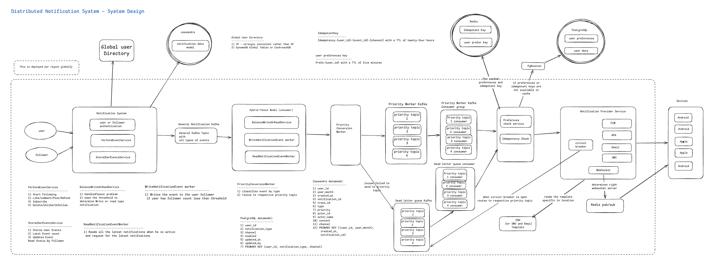

# Distributed Notification System at One Billion Users

---

## Table of Contents

1. [Executive Summary](#executive-summary)
2. [Functional Requirements](#functional-requirements)
3. [Non-Functional Requirements](#non-functional-requirements)
4. [System Scale and Volume](#system-scale-and-volume)
5. [CAP Theorem Analysis](#cap-theorem-analysis)
6. [Architecture Overview](#architecture-overview)
7. [Component Design and Technology Selection](#component-design-and-technology-selection)
8. [Data Models](#data-models)
9. [Error Scenarios and Failure Handling](#error-scenarios-and-failure-handling)
10. [Notification Providers](#notification-providers)
11. [Global Distribution Strategy](#global-distribution-strategy)
12. [Back-of-Envelope Calculations](#back-of-envelope-calculations)
13. [Trade-offs and Limitations](#trade-offs-and-limitations)
14. [Design Diagram](#14-design-diagram)

---

## Executive Summary

The Distributed Notification System is a continuously operating global platform designed to deliver alerts, social updates, and transactional messages to one billion registered users across four geographic regions. It must handle sustained peak throughput of sixty thousand notifications per second while absorbing unpredictable viral traffic spikes reaching ten times that rate — scenarios that arise when a high-follower-count user posts content that propagates across hundreds of millions of follower inboxes simultaneously.

The system serves a social platform comparable in nature to Instagram or LinkedIn, where users perform actions — likes, comments, posts, reposts, subscriptions, follows — that trigger notifications for their followers and connections. Each notification type carries a distinct delivery guarantee and latency expectation, ranging from one-second exactly-once delivery for security-critical alerts to same-day best-effort delivery for marketing content.

The architecture prioritises availability over consistency in its delivery pipeline, accepting brief enforcement gaps during infrastructure failures rather than blocking legitimate users from receiving communications. A single exception applies: the Global User Directory, which routes users to their home geographic region for data residency compliance, is positioned as a strongly consistent CP system because incorrect routing constitutes an immediate GDPR violation with material legal consequences.

---

## Functional Requirements

**Multi-Channel Delivery.** The system delivers notifications across five channels simultaneously: Android push via Firebase Cloud Messaging, iOS push via Apple Push Notification service, email, SMS, and in-app real-time delivery via WebSocket. Each user may have multiple registered devices, and every active device for a recipient must receive an independent delivery attempt with its own token, status record, and retry lifecycle.

**Notification Type Support.** Four distinct notification categories are supported, each with independently configured delivery guarantees, latency targets, retry policies, and dead letter queue thresholds.

Critical notifications cover security alerts, account lockouts, and payment failures. They require exactly-once delivery with zero tolerance for message loss, and they bypass all user preference checks except account deletion status. A user who has opted out of notifications cannot opt out of a security alert.

Transactional notifications cover direct messages, connection requests, job application status updates, and subscription events. They require at-least-once delivery with idempotency protection against duplicates.

Social notifications cover likes, comments, new followers, and mentions. They may tolerate occasional loss under extreme load conditions, where the cost of a missed engagement notification is low relative to the infrastructure complexity required to prevent it.

Marketing notifications cover scheduled campaigns, weekly digests, and re-engagement content. They are best-effort with no strict delivery guarantee and can be paused entirely during system incidents without affecting other notification categories.

**Fan-out at Social Scale.** A single event — a celebrity posting a photo — must propagate notifications to potentially hundreds of millions of followers. The system implements a hybrid fan-out model that routes regular users through write-time fan-out, generating per-recipient notification records at event time, and routes high-follower-count accounts through read-time fan-out, storing a single event record and computing recipient feeds at read time. The threshold governing this routing decision is dynamically adjustable based on observed infrastructure load.

**User Preference Enforcement.** Every delivery attempt must be evaluated against the recipient's preference profile before any provider API call is made. Preference enforcement covers channel-level opt-in and opt-out per notification type, quiet hours configured in the user's local timezone, frequency caps per notification category per time period, and account status validation.

**Idempotent Delivery.** Every notification delivery attempt across every channel must be protected by a deterministic idempotency key constructed from the user identifier, event identifier, and delivery channel. This key is checked atomically in Redis before any provider API call is made, ensuring that retries triggered by network timeouts, worker crashes, or dead letter queue replay never result in duplicate delivery.

**Real-Time In-App Delivery.** For users actively connected to the application, notifications must be delivered immediately through a persistent WebSocket connection. On reconnection after a disconnection period, missed notifications must be fetched from the notification inbox and delivered in chronological order before live WebSocket delivery resumes.

**Zero-Downtime Operations.** Rolling deployments must replace service instances without service interruption. WebSocket servers must drain existing connections before terminating. Kafka consumer groups must rebalance automatically during deployments without message loss.

---

## Non-Functional Requirements

**Scale.** The system serves one billion registered users with approximately one hundred million concurrently active at peak hours. It must sustain sixty thousand notifications per second at average peak load and absorb viral burst events reaching six hundred thousand notifications per second without degrading delivery for unaffected users.

**Latency.** Delivery latency targets are tiered strictly by notification priority. Critical notifications must be delivered within one second of the triggering event. Transactional notifications must be delivered within five seconds. Social notifications must be delivered within sixty seconds. Marketing notifications carry no strict latency requirement beyond same-day delivery.

**Availability.** The system prioritises availability over consistency under failure conditions. Infrastructure failures trigger fail-open behaviour for critical notifications and safe suppression for non-critical ones, ensuring the platform remains responsive to end users regardless of the state of internal infrastructure components.

**Data Residency and Regulatory Compliance.** The system must comply with GDPR for European users, storing and processing all personal data — user identifiers, device tokens, notification content, and delivery logs — exclusively within EU-based regional infrastructure. Equivalent compliance applies under India's Digital Personal Data Protection Act and California's CCPA. Personal data must never be replicated across jurisdictional boundaries under any operating condition, including during regional failover.

**Fault Tolerance.** Delivery provider failures must trigger circuit breaker isolation and dead letter queue buffering with automatic replay on recovery. Redis, Kafka, and Cassandra failures must each trigger predefined degradation behaviours that maintain delivery continuity. Planned maintenance must be executable through zero-downtime rolling procedures across all components.

**Observability.** The system must emit metrics, distributed traces, and structured logs sufficient to diagnose any delivery failure for any user within two minutes of investigation beginning. Automated alerting must detect systemic incidents before users report them.

---

## System Scale and Volume

Understanding the scale parameters is essential for validating every technology selection and capacity decision in this design.

The platform serves one billion registered users globally with approximately one hundred million concurrently active at peak hours. At five hundred million notifications delivered per day, the average throughput is approximately six thousand notifications per second. Peak throughput reaches sixty thousand per second during high-activity periods, with viral events capable of producing spikes to six hundred thousand per second for brief intervals.

A single viral event from a celebrity account with five hundred million followers generates five hundred million potential notification records. Under a naive write-time fan-out model, this single event would require five hundred million Cassandra writes within seconds — a volume that would overwhelm any storage cluster of reasonable cost. This is the precise scenario that motivates the hybrid fan-out model, where celebrity accounts are routed to read-time fan-out and their events are stored as a single record rather than multiplied across every follower's inbox.

At ten million active users with two Cassandra counter entries each, the Redis memory footprint for preference caching reaches approximately two gigabytes — well within the capacity of a standard Redis cluster. The idempotency key store adds a further two to three gigabytes at peak delivery volume with a twenty-four-hour TTL per key. Combined, the Redis working set remains manageable without requiring a disproportionately large cluster.

The PostgreSQL preference store handles a low write volume — users change their notification preferences infrequently — but a very high read volume, since every notification delivery attempt requires a preference check. Without caching, sixty thousand notifications per second would generate sixty thousand PostgreSQL queries per second, far exceeding single-node capacity. The Redis preference cache absorbs approximately ninety-eight percent of these reads, leaving PostgreSQL to serve only cache misses at a manageable two percent of total read volume.

---

## CAP Theorem Analysis

The notification system does not occupy a single position in the CAP theorem. Different components make deliberately different trade-offs based on the consequences of inconsistency in each specific context.

**The Notification Delivery Pipeline — AP.** The primary delivery pipeline prioritises Availability and Partition Tolerance over strict Consistency. When Redis is unavailable, preference checks fall back to safe defaults rather than blocking delivery. When Kafka experiences degradation, the system applies backpressure at the ingestion layer rather than rejecting events. When Cassandra is unreachable, push notifications continue being delivered while inbox persistence is temporarily suspended. This AP position reflects the core business priority: a brief enforcement gap or a temporarily missing inbox record is materially less harmful than blocking one billion users from receiving time-sensitive communications.

**The Global User Directory — CP.** The global user directory — which maps every user to their home geographic region — occupies the CP quadrant. It prioritises Consistency and Partition Tolerance over Availability. This is the single deliberate exception to the system's AP orientation, and the reasoning is regulatory rather than technical. An incorrect region assignment — caused by a stale or inconsistent read during a network partition — would route a European user's personal data to a non-EU data centre, constituting an immediate GDPR violation. The legal and financial consequences of this inconsistency — fines of up to four percent of global annual revenue — materially exceed the operational consequences of a brief directory unavailability. When the directory is unreachable, the system queues cross-region events for retry rather than routing them to an incorrect region based on stale data.

**The Cassandra Notification Inbox — AP with Tunable Consistency.** Cassandra's LOCAL_QUORUM consistency setting ensures that reads and writes are consistent within a geographic region without requiring cross-region coordination. This provides strong consistency for normal operations while accepting that a regional partition may temporarily produce slightly stale reads. For notification inbox data, this trade-off is appropriate — a user seeing a notification appear a few hundred milliseconds later than absolute consistency would guarantee is imperceptible in practice.

**Redis Caching Layer — Eventual Consistency.** The Redis preference cache accepts eventual consistency through its five-minute TTL model. A preference change made by a user takes effect within five minutes as the cache expires and is refreshed from PostgreSQL. For preference data, this eventual consistency is acceptable because the system additionally uses Redis pub/sub to broadcast invalidation events to all delivery workers immediately upon a preference change, reducing the effective inconsistency window to milliseconds in practice.

---

## Architecture Overview

The system is organised around four guiding principles. Regional self-sufficiency ensures each geographic region operates as a complete, independent notification stack. Priority isolation ensures critical, transactional, social, and marketing notifications flow through entirely separate processing pipelines. Separation of concerns ensures fan-out logic, preference enforcement, template rendering, and provider delivery are independent components with well-defined interfaces. Availability over consistency ensures every failure mode defaults to continued delivery for critical notifications and safe suppression for non-critical ones.

The end-to-end flow proceeds as follows. A user performs an action — posting content, liking a photo, sending a message — which the PerformEventService receives and validates. The StoreUserEventsService persists the event to Cassandra and publishes it to the General Notification Kafka topic. The Hybrid Fan-out Model consumes this event, makes the write-time versus read-time routing decision based on the publisher's follower count, and generates the appropriate notification records. The Priority Conversion Worker classifies each notification by type and routes it to the appropriate priority-isolated Kafka topic. Priority-specific delivery workers consume from these topics, evaluate the recipient's preferences through the three-tier preference check service, verify the idempotency key in Redis, render the notification content from the CDN-cached template, and deliver through the circuit-breaker-protected Notification Provider Service. Delivery failures route to the priority-aligned dead letter queue for replay. Successfully delivered notifications are persisted to the Cassandra notification inbox.

---

## Component Design and Technology Selection

### Apache Kafka — Event Streaming and Priority Queue

Kafka serves as the backbone of the notification pipeline for three specific reasons that align directly with the system's requirements. Its log-based architecture retains messages durably on disk, ensuring that no notification event is lost even if all delivery workers simultaneously restart. Its consumer group model enables multiple independent workers to read from the same topic simultaneously, providing the horizontal scaling required to process sixty thousand notifications per second. Its topic-based organisation enables complete priority isolation — by maintaining four dedicated topics for critical, transactional, social, and marketing notifications, the system guarantees that a surge of marketing volume cannot consume worker capacity needed for critical delivery.

In practice, a critical security alert and a promotional marketing email both traverse the same physical Kafka infrastructure but flow through entirely separate topics, consumer groups, and worker pools. The critical topic is configured with twenty dedicated worker instances that never scale down, while the marketing topic has five worker instances that can be paused entirely during incidents. This isolation is what makes the one-second delivery SLA for critical notifications achievable even when the platform is simultaneously processing millions of social notifications per second.

The General Notification Kafka topic serves as the initial ingestion point for all event types regardless of priority. This single entry point simplifies the producer side — application services publish all events to one topic without knowledge of priority classification — while the Priority Conversion Worker handles classification and routing to the appropriate priority topic downstream.

### Hybrid Fan-out Model

The hybrid fan-out model is the most architecturally significant decision in the notification system. It addresses the celebrity problem — the scenario where a single user with five hundred million followers posts content, requiring five hundred million notification records to be generated simultaneously.

The BalanceWriteOrReadService evaluates the publisher's follower count against a dynamically configurable threshold — typically set between ten thousand and one hundred thousand followers depending on current infrastructure load. For publishers below the threshold, the WriteNotificationEventWorker generates a notification record in each follower's Cassandra inbox immediately at event time. This is write-time fan-out: reads are fast because the inbox is pre-populated, but writes are amplified proportional to the follower count. For publishers above the threshold, a single event record is stored in the publisher events table, and the ReadNotificationEventWorker computes the follower's notification feed at read time by querying this table. This eliminates write amplification at the cost of higher read-time computation.

The threshold is dynamically adjustable because the optimal value depends on current infrastructure load. During the Indian Premier League final or a major news event, when the platform experiences burst traffic, the threshold is temporarily lowered to route more publishers to read-time fan-out, reducing write amplification and protecting the Cassandra cluster from overload. When traffic returns to normal, the threshold is raised to restore the pre-computed inbox experience for a larger proportion of users.

The hybrid model works in practice because users typically follow very few celebrity accounts — perhaps five to ten — and many regular accounts. At read time, the system serves pre-computed inbox records for the majority of followed accounts and performs real-time event queries for the small number of celebrity accounts, merging the results before presentation. The computational cost of querying five celebrity event tables is trivial compared to the write amplification that would result from fanning out a celebrity post to five hundred million inbox records.

### Apache Cassandra — Notification Inbox Storage

Cassandra is selected for the notification inbox for three characteristics that align precisely with the access pattern requirements. Its linear write scalability — achieved through its masterless distributed ring architecture — ensures that adding nodes to the cluster increases write throughput proportionally, without the coordination overhead that makes single-primary databases unsuitable for billion-row write workloads. Its partition-based data model enables all notifications for a single user to be co-located on the same set of nodes, making the most frequent read operation — fetch the last twenty notifications for user X — a single-partition lookup with no cross-node coordination. Its native TTL support enables automatic notification expiry without a separate retention job, eliminating the tombstone accumulation that explicit deletion at scale would produce.

The schema design is driven entirely by access patterns rather than by entity normalisation. The primary table partitions by user_id and year_month — a time-bucketing strategy that bounds each partition to one month of activity — and clusters by created_at in descending order, so the most recent notifications are physically stored first on disk and retrieved without sorting. A separate type-filtered table partitions by user_id, notification type, and year_month, enabling type-filtered inbox views without a full partition scan. Write amplification — every notification written to both tables — is the deliberate cost of enabling both access patterns efficiently.

The ninety-day TTL set at the table level ensures that notification records expire automatically after ninety days regardless of whether they have been read or cleared. The cleared-before timestamp pattern — storing the timestamp of a user's last inbox clear action and filtering at query time — eliminates the tombstone accumulation that physical deletion would produce, preserving read performance across all user partitions.

### PostgreSQL — User Preferences and Relational Data

PostgreSQL stores user notification preferences, account status, device token registry, quiet hours configuration, frequency cap tracking, and delivery audit logs. These datasets share characteristics that make PostgreSQL the correct choice: they require transactional integrity across multiple related entities, support complex administrative queries that cannot be anticipated at schema design time, and have volumes that do not exceed single-node write capacity.

The preference schema uses a composite primary key of user_id, notification_type, and channel, enabling efficient lookup of all preferences for a specific user across all notification types and channels in a single index scan. The device token registry maps each user to all their registered devices through a composite primary key of user_id and token, supporting the multi-device delivery requirement without denormalisation.

The delivery audit log table provides the compliance record required to demonstrate that specific critical notifications were delivered within the required latency window — a requirement in regulated industries where security communications carry legal delivery obligations.

### Redis — Caching, Idempotency, and Coordination

Redis serves three distinct functions in the notification system, all within a single cluster distinguished by key prefix conventions.

The preference cache stores each user's complete preference profile as a serialised JSON object under the key `prefs:{user_id}` with a five-minute TTL. A single Redis GET operation retrieves everything the preference check service needs to evaluate all five preference dimensions simultaneously, without secondary lookups. Cache invalidation uses Redis pub/sub to broadcast preference change events to all delivery workers immediately, reducing the effective inconsistency window to milliseconds despite the five-minute TTL.

The idempotency store records every notification delivery attempt under the key `idempotency:{user_id}:{event_id}:{channel}` with a twenty-four-hour TTL. The atomic Redis SET NX operation — which sets the key only if it does not exist — is the mechanism that makes the idempotency guarantee safe under concurrent access from fifty worker instances. If two workers simultaneously attempt delivery of the same notification, only one will succeed in setting the key; the other will receive false and skip the delivery attempt.

The unread notification counter maintains an atomic integer per user under the key `unread:{user_id}` with a thirty-day TTL. This counter is incremented on every notification delivery and decremented when the user reads notifications, enabling badge count queries to be served at sub-millisecond latency without any Cassandra involvement. A SELECT COUNT query against Cassandra at sixty thousand requests per second would produce catastrophic read load — the Redis counter eliminates this entirely.

Redis pub/sub additionally coordinates WebSocket cross-server delivery. When a user is actively connected to WebSocket Server 47 and a delivery worker running on a different machine has a notification for that user, the worker publishes to the Redis channel `ws:user:{user_id}`. Server 47, which subscribed to this channel when the user connected, receives the message immediately and pushes it through the live WebSocket connection. The connection registry — stored as `ws:connected:{user_id}` with a TTL refreshed by heartbeats — tells the delivery worker which server to target.

### PgBouncer — PostgreSQL Connection Pooling

PgBouncer is a lightweight, single-purpose connection pooler deployed between the application services and the PostgreSQL cluster. Without connection pooling, each of the hundreds of delivery worker instances operating across the fleet would attempt to maintain its own persistent connection to PostgreSQL, rapidly exhausting the database's connection limit and producing connection errors that would prevent preference checks from completing.

PgBouncer in transaction pooling mode maintains a small, fixed pool of real database connections — typically twenty to fifty — shared across all application connections through multiplexing. A delivery worker acquires a connection from the pool for the duration of a single transaction, then returns it immediately. This enables thousands of concurrent application instances to share a fraction of the real database connections, eliminating connection exhaustion while adding negligible latency overhead.

PgBouncer is preferred over PgPool-II for this design because the preference check service already uses Redis as its primary caching layer, making PgPool's query caching capability redundant. Introducing PgPool's query cache alongside Redis would create two competing caches for the same data, producing invalidation complexity without a commensurate performance benefit. PgBouncer's single-purpose connection pooling is the appropriate tool for the specific problem it solves.

### Dead Letter Queue Kafka — Failure Preservation and Replay

The dead letter queue is implemented as four dedicated Kafka topics — one per priority level — that receive notifications after exhausting all configured retry attempts or when the circuit breaker rejects a delivery attempt due to provider unavailability. Four separate dead letter queue consumer components read from these topics when the operations team initiates a replay.

The priority-aligned structure is essential. When FCM recovers from an outage and the operations team replays the dead letter queue, critical security alerts must be replayed and delivered before transactional notifications, which must be delivered before social notifications. A single undifferentiated dead letter queue would lose this ordering, potentially delivering marketing content before a security alert that a user urgently needs to see.

The dead letter queue serves a secondary function as an operational audit trail. Every message in the dead letter queue carries metadata indicating the number of delivery attempts, the error code returned on each attempt, the timestamp of each attempt, and the trace ID linking the failed notification to its complete delivery trace in the distributed tracing system. This metadata enables the operations team to distinguish between transient failures that should be replayed immediately and systematic failures — such as a provider-side bug rejecting a specific payload format — that require investigation before replay.

### Circuit Breaker — Provider Failure Isolation

The circuit breaker sits within the Notification Provider Service, positioned between the prepared notification payload and the outbound provider API call. It operates as a per-provider state machine — one for FCM, one for APNs, one for the email provider, one for the SMS provider — ensuring that a failure in one channel does not suppress delivery through healthy channels.

In its closed state, all provider API calls proceed normally. After a configurable number of consecutive failures, the circuit breaker opens, rejecting all calls to that provider immediately without attempting the API call and routing the notification to the corresponding priority dead letter queue. This prevents delivery worker threads from blocking on failed API calls, which at sixty thousand notifications per second would rapidly exhaust the thread pool and starve healthy notifications of processing capacity.

After a configurable recovery timeout, the circuit breaker enters a half-open state, permitting a small percentage of calls as health probes. If probes succeed, the circuit breaker closes and normal operation resumes. If they fail, the circuit breaker returns to open and the timeout resets. Recovery uses staggered timing across worker instances — each instance adds a random delay before probing — to prevent the thundering herd problem where all workers simultaneously flood a recovering provider with backed-up notifications.

### Global User Directory — Regional Routing

The Global User Directory is a strongly consistent distributed database that maps every user identifier to their home geographic region. It sits outside the regional deployment boundary, shared across all regions, and is implemented on DynamoDB Global Tables or CockroachDB — technologies chosen specifically for their ability to provide strongly consistent reads from any geographic location with sub-millisecond latency.

The directory is the mechanism that enables cross-region notification forwarding. When a user in the United States triggers an event that must notify a user whose home region is Europe, the Notification System consults the global directory to determine the correct regional destination, then forwards the event to the European regional stack for processing. Personal data never crosses regional boundaries — only the lightweight event payload is forwarded, and all processing against European user data occurs within EU infrastructure.

The CP positioning of this component — accepting temporary unavailability rather than returning an incorrect region assignment — is the correct trade-off because incorrect routing constitutes an immediate GDPR violation. The system handles directory unavailability by queuing cross-region events for retry, processing local-region events normally, and reconciling the deferred events once the directory recovers.

---

## Data Models

### PostgreSQL Schema

The user_notification_preferences table stores the channel-level opt-in and opt-out configuration for every user across every notification type, with a composite primary key of (user_id, notification_type, channel) that enables single-index-scan retrieval of all preferences for a specific user.

The user_quiet_hours table stores each user's quiet hours window as local hour boundaries and a timezone identifier. The preference check service converts the current UTC timestamp to the user's local timezone at evaluation time to determine whether non-critical notifications should be suppressed or delayed to the end of the quiet hours window.

The user_account_status table records the operational status of every user account — active, suspended, deleted, or unverified — serving as the first gate in the preference evaluation sequence. A CHECK constraint enforces the valid status values at the database level, preventing application-level errors from corrupting the status field with invalid values.

The user_device_tokens table maintains the one-to-many mapping between each user and their registered devices, with a platform column that determines whether FCM or APNs handles delivery. The is_active flag enables soft deletion of invalidated tokens — when a provider returns an UNREGISTERED error, the token is marked inactive rather than deleted, preserving the audit trail of which devices a user has historically used.

The notification_delivery_log table provides the audit trail of every delivery attempt, recording provider message IDs for successful deliveries and error codes for failures. Secondary indexes on notification_id and on (user_id, attempted_at DESC) support both notification-specific debugging — retrieving the full delivery history for a specific notification — and user-specific reporting.

### Cassandra Schema

The user_notifications table is the primary notification inbox, partitioned by (user_id, year_month) and clustered by created_at in descending order. The year_month component of the partition key bounds each partition to one month of activity, preventing unbounded partition growth and maintaining predictable read latency for active users regardless of how long they have been on the platform. The ninety-day table-level TTL eliminates the need for a retention enforcement job and prevents tombstone accumulation from explicit deletion.

The notification_read_status table is an append-only read receipt store. Rather than updating a read_status column within the primary notification table — which generates a tombstone for every overwritten cell value — read receipts are inserted as new rows. The application merges the two result sets in memory. This design eliminates tombstone accumulation from read status updates at high frequency, preserving partition read performance for active users who read many notifications per session.

The user_notifications_by_type table enables type-filtered inbox views without a full partition scan. Its composite partition key of (user_id, type, year_month) means that a query for all LIKE notifications for a specific user in a specific month resolves to a single partition lookup. Write amplification — every notification written to both this table and the primary table — is the deliberate cost of enabling efficient type-filtered reads.

The publisher_events table supports the read-time fan-out path for celebrity accounts. A single event record is stored here when a high-follower-count user performs an action, and follower feeds are populated at read time by querying this table for each celebrity account the user follows.

---

## Error Scenarios and Failure Handling

**Delivery Provider Outage.** When FCM, APNs, SendGrid, or Twilio experiences an outage, the circuit breaker for that provider opens after a configurable number of consecutive failures. Delivery workers stop attempting API calls to the failed provider and route affected notifications to the corresponding priority dead letter queue. For critical notifications, the system attempts delivery through an alternative channel — falling back to SMS when push providers are unavailable — before routing to the dead letter queue. When the provider recovers, the circuit breaker probes with a small percentage of traffic, transitions through the half-open state, and closes when probes succeed. The dead letter queue replay is then initiated with staggered timing to prevent thundering herd behaviour on the recovering provider.

**Redis Unavailability.** When Redis becomes unreachable, the preference check service falls back to safe defaults: critical notifications are always permitted through, and all non-critical notifications are suppressed. This asymmetry reflects the business priority that a security alert must reach the user even if preference verification is temporarily impossible, while a marketing notification can safely wait until Redis recovers. The idempotency key store being unavailable means that retries during the outage window may produce duplicate deliveries for non-critical notifications — a known and accepted trade-off given the rarity of simultaneous Redis and other infrastructure failures.

**Kafka Consumer Lag Growth.** When delivery workers cannot keep pace with the rate of incoming notifications — due to a provider slowdown, a deployment event, or a traffic spike — consumer lag grows on the affected priority topics. The observability layer monitors lag per topic against defined thresholds and alerts the operations team when the critical topic lag exceeds one hundred messages or the social topic lag exceeds one million messages. Auto-scaling policies add delivery worker instances when lag grows above threshold, and the priority isolation ensures that lag growth on the social or marketing topics does not affect the critical or transactional pipelines.

**Cassandra Unavailability.** When Cassandra becomes unreachable, notification delivery continues — push notifications are sent through FCM and APNs, emails through SendGrid, and in-app notifications through WebSocket — but inbox persistence is temporarily suspended. Delivery workers buffer the delivery log entries locally and flush them to Cassandra once connectivity is restored. Users may temporarily see a stale or empty notification inbox during the outage, but they continue receiving push notifications on their devices. This represents the AP trade-off: availability of the communication channel is preserved at the cost of temporary inbox consistency.

**WebSocket Server Restart.** When a WebSocket server instance restarts — during a rolling deployment or due to an infrastructure failure — all clients connected to that instance simultaneously lose their connection. Without mitigation, all clients would attempt reconnection simultaneously, producing a thundering herd that overwhelms the restarting server. Clients apply a randomised exponential backoff delay before reconnecting, spreading fifty thousand simultaneous reconnection attempts across a thirty-second window and limiting the effective reconnection rate to approximately one thousand seven hundred per second — well within the server's capacity. Notifications missed during the disconnection period are fetched from the Cassandra inbox when the client reconnects and sends its last-seen timestamp.

**Thundering Herd During Viral Events.** When a major global event — a World Cup result, a viral celebrity post — causes millions of users to simultaneously post or react, the fan-out pipeline faces an extreme write spike. The system applies rate limiting at the event ingestion layer, capping the rate at which events enter the General Notification Kafka topic regardless of arrival rate. Simultaneously, the hybrid fan-out threshold is dynamically lowered to route more publishers to read-time fan-out, reducing write amplification and protecting the Cassandra cluster. Marketing worker pools are paused during the spike to free processing capacity for the higher-priority social and critical pipelines.

---

## Notification Providers

**Firebase Cloud Messaging (FCM).** FCM is the mandatory delivery channel for Android push notifications, operated by Google. Authentication uses OAuth 2.0 service account credentials that produce short-lived access tokens refreshed hourly. FCM supports topic-based delivery for scenarios like match score updates, where a single API call delivers to all topic subscribers, and individual device token delivery for personalised notifications. Token invalidation is handled through the UNREGISTERED error response, which triggers immediate removal of the invalid token from the device registry and marking of the corresponding PostgreSQL record as inactive.

**Apple Push Notification Service (APNs).** APNs is the mandatory delivery channel for iOS, iPadOS, macOS, and watchOS devices, operated by Apple. Token-based authentication uses a JSON Web Token signed with an Apple-issued private key — a more flexible approach than certificate-based authentication because a single key authenticates deliveries to all applications within the developer account. APNs enforces a four-kilobyte payload limit and a per-device daily notification limit, requiring the notification system to store large content in object storage and include only a reference URL in the notification payload. The apns-priority header is set to ten for critical notifications — delivering immediately and waking a sleeping device — and five for social and marketing notifications, where battery conservation is preferred over immediacy.

**SendGrid — Email Delivery.** SendGrid provides transactional email delivery with dedicated IP pools for transactional messages and shared IP pools for marketing content. The separation of these pools ensures that spam complaints generated by marketing campaigns do not affect the deliverability of password reset emails and security alerts. SendGrid's delivery webhook notifies the notification system of every delivery event — delivered, opened, clicked, bounced, marked as spam — enabling real-time updates to the delivery audit log and automatic suppression of hard-bounced addresses.

**Twilio — SMS Delivery.** Twilio provides SMS delivery through direct carrier interconnections across one hundred eighty countries. High-volume sending uses a pool of short code numbers — five or six digit numbers pre-approved by carriers for application-to-person messaging — to achieve the throughput required for time-sensitive notifications. Delivery receipts confirm whether a message reached the recipient's handset at the carrier level, providing a higher delivery confirmation standard than email's open-rate proxies. SMS is reserved for critical notifications where confirmed delivery is essential, given its substantially higher per-message cost relative to push and email.

**WebSocket — Real-Time In-App Delivery.** WebSocket provides sub-one-hundred-millisecond in-app delivery for users actively connected to the application. The WebSocket server fleet — two thousand instances for one hundred million concurrent users at fifty thousand connections per instance — uses Redis pub/sub for cross-server coordination. Each server subscribes to a Redis channel per connected user and the connection registry maps each user to their current server, enabling delivery workers to target the correct server instance without direct server-to-server communication.

---

## Global Distribution Strategy

The system deploys a complete, self-sufficient notification stack in four geographic regions: North America (US East), Europe (EU West), South Asia (AP South), and East Asia (AP East). Each regional stack operates independently during normal operation, processing and delivering notifications for its local users without dependence on other regions. Cross-region communication is limited to two scenarios: event forwarding when a triggering event occurs in a different region than the recipient user, and global user directory lookups for region assignment verification.

User-to-region assignment is determined at account creation based on the user's geographic location and is stored permanently in the Global User Directory. The assignment is immutable for the lifetime of the account — even if a user physically moves to a different country, their data residency remains in their original home region. This immutability is a regulatory requirement under GDPR: once personal data is established in a specific jurisdiction, migrating it to another jurisdiction requires explicit user consent and a formal data migration process.

Cross-region event forwarding uses Kafka MirrorMaker 2 for high-volume social and marketing events, replicating Kafka topics across regional clusters with a typical lag of fifty to five hundred milliseconds. For critical notifications requiring lower latency, a direct API call from the source region's notification gateway to the destination region's ingestion endpoint forwards the event synchronously, adding fifty to one hundred fifty milliseconds of cross-region overhead — acceptable for transactional and critical notifications given their higher latency headroom.

Regional failover is orchestrated by a global health check service that monitors all regions every ten seconds. When a region fails three consecutive checks, the service updates GeoDNS routing to redirect traffic to the nearest healthy region. During failover, users may see stale or empty notification inboxes — Cassandra data for the failed region is inaccessible — but push notification delivery continues through the failover region's provider integrations. Data in the failed region is not lost and becomes accessible again when the region recovers, at which point deferred events are replayed and the inbox is reconciled.

---

## Back-of-Envelope Calculations

Back-of-envelope estimation validates that the technology selections and capacity decisions in this design are proportionate to the actual numbers. Each calculation below is derived from the scale parameters established during the clarification phase and directly informs a specific architectural decision.

### Notification Throughput

The platform delivers five hundred million notifications per day across all channels combined. Dividing by eighty-six thousand four hundred seconds in a day produces an average throughput of approximately five thousand seven hundred and eighty notifications per second. Applying a peak-to-average ratio of ten — the multiplier established during clarification for viral event bursts — produces a peak throughput requirement of approximately fifty-eight thousand notifications per second, rounded to sixty thousand for capacity planning purposes. Individual viral events — a celebrity post from an account with five hundred million followers — can spike this to six hundred thousand notifications per second for brief intervals of thirty to ninety seconds.

These throughput numbers directly justify the Kafka-based pipeline. A single Kafka cluster with one hundred partitions per topic and appropriate consumer pools can sustain well over one million messages per second, providing substantial headroom above the peak requirement. A synchronous HTTP-based delivery pipeline would collapse at this throughput given the serialisation overhead of request-response cycles.

### Fan-out Write Amplification

Under a naive write-time fan-out model applied to all users regardless of follower count, a single post from a celebrity with five hundred million followers would generate five hundred million Cassandra writes. At a Cassandra write throughput of one million writes per second per cluster, this single event would require five hundred seconds — over eight minutes — to complete, during which the cluster is saturated and no other user's notifications can be persisted. This is the quantitative proof that write-time fan-out cannot be applied uniformly and motivates the hybrid model with a dynamically adjustable threshold.

Under the hybrid model, a celebrity post generates one event record in the publisher_events table rather than five hundred million inbox records. The write cost is constant regardless of follower count. At read time, each follower's feed computation queries the publisher events table for the handful of celebrity accounts they follow — typically five to ten accounts — and merges the results with their pre-computed inbox. The read-time overhead per user is bounded by the number of celebrity accounts they follow, not by the celebrity's total follower count.

### Redis Memory Footprint

Three Redis key spaces contribute to the total memory requirement.

The preference cache holds one entry per active user. At one hundred million concurrently active users with an average serialised preference profile of two hundred bytes per entry, the preference cache consumes approximately twenty gigabytes of Redis memory. With a five-minute TTL, the working set at any moment reflects the active user population rather than the full one billion registered user base.

The idempotency key store holds one entry per delivery attempt within the twenty-four-hour TTL window. At sixty thousand notifications per second across five delivery channels on average — push, email, in-app, with some subset receiving SMS — the store holds approximately sixty thousand multiplied by five multiplied by eighty-six thousand four hundred entries, but with the twenty-four-hour TTL bounding the working set to the past day's attempts. At fifty bytes per key, the idempotency store consumes approximately twenty-six gigabytes at peak sustained throughput.

The unread notification counter holds one integer per active user. At one hundred million active users with eight bytes per counter key and value pair, this key space consumes approximately eight hundred megabytes — negligible relative to the other two key spaces.

Combined, the three Redis key spaces require approximately forty-seven gigabytes of memory at peak active user load. A Redis cluster provisioned with sixty-four gigabytes of total memory provides adequate headroom for replication buffers, operational overhead, and growth before resizing is required.

### Cassandra Storage Footprint

The primary notification inbox table stores notifications for ninety days based on the table-level TTL. At five hundred million notifications per day across one billion users, the steady-state row count in the primary table is five hundred million multiplied by ninety, producing forty-five billion rows. At an average row size of two hundred bytes — accounting for the user_id, year_month, created_at, notification_id, type, actor_name, content, deep_link, trace_id, and channel columns — the raw data size is nine terabytes. With Cassandra's replication factor of three, the total storage consumed across the cluster is twenty-seven terabytes. Across a cluster of ten nodes, each node holds approximately two point seven terabytes of data, well within the four to eight terabyte per node range recommended for production Cassandra deployments.

The user_notifications_by_type table adds approximately the same volume as the primary table — a direct consequence of the write amplification strategy. Total Cassandra storage across both tables reaches approximately fifty-four terabytes with replication, requiring a cluster of fourteen to twenty nodes depending on provisioned disk capacity per node.

### PostgreSQL Storage and Query Rate

The user_notification_preferences table holds one row per user per notification type per channel. At one billion users, eight notification types, and three channels each, the table holds twenty-four billion rows. At approximately one hundred bytes per row, the raw table size is approximately two point four terabytes — large but manageable for a PostgreSQL instance with appropriate indexing, particularly given that write volume is low and administrative queries are the primary driver of ad-hoc access patterns.

The preference check service generates approximately sixty thousand preference lookup requests per second at peak notification throughput. The Redis preference cache absorbs approximately ninety-eight percent of these lookups — fifty-eight thousand eight hundred per second — leaving approximately one thousand two hundred queries per second reaching PostgreSQL through PgBouncer. This query rate is well within the capacity of a single well-provisioned PostgreSQL primary with read replicas, validating the three-tier caching architecture's effectiveness at protecting the database from direct exposure to peak notification throughput.

### Kafka Partition and Consumer Sizing

Each priority topic requires sufficient partitions to support the peak consumer throughput for that priority level. The critical topic must sustain delivery of time-sensitive notifications with a one-second SLA. At twenty dedicated worker instances each processing one thousand notifications per second, the critical topic requires twenty partitions minimum — one partition per worker — to avoid consumer idle time from partition contention. The social topic, which handles the bulk of notification volume at approximately fifty thousand notifications per second during peak, requires fifty partitions to support the ten worker instances at five thousand notifications per second per worker.

Consumer lag thresholds are calibrated from these throughput figures. A consumer lag of one thousand messages on the critical topic — at twenty thousand notifications per second total throughput — represents fifty milliseconds of backlog, which is within the one-second SLA with substantial headroom. The same lag on the marketing topic — at five thousand notifications per second — represents two hundred milliseconds of backlog, entirely acceptable for a same-day delivery requirement.

### WebSocket Server Fleet Sizing

Each WebSocket server instance maintains between fifty thousand and one hundred thousand simultaneous persistent connections, depending on available memory and operating system file descriptor limits. At one hundred million concurrently active users — the peak concurrent figure established during clarification — and fifty thousand connections per server instance, the fleet requires two thousand server instances to serve all active connections without exceeding per-instance capacity.

Each WebSocket connection consumes approximately sixty-four kilobytes of memory for the TCP buffer, the WebSocket frame buffer, and the associated session state. At fifty thousand connections per instance, each server requires approximately three point two gigabytes of memory for connection state alone, plus operating system and application overhead. A server provisioned with eight gigabytes of memory comfortably accommodates fifty thousand connections with headroom for traffic spikes.

### Network Bandwidth Between Services

The notification payload transmitted from a delivery worker to FCM or APNs averages approximately one kilobyte, including the JSON body, authentication headers, and provider-specific metadata. At sixty thousand notifications per second peak throughput, the aggregate outbound bandwidth to push providers is approximately sixty megabytes per second — well within the capacity of standard data centre network infrastructure and within the quota limits of FCM and APNs for a platform of this scale.

The Redis operations generated by the notification pipeline — preference cache lookups, idempotency key checks, unread counter increments, and WebSocket pub/sub messages — average approximately two hundred bytes per operation in each direction. At three hundred thousand Redis operations per second — five operations per notification at sixty thousand notifications per second — the aggregate Redis network bandwidth is approximately sixty megabytes per second bidirectional, again well within data centre network capacity.

### Summary Table

| Metric                                    | Value                        | Implication                                                        |
|-------------------------------------------|------------------------------|--------------------------------------------------------------------|
| Average notification throughput           | 5,780 per second             | Kafka cluster with 100 partitions provides 170x headroom           |
| Peak notification throughput              | 60,000 per second            | Drives worker pool sizing per priority topic                       |
| Viral event peak                          | 600,000 per second           | Motivates dynamic threshold lowering and ingestion rate limiting   |
| Celebrity fan-out write amplification     | 500 million writes per event | Motivates hybrid fan-out model with read-time path for celebrities |
| Redis memory — preference cache           | 20 GB                        | Standard Redis cluster with 64 GB provisioning                     |
| Redis memory — idempotency store          | 26 GB                        | Within 64 GB provisioning with 18 GB headroom                      |
| Cassandra storage — primary table         | 27 TB with replication       | 10-node cluster at 2.7 TB per node                                 |
| Cassandra storage — total with type table | 54 TB with replication       | 14-20 node cluster depending on disk provisioning                  |
| PostgreSQL preference table               | 2.4 TB raw                   | Manageable with appropriate indexing and read replicas             |
| PostgreSQL query rate after caching       | 1,200 per second             | Well within single-node PostgreSQL capacity                        |
| WebSocket server fleet                    | 2,000 instances              | At 50,000 connections per instance for 100M concurrent users       |
| Push provider outbound bandwidth          | 60 MB per second             | Standard data centre network capacity                              |

---

The hybrid fan-out model introduces read-time complexity when a user follows many celebrity accounts. The merge operation that combines pre-computed inbox records with real-time celebrity event queries is bounded by the number of celebrity accounts the user follows — typically a small number — but it adds measurable latency for users who follow many high-follower-count accounts simultaneously.

The idempotency key TTL of twenty-four hours means that a notification replayed more than twenty-four hours after its original delivery attempt is not protected against duplication. In practice, dead letter queue replay occurs within hours of the original failure, making this window sufficient for the vast majority of failure scenarios. For critical notifications, operations teams should prioritise replay within the twenty-four-hour window and verify idempotency key presence before initiating replay of older messages.

The regional quota allocation approach — distributing global rate limits across regions proportionally — means that a user who routes requests through multiple regions could theoretically exceed their global limit by consuming quota from each regional allocation independently. For a notification system where the rate limit is a fair-usage control rather than a hard security boundary, this regional approximation is acceptable. A global counter approach would eliminate this gap but add one hundred to three hundred milliseconds of cross-region write latency to every notification evaluation — an overhead incompatible with the one-second critical notification SLA.

The fail-open behaviour during Redis unavailability means that user opt-out preferences are not enforced for the duration of the outage. A user who opted out of marketing notifications may receive one if a delivery worker processes their notification during a Redis outage and falls back to default-permit behaviour. The system logs every delivery made under degraded preference enforcement, enabling the operations team to identify and compensate affected users after recovery.

---

## 14. Design Diagram

