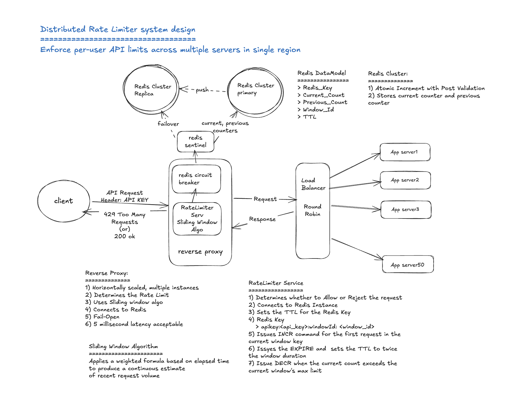

# Rate Limiting Algorithms: A Comparative Analysis

**Document scope:** A professional reference comparing the five primary rate limiting algorithms used in software systems, covering their design philosophy, trade-offs, advantages, disadvantages, and appropriate use cases. Intended for engineers making informed algorithm selection decisions.

---

## Table of Contents

1. [Introduction](#introduction)
2. [Fixed Window Counter](#fixed-window-counter)
3. [Sliding Window Log](#sliding-window-log)
4. [Sliding Window Counter](#sliding-window-counter)
5. [Token Bucket](#token-bucket)
6. [Leaky Bucket](#leaky-bucket)
7. [Comparative Summary](#comparative-summary)
8. [Algorithm Selection Guide](#algorithm-selection-guide)
9. [Conclusion](#conclusion)

---

## Introduction

Rate limiting is the practice of controlling the frequency at which a system accepts requests from a given client or source. It serves multiple operational purposes simultaneously: protecting backend infrastructure from traffic overload, enforcing fair usage policies across a shared platform, providing security boundaries against brute-force and denial-of-service attacks, and enabling differentiated service tiers based on subscription level.

Five algorithms have emerged as the primary approaches to rate limiting in production systems, each making a different set of trade-offs across dimensions including memory consumption, accuracy, burst tolerance, computational cost, and implementation complexity. No single algorithm is universally superior. The appropriate choice depends on the specific requirements of the system being protected and the nature of the traffic it serves.



This document examines each algorithm in depth, evaluates its practical characteristics, and provides guidance on when each is and is not appropriate.

---

## Fixed Window Counter

### Design Philosophy

The fixed window counter divides time into discrete, non-overlapping intervals of uniform size. A single counter tracks all requests arriving within the current interval. When the counter reaches the defined limit, subsequent requests are rejected until the interval resets. The reset occurs automatically when the first request arrives after the interval boundary has passed.

This approach mirrors the most intuitive formulation of a rate limit: a client may make at most N requests in any given period T. Its simplicity is both its primary strength and the source of its most significant weakness.

### How It Enforces the Limit

The counter increments on every permitted request and is compared against the maximum on every arriving request. When the counter equals the maximum, the request is rejected and the counter remains unchanged. When the interval expires, the counter resets to zero and a new interval begins. The interval boundary is determined by dividing the current timestamp by the interval duration, producing a monotonically increasing integer that identifies each successive window.

### Example Walkthrough

**Configuration:** limit = 5 requests, window = 10 seconds

```
WINDOW 1 (t=0s to t=10s)                    WINDOW 2 (t=10s to t=20s)
|------------------------------------------|-------------------------------------------|
|                                          |                                           |
|  t=2s   R1 arrives  counter=0 -> 1  OK   |  t=10.0s  R7 arrives  counter RESETS to 0 |
|  t=3s   R2 arrives  counter=1 -> 2  OK   |           counter=0 -> 1               OK |
|  t=4s   R3 arrives  counter=2 -> 3  OK   |                                           |
|  t=6s   R4 arrives  counter=3 -> 4  OK   |  t=10.1s  R8 arrives  counter=1 -> 2   OK |
|  t=8s   R5 arrives  counter=4 -> 5  OK   |                                           |
|  t=9s   R6 arrives  counter=5    REJECT  |                                           |
|                                          |                                           |
|------------------------------------------|-------------------------------------------|

BOUNDARY PROBLEM — requests permitted within a 2-second span around the reset:

  t=8.0s   R5   PERMITTED   (Window 1, counter=5, last slot)
  t=10.0s  R7   PERMITTED   (Window 2, counter reset to 0)
  t=10.1s  R8   PERMITTED   (Window 2, counter=1)

  3 requests in 2.1 seconds despite a limit of 5 per 10 seconds.
  The reset at t=10s granted a fresh allocation immediately adjacent
  to a nearly exhausted one.

RESULT:  7 of 8 requests permitted.  R6 rejected.
         Counter state stored: 1 integer per user.
```

### Advantages

The fixed window counter requires the least memory of any rate limiting algorithm — a single counter per user, regardless of how many requests that user makes within the window. This makes it viable at any scale without capacity planning concerns. Its computational cost is essentially constant — a clock comparison and a counter increment — which means it introduces negligible latency overhead even under high concurrency. The implementation is straightforward, which reduces the surface area for defects and simplifies operational reasoning.

### Disadvantages

The algorithm's central weakness is the boundary vulnerability, commonly referred to as the boundary attack. Because the counter resets abruptly at a fixed, predictable moment, a client can send the maximum number of requests immediately before the boundary and the same number immediately after, receiving twice the intended allocation within a very short period. For a limit of five requests per ten seconds, a client who sends five requests at the ninth second and five more at the first second of the next window has sent ten requests in approximately two seconds — double the stated limit.

Whether this constitutes a meaningful problem depends on context. For non-sensitive APIs where the rate limit is a quality-of-service measure rather than a security control, an occasional doubling at window boundaries is unlikely to cause operational harm. For authentication endpoints, payment APIs, or any system where the rate limit is a security boundary, the boundary vulnerability is a genuine and exploitable weakness.

### Best Use Cases

The fixed window counter is appropriate for internal dashboards, administrative endpoints, and non-critical public APIs where simplicity and minimal resource consumption are valued and the rate limit is a courtesy constraint rather than a hard security boundary. It is also a reasonable choice during the earliest stages of a product's lifecycle when the priority is shipping working software quickly and the traffic volumes do not justify more sophisticated approaches.

### When to Avoid It

The fixed window counter should not be used on authentication endpoints, password reset flows, payment initiation APIs, account creation endpoints, or any other path where an attacker who understands the window structure could meaningfully exploit the boundary reset to exceed the intended limit.

---

## Sliding Window Log

### Design Philosophy

The sliding window log was designed to eliminate the boundary vulnerability of the fixed window counter entirely. Rather than maintaining a counter that resets at predetermined boundaries, it records the precise timestamp of every request. When a new request arrives, the algorithm removes all timestamps older than the window duration, counts what remains, and makes its allow-or-reject decision based on whether that count falls below the permitted maximum.

Because the window is always measured backwards from the current moment rather than forward from a fixed start point, there is no boundary to exploit. At any instant in time, the system asks how many requests have arrived in the last N milliseconds from right now. As time advances, old entries fall out of the window naturally, creating capacity for new requests without any abrupt reset.

### How It Enforces the Limit

On every request, the algorithm first removes all log entries whose timestamps fall outside the active window. It then counts the remaining entries. If the count is below the maximum, the request is permitted and its timestamp is recorded. If the count equals or exceeds the maximum, the request is rejected and no entry is added. The log therefore always reflects an accurate count of recent requests within the active window at the moment of evaluation.

### Example Walkthrough

**Configuration:** limit = 5 requests, window = 10 seconds (slides with current time)

```
REQUESTS ARRIVING:
  R1 at t=2s,  R2 at t=4s,  R3 at t=6s,  R4 at t=7s,  R5 at t=9s
  R6 at t=10s, R7 at t=13s

---------------------------------------------------------------------------
t=2s   New request R1 arrives
       Active window: t=0s to t=2s
       Log before:  []
       Expired:     none removed
       Log after:   [2]
       Count=1  <  limit=5   -->  PERMIT R1
---------------------------------------------------------------------------
t=4s   New request R2 arrives
       Active window: t=0s to t=4s
       Log before:  [2]
       Expired:     none removed
       Log after:   [2, 4]
       Count=2  <  limit=5   -->  PERMIT R2
---------------------------------------------------------------------------
t=6s   R3 arrives   log=[2,4,6]       count=3   PERMIT
t=7s   R4 arrives   log=[2,4,6,7]     count=4   PERMIT
t=9s   R5 arrives   log=[2,4,6,7,9]   count=5   PERMIT
---------------------------------------------------------------------------
t=10s  New request R6 arrives
       Active window: t=0s to t=10s
       Log before:  [2, 4, 6, 7, 9]
       Expired:     none (t=2 still within window)
       Log after:   [2, 4, 6, 7, 9]
       Count=5  >= limit=5   -->  REJECT R6
       NOTE: No counter reset occurs. t=10s has no special meaning.
---------------------------------------------------------------------------
t=13s  New request R7 arrives
       Active window: t=3s to t=13s   (last 10 seconds from now)
       Log before:  [2, 4, 6, 7, 9]
       Expired:     t=2 is now outside window  -->  REMOVED
       Log after:   [4, 6, 7, 9]
       Count=4  <  limit=5   -->  PERMIT R7
       Log stored:  [4, 6, 7, 9, 13]
---------------------------------------------------------------------------

KEY POINT: At t=13s the algorithm looked back exactly 10 seconds.
           The entry at t=2s aged out naturally.
           No boundary reset occurred at t=10s.
           No doubling effect is possible.

RESULT:  6 of 7 requests permitted.  R6 rejected.
         Log stored: 1 timestamp per permitted request.
```

### Advantages

The sliding window log provides the highest accuracy of any rate limiting algorithm. It makes no approximations and performs no estimations — the count it evaluates is exact. There is no boundary moment for a client to exploit, making it the strongest choice for security-sensitive applications. The algorithm is also conceptually transparent: the log contains exactly the requests that count against the limit, and the decision logic is straightforward to audit and reason about.

### Disadvantages

The memory cost of the sliding window log scales directly with traffic volume. The algorithm stores one entry per request within the active window, which means a user who sends the maximum number of permitted requests will have a log of that size. At scale — for example, a limit of one thousand requests per minute across one hundred thousand concurrent users — the total log can contain tens of millions of entries simultaneously, requiring substantial memory capacity and careful operational planning.

The computational cost also varies with traffic. The eviction loop that removes expired entries must iterate through potentially many timestamps on each request. Under normal conditions this cost is modest, but under bursty traffic followed by a quiet period, the first request after the quiet period must evict a large number of accumulated expired entries in a single pass. For latency-sensitive endpoints, this variability in processing time may be undesirable.

### Best Use Cases

The sliding window log is the appropriate choice for security-critical endpoints where exact enforcement is operationally necessary and traffic volume is moderate. Authentication endpoints, account lockout mechanisms, password reset flows, and similar paths where an attacker who exceeds the limit even slightly gains a meaningful advantage are the strongest candidates. The algorithm's precision is most valuable precisely in these contexts, and the traffic volumes on such endpoints are typically low enough that the memory cost remains manageable.

### When to Avoid It

The sliding window log should not be used on high-volume public API endpoints where the number of permitted requests per window is large and the concurrent user base is broad. In such contexts, the memory and computational costs become prohibitive and a more efficient algorithm such as the sliding window counter will produce nearly equivalent accuracy at a fraction of the resource cost.

---

## Sliding Window Counter

### Design Philosophy

The sliding window counter was designed as a practical hybrid that captures the accuracy benefits of the sliding window log while maintaining the memory efficiency of the fixed window counter. Rather than storing every individual request timestamp, it maintains two counters — one for the current window and one for the preceding window — and applies a weighted formula to produce a continuous estimate of recent request volume.

The algorithm's central insight is that an exact count of requests within an arbitrary sliding window can be closely approximated from just two fixed-window counts, using the proportion of time elapsed within the current window as a weighting factor. This approximation introduces a small error under certain traffic distributions, but in practice that error remains below one percent for typical patterns, making the algorithm near-exact for all practical purposes.

### How It Enforces the Limit

When a request arrives, the algorithm reads the counter for the current window and the counter for the immediately preceding window. It calculates how much of the previous window still overlaps with the current sliding window — expressed as a ratio of the window duration — and applies that ratio as a weight to the previous window's count. Adding the weighted previous count to the current count produces an estimate of how many requests have occurred within the last full window duration from the current moment. If this estimate is below the maximum, the request is permitted and the current window's counter is incremented. If the estimate equals or exceeds the maximum, the request is rejected.

### Example Walkthrough

**Configuration:** limit = 5 requests, window = 10 seconds
**State entering this window:** previous window recorded 4 requests, current window counter = 0

```
FORMULA:  estimated = (prev_count x overlap_ratio) + curr_count
          overlap_ratio = (window_duration - elapsed) / window_duration

---------------------------------------------------------------------------
Requests R1 to R4 all arrive at t=7s into the current window
elapsed = 7s,  overlap_ratio = (10 - 7) / 10 = 0.3
prev_count contribution = 4 x 0.3 = 1.2

  R1 arrives:  estimated = (4 x 0.3) + 0 = 1.2   < 5   PERMIT   curr=1
  R2 arrives:  estimated = (4 x 0.3) + 1 = 2.2   < 5   PERMIT   curr=2
  R3 arrives:  estimated = (4 x 0.3) + 2 = 3.2   < 5   PERMIT   curr=3
  R4 arrives:  estimated = (4 x 0.3) + 3 = 4.2   < 5   PERMIT   curr=4
  R5 arrives:  estimated = (4 x 0.3) + 4 = 5.2   >= 5  REJECT
---------------------------------------------------------------------------

HOW THE WEIGHT CHANGES AS TIME ADVANCES WITHIN THE SAME WINDOW:

  At t=2s    overlap_ratio = (10-2)/10  = 0.8   prev contributes heavily
  At t=5s    overlap_ratio = (10-5)/10  = 0.5   prev contributes 50%
  At t=7s    overlap_ratio = (10-7)/10  = 0.3   prev contributes 30%
  At t=9s    overlap_ratio = (10-9)/10  = 0.1   prev almost gone
  At t=10s   new window starts,  prev becomes curr,  curr resets to 0

  The previous window's influence fades continuously.
  There is no abrupt reset point to exploit.
---------------------------------------------------------------------------

COUNTER STATE STORED PER USER:

  prev_key  "user-A:window-1"  value=4
  curr_key  "user-A:window-2"  value=4  (after 4 permitted requests)

  Only 2 integers stored regardless of traffic volume.
---------------------------------------------------------------------------

RESULT:  4 of 5 requests permitted.  R5 rejected.
         Memory cost: 2 counters per user.
```

### Advantages

The sliding window counter eliminates the boundary vulnerability of the fixed window counter because the weighted formula produces a continuous estimate with no discrete reset moment. A client who sends requests at the end of one window and the beginning of the next will find that the previous window's count still contributes to the estimate in proportion to the overlap, preventing the doubling effect that the fixed window counter permits.

Memory consumption is minimal — two counters per user regardless of traffic volume — making the algorithm viable at any scale without the capacity planning concerns of the sliding window log. The computational cost is constant, involving only arithmetic on two integers, which means the algorithm introduces no variable latency under bursty conditions.

### Disadvantages

The algorithm's one trade-off is that it is an approximation rather than a mathematically exact count. The weighted formula assumes that requests in the previous window were uniformly distributed across that window, which may not reflect the actual distribution under certain traffic patterns. In the worst case, this approximation error can allow slightly more or fewer requests than the strict limit. For the vast majority of real-world applications this margin is operationally insignificant, but for systems requiring exact enforcement it is a meaningful distinction from the sliding window log.

### Best Use Cases

The sliding window counter is the appropriate choice for production public APIs serving a broad user base, where the rate limit enforces fair usage policies and the occasional sub-percent approximation error is acceptable. It is the algorithm used by Cloudflare, Stripe, and most major API platforms in production precisely because it delivers near-exact enforcement at constant memory cost. Systems that need to enforce tiered rate limits across millions of users — free, paid, and enterprise tiers, for example — will find this algorithm the most practical option for operating at scale.

### When to Avoid It

The sliding window counter is not appropriate where exact enforcement is a legal or compliance requirement, or where any deviation from the stated limit could have direct consequences for system security. In those narrow cases, the sliding window log's exact counting is worth the additional resource cost.

---

## Token Bucket

### Design Philosophy

The token bucket algorithm represents a fundamentally different philosophy from the window-based approaches. Rather than measuring how many requests have occurred within a recent period, it models each user's entitlement as a bucket that fills with tokens over time. Each request consumes a token, and a request arriving when the bucket is empty is rejected. The defining characteristic is that tokens accumulate during periods of inactivity, allowing idle clients to exercise a burst of requests when they resume activity.

This design acknowledges that real-world client traffic is rarely uniform. Users make requests in natural patterns — bursts of activity followed by quiet periods — and a rate limiting algorithm that penalises this natural variability produces a poorer client experience without improving system protection. The token bucket permits bursts proportional to a client's recent quiet behaviour, rewarding good usage patterns while still enforcing a meaningful ceiling on sustained throughput.

### How It Enforces the Limit

Each user has a bucket with a defined capacity — the maximum number of tokens it can hold — and a defined refill rate — how many tokens are added per second. The bucket starts full. When a request arrives, the algorithm first calculates how many tokens should have been added since the last request, based on elapsed time and the refill rate, and adds them to the bucket up to the capacity ceiling. It then checks whether the bucket contains at least one token. If so, it removes one token and permits the request. If not, it rejects the request.

The capacity controls the maximum burst size. The refill rate controls the sustained throughput ceiling. A client who has been idle long enough for the bucket to fill completely can send a burst equal to the capacity, then must wait for tokens to accumulate at the refill rate before making further requests.

### Example Walkthrough

**Configuration:** capacity = 10 tokens, refill rate = 2 tokens per second. Bucket starts full.

```
PHASE 1 — Rapid burst consuming the full bucket
  Bucket starts:  [##########]  tokens=10

  R1  arrives  refill +0  tokens=10  consume 1  tokens=9   PERMIT
  R2  arrives  refill +0  tokens=9   consume 1  tokens=8   PERMIT
  R3  arrives  refill +0  tokens=8   consume 1  tokens=7   PERMIT
  R4  arrives  refill +0  tokens=7   consume 1  tokens=6   PERMIT
  R5  arrives  refill +0  tokens=6   consume 1  tokens=5   PERMIT
  R6  arrives  refill +0  tokens=5   consume 1  tokens=4   PERMIT
  R7  arrives  refill +0  tokens=4   consume 1  tokens=3   PERMIT
  R8  arrives  refill +0  tokens=3   consume 1  tokens=2   PERMIT
  R9  arrives  refill +0  tokens=2   consume 1  tokens=1   PERMIT
  R10 arrives  refill +0  tokens=1   consume 1  tokens=0   PERMIT
  R11 arrives  refill +0  tokens=0   no token available    REJECT

  Bucket after burst:  [          ]  tokens=0
---------------------------------------------------------------------------
PHASE 2 — User waits 3 seconds then sends one request
  elapsed = 3s,  tokens to add = 3 x 2 = 6
  tokens = min(10, 0 + 6) = 6

  R12 arrives  refill +6  tokens=6   consume 1  tokens=5   PERMIT

  Bucket after refill and consume:  [#####     ]  tokens=5
---------------------------------------------------------------------------
PHASE 3 — User goes idle for 8 seconds then sends one request
  elapsed = 8s,  tokens to add = 8 x 2 = 16
  tokens = min(10, 5 + 16) = 10   (capped at capacity)

  R13 arrives  refill +5  tokens=10  consume 1  tokens=9   PERMIT

  Bucket after:  [#########]  tokens=9
  NOTE: 16 tokens were calculated but only 5 were actually added.
        Capacity ceiling prevents credit accumulation beyond limit.
---------------------------------------------------------------------------
BUCKET STATE STORED PER USER:
  current_tokens    = 9
  last_refill_time  = timestamp of R13

  Only 2 values stored regardless of traffic volume.
---------------------------------------------------------------------------

RESULT:  12 of 13 requests permitted.  R11 rejected.
         Idle time rewards client with burst capacity up to ceiling only.
```

### Advantages

The token bucket's burst handling is its primary advantage over the window-based algorithms. Clients whose natural usage patterns involve occasional spikes — mobile applications, user-facing tools, event-driven systems — are accommodated without false rejections, producing a better client experience without compromising protection. Memory consumption is minimal, requiring only a token count and a timestamp per user. The computation is efficient, involving only arithmetic on two values with no iteration or sorted data structures.

The token bucket also supports variable cost per request, allowing different operations to be charged different numbers of tokens based on their computational expense. A lightweight read might cost one token while a resource-intensive export costs five, enabling the rate limiter to reflect actual system load rather than treating all requests as equivalent.

### Disadvantages

The burst allowance can be exploited by a sophisticated client who understands the bucket parameters. A client who deliberately stays just below the refill rate between bursts can sustain a higher effective throughput than the refill rate alone would imply. For most applications this is an acceptable trade-off, but for security-critical endpoints where the rate limit must be a hard ceiling, the token bucket's burst allowance is a meaningful gap.

The algorithm also does not enforce a strict limit on requests within any given time window. Two clients who time their bursts to coincide can each receive their full burst allowance simultaneously, which may produce more aggregate traffic than a window-based algorithm would permit.

### Best Use Cases

The token bucket is appropriate for mobile API backends, user-facing APIs, and any system where client traffic is naturally bursty and the rate limit is intended to prevent abuse rather than enforce precise timing constraints. AWS API Gateway uses the token bucket as its primary rate limiting mechanism, reflecting its widespread suitability for general-purpose API protection. Systems that wish to differentiate request costs based on operation type will also find the token bucket's variable cost model more expressive than the binary allow-or-reject of the window algorithms.

### When to Avoid It

The token bucket is not appropriate for endpoints where the rate limit must be an exact ceiling with no burst allowance, or where downstream systems cannot accommodate the variable throughput that burst consumption produces. Payment settlement systems, video encoding pipelines, and third-party API integrations with their own strict throughput constraints are better served by an algorithm that guarantees a constant output rate.

---

## Leaky Bucket

### Design Philosophy

The leaky bucket algorithm is the most distinctive of the five, because it does not simply allow or reject requests — it queues them for processing at a fixed output rate. Incoming requests are added to a bounded queue. A scheduler drains the queue at a constant rate, processing requests in order. Requests that arrive when the queue is full are discarded.

The algorithm's defining property is that its output is always smooth and constant, regardless of how requests arrive. A downstream system receiving traffic through a leaky bucket will always see exactly the configured throughput, never more, regardless of upstream bursts. This property makes the leaky bucket unique among the five algorithms — the others control the rate at which requests are accepted, while the leaky bucket controls the rate at which they are processed.

### How It Enforces the Limit

When a request arrives, the algorithm checks whether the queue has capacity. If the queue is below its maximum size, the request is added to the queue and will be processed when the scheduler reaches it. If the queue is full, the request is rejected immediately. The scheduler runs independently of request arrival, draining one or more requests from the queue at each interval according to the configured leak rate. The processing order is strictly first-in, first-out.

### Example Walkthrough

**Configuration:** queue capacity = 5, leak rate = 2 requests per second. Queue starts empty.

```
PHASE 1 — User sends 8 requests simultaneously at t=0s
  Incoming:  R1  R2  R3  R4  R5  R6  R7  R8

  R1 arrives  queue=[R1]              size=1  QUEUED
  R2 arrives  queue=[R1,R2]           size=2  QUEUED
  R3 arrives  queue=[R1,R2,R3]        size=3  QUEUED
  R4 arrives  queue=[R1,R2,R3,R4]     size=4  QUEUED
  R5 arrives  queue=[R1,R2,R3,R4,R5]  size=5  QUEUED  (queue full)
  R6 arrives  queue full              size=5  REJECT
  R7 arrives  queue full              size=5  REJECT
  R8 arrives  queue full              size=5  REJECT
---------------------------------------------------------------------------
PHASE 2 — Scheduler drains queue at constant rate of 2 per second
  Downstream consumer receives a perfectly smooth stream

  t=0.5s  R1 processed  queue=[R2,R3,R4,R5]     size=4
  t=1.0s  R2 processed  queue=[R3,R4,R5]         size=3
  t=1.5s  R3 processed  queue=[R4,R5]             size=2
  t=2.0s  R4 processed  queue=[R5]                size=1
  t=2.5s  R5 processed  queue=[]                  size=0

  Downstream received:  exactly 2 requests per second.
  Upstream burst of 8:  entirely invisible to downstream.
---------------------------------------------------------------------------
PHASE 3 — User sends 2 new requests at t=4s (queue is empty)
  R9  arrives  queue=[R9]      size=1  QUEUED
  R10 arrives  queue=[R9,R10]  size=2  QUEUED

  t=4.5s  R9  processed  queue=[R10]  size=1
  t=5.0s  R10 processed  queue=[]     size=0
---------------------------------------------------------------------------
OUTPUT RATE COMPARISON — what the downstream consumer saw:

  t=0.5s   1 request processed
  t=1.0s   1 request processed
  t=1.5s   1 request processed
  t=2.0s   1 request processed
  t=2.5s   1 request processed
  t=3.0s   idle
  t=3.5s   idle
  t=4.0s   idle
  t=4.5s   1 request processed
  t=5.0s   1 request processed

  Rate never exceeded 2 per second.  Burst was absorbed, not passed through.
---------------------------------------------------------------------------

RESULT:  7 of 10 requests queued and processed.  R6, R7, R8 rejected.
         Queue state stored: bounded list per user, max 5 entries.
```

### Advantages

The leaky bucket provides the smoothest and most predictable output rate of any rate limiting algorithm. Downstream systems that require a constant throughput — third-party APIs with strict rate limits, payment processors, video encoding infrastructure, database write pipelines — benefit from receiving a perfectly consistent request stream regardless of upstream traffic patterns. The queue mechanism also provides a degree of buffering, allowing a brief burst of incoming requests to be absorbed and processed in order rather than rejected immediately.

### Disadvantages

The introduction of a processing queue means that permitted requests are not served immediately. A client whose request enters a partially full queue must wait for all preceding requests to drain before theirs is processed, introducing latency proportional to the queue depth. For user-facing APIs where clients expect immediate responses, this behaviour is unacceptable.

The leaky bucket also requires a background scheduler running independently of request handling, which adds operational complexity compared to the stateless evaluation of the window and bucket algorithms. The scheduler must be resilient to failures and correctly handle shutdown scenarios to avoid processing requests against a closed downstream connection.

Unlike the token bucket, the leaky bucket provides no burst allowance whatsoever. Every client, regardless of their prior inactivity, is subject to the same queue wait time and the same constant drain rate. This makes the algorithm poorly suited to interactive use cases where responsiveness matters.

### Best Use Cases

The leaky bucket is appropriate for system-to-system integrations where the producing system must respect the throughput constraints of a downstream consumer. Sending events to a third-party webhook endpoint with a published rate limit, writing records to a database at a sustained rate to avoid overwhelming the write path, submitting transactions to a payment processor that enforces strict throughput — these are the scenarios where the leaky bucket's constant output rate is a genuine operational requirement rather than a constraint. The algorithm is also a natural fit for asynchronous processing pipelines where the client submits a job and receives a confirmation immediately, with processing occurring in the background at the controlled rate.

### When to Avoid It

The leaky bucket should not be used for synchronous APIs where clients expect immediate responses. The queueing behaviour makes it fundamentally incompatible with request-response patterns where latency is a concern. It is also inappropriate where burst traffic is legitimate and should be accommodated rather than serialised.

---

## Comparative Summary

The following table summarises the key dimensions across which the five algorithms differ, providing a concise reference for algorithm selection decisions.

| Dimension                 | Fixed Window                   | Sliding Window Log           | Sliding Window Counter      | Token Bucket                | Leaky Bucket                      |
|---------------------------|--------------------------------|------------------------------|-----------------------------|-----------------------------|-----------------------------------|
| Memory per user           | Minimal — one counter          | High — one entry per request | Minimal — two counters      | Minimal — two values        | Low — bounded queue               |
| Accuracy                  | Low — boundary gap exists      | Exact                        | Near-exact — under 1% error | Burst-aware                 | Exact output rate                 |
| Boundary vulnerability    | Yes                            | No                           | No                          | No                          | No                                |
| Burst handling            | None                           | None                         | None                        | Explicit — by design        | None — queued only                |
| Output rate               | Variable                       | Variable                     | Variable                    | Variable                    | Constant                          |
| Processing delay          | None                           | None                         | None                        | None                        | Yes — queue wait                  |
| Computational cost        | Constant                       | Variable                     | Constant                    | Constant                    | Constant                          |
| Implementation complexity | Low                            | Moderate                     | Moderate                    | Moderate                    | Higher                            |
| Distributed deployment    | Simple                         | Requires atomic sorted set   | Simple                      | Simple                      | Requires distributed queue        |
| Best suited for           | Internal and non-critical APIs | Security-critical endpoints  | Production public APIs      | Mobile and interactive APIs | System integrations and pipelines |

---

## Algorithm Selection Guide

Selecting the appropriate algorithm requires matching the algorithm's characteristics to the specific requirements of the endpoint being protected. The following framework provides a practical starting point.

When the primary concern is simplicity and the rate limit is a courtesy constraint rather than a security boundary, the fixed window counter is sufficient. Its minimal resource consumption and straightforward implementation make it the lowest-cost option for scenarios where occasional boundary effects are acceptable.

When security is the priority and traffic volume is modest — authentication endpoints, account lockout mechanisms, password reset flows — the sliding window log provides the strongest and most defensible enforcement. Its exact counting and absence of boundary vulnerability are worth the additional memory cost at the low traffic volumes typical of these paths.

When the system serves a broad, general-purpose public API at scale and requires near-exact enforcement without the memory overhead of the sliding window log, the sliding window counter is the production-proven choice. Its near-exact accuracy, minimal memory footprint, and constant computational cost make it suitable for systems ranging from startup scale to enterprise deployment.

When client traffic is naturally bursty and the system should accommodate legitimate spikes without false rejections, the token bucket is the most appropriate choice. Its explicit burst allowance and minimal resource consumption make it well-suited to mobile backends, user-facing APIs, and any system where traffic patterns are variable and responsiveness matters.

When the system must protect a downstream consumer that cannot absorb variable throughput — a third-party API, a payment processor, a database write path — the leaky bucket is the only algorithm that provides a guaranteed constant output rate. Its processing delay and additional operational complexity are the price of that guarantee, and they are appropriate costs when the downstream constraint is a hard requirement.

---

## Conclusion

Rate limiting algorithm selection is a design decision with meaningful consequences for both system protection and client experience. The five algorithms covered in this document represent the full practical spectrum from maximum simplicity to maximum precision, and from burst tolerance to constant-rate enforcement.

In practice, production systems often deploy multiple algorithms in combination. A sliding window counter at the API gateway level handles the broad population of general requests efficiently, while a sliding window log on specific security-sensitive endpoints provides exact enforcement where it genuinely matters. A token bucket governs interactive client sessions where burst accommodation improves user experience, while a leaky bucket manages outbound traffic to constrained downstream dependencies.

The appropriate architecture is one that applies the right algorithm to each specific constraint — using the simplest option that meets the requirement, and reserving the more complex algorithms for the scenarios where their additional capabilities are operationally necessary.
