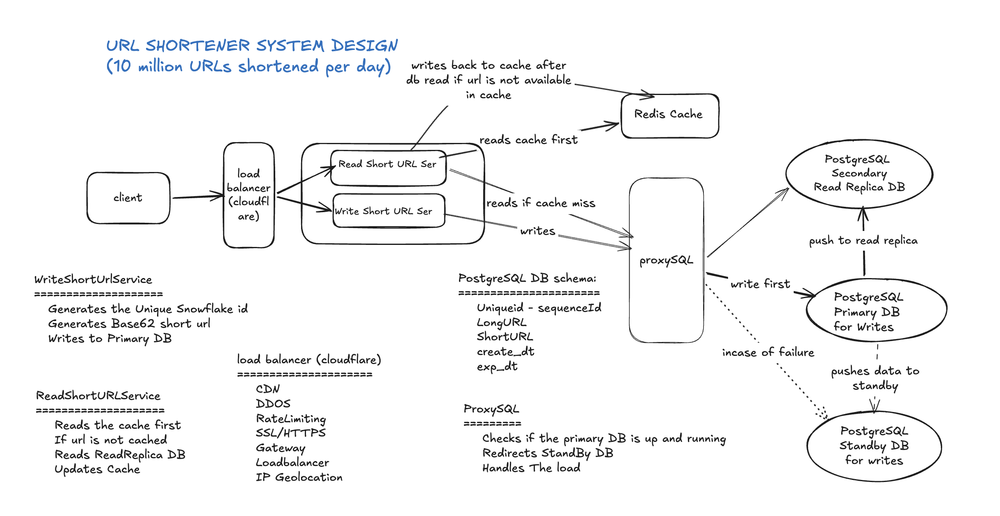

# URL Shortener System Design

> Scale: 10 million URLs shortened per day

---

## Table of Contents

1. [System Overview](#system-overview)
2. [Components](#components)
3. [Traffic Calculations](#traffic-calculations)
4. [Data Model](#data-model)
5. [Read and Write Flow](#read-and-write-flow)
6. [Short URL Generation — Base62 Algorithm and Collision Resolution](#short-url-generation--base62-algorithm-and-collision-resolution)
7. [CAP Theorem](#cap-theorem)
8. [Improvements Made](#improvements-made)
9. [Why This is a Better Design](#why-this-is-a-better-design)

---

## System Overview

A URL shortener converts a long URL into a short 8-character code. Users submit a long URL and receive a short URL (e.g. `sht.ly/aB3kR9xZ`). When a user clicks the short URL they are redirected to the original long URL within 100ms.


---

## Components

### Client (Browser)
The entry point of the system. The client either submits a long URL to shorten, or clicks an existing short URL to be redirected. All requests go through the Load Balancer — the client never talks directly to any service.

### Load Balancer
Sits in front of all services and distributes incoming traffic. Routes shorten requests to the Write service and redirect requests to the Read service. Prevents any single service instance from being overwhelmed and enables horizontal scaling.

### Write Short URL Service
Responsible for generating and persisting new short URLs. Generates a unique Snowflake ID without any database dependency, encodes it to a Base62 short code (6–8 characters), and writes the mapping to the Primary DB via ProxySQL. Does not interact with Redis at all — cache population is the Read service's responsibility.

### Read Short URL Service
Responsible for resolving a short URL back to the original long URL and redirecting the client. Implements the Cache Aside (Lazy Loading) pattern — checks Redis first, falls back to the Replica DB via ProxySQL on a cache miss, writes the result back to Redis, then redirects the client. Owns the entire read flow including cache management.

### Redis Cache
An in-memory cache shared by the Read service. Stores hot (frequently accessed) short URL mappings with a TTL of 1 year. Populated lazily — only URLs that are actually clicked end up in cache. Reduces DB load drastically for popular URLs. Redis is queried before ProxySQL on every read request.

### ProxySQL
A database proxy that sits between the services and the PostgreSQL databases. Automatically routes INSERT/UPDATE queries to the Primary DB and SELECT queries to the Read Replica. Monitors Primary DB health and redirects to the Standby DB on failure. Decouples services from DB topology — services talk to one single endpoint.

### PostgreSQL Primary DB
The single source of truth for all write operations. Accepts only INSERT and UPDATE queries routed from ProxySQL. Asynchronously replicates all data to the Read Replica and synchronously pushes data to the Standby DB for failover readiness.

### PostgreSQL Secondary Read Replica DB
Handles all SELECT queries routed by ProxySQL. Receives data via asynchronous replication from the Primary DB. Slight replication lag is acceptable for a URL shortener since read consistency of a few milliseconds is not critical.

### PostgreSQL Standby DB
A hot standby that mirrors the Primary DB via synchronous replication. Not used for normal reads or writes. Activated automatically by ProxySQL when the Primary DB goes down. Promoted to Primary in approximately 30 seconds, eliminating the single point of failure on the write path.

### Snowflake ID Generator
An in-process ID generation algorithm (invented by Twitter) that produces unique 64-bit IDs using a combination of timestamp (41 bits), machine ID (10 bits), and sequence number (12 bits). Generates up to 4 million unique IDs per millisecond without any database round trip, completely eliminating DB dependency from ID generation.

### Base62 Encoder
Converts the numeric Snowflake ID to a short alphanumeric string using 62 characters (A–Z, a–z, 0–9). Produces URL-safe output with no special characters like `+`, `/`, or `=`. An 8-character Base62 string supports 218 trillion unique combinations.

### Expiry Cleanup Job
A scheduled background job that runs daily to delete expired URL mappings from the database. Keeps the database lean over time by removing records past their `exp_dt` timestamp.

---

## Traffic Calculations

### Write traffic (URL shortening)

| Period            | Calculation           | Volume          |
|-------------------|-----------------------|-----------------|
| Per day           | given requirement     | 10,000,000      |
| Per hour          | 10,000,000 ÷ 24       | ~416,666        |
| Per minute        | 416,666 ÷ 60          | ~6,944          |
| Per second (avg)  | 6,944 ÷ 60            | ~115 writes/sec |
| Per second (peak) | 115 × 3 (peak factor) | ~300 writes/sec |

### Read traffic (URL redirects)

Assuming a 10:1 read-to-write ratio (common for URL shorteners):

| Period                  | Volume           |
|-------------------------|------------------|
| Reads per second (avg)  | ~1,150 reads/sec |
| Reads per second (peak) | ~3,000 reads/sec |

### Short URL capacity

| Characters | Combinations         | Safe for (at 10M/day) |
|------------|----------------------|-----------------------|
| 6 chars    | 62^6 = ~56 billion   | ~15 years             |
| 7 chars    | 62^7 = ~3.5 trillion | ~958 years            |
| 8 chars    | 62^8 = ~218 trillion | ~60,000 years         |

**8 characters chosen** — future-proof with ample headroom.

---

## Data Model

### PostgreSQL table: `url_mapping`

| Column       | Type        | Description                         |
|--------------|-------------|-------------------------------------|
| `unique_id`  | BIGINT (PK) | Snowflake generated sequence ID     |
| `long_url`   | TEXT        | Original full URL submitted by user |
| `short_url`  | VARCHAR(8)  | Base62 encoded short code           |
| `created_dt` | TIMESTAMP   | Timestamp of creation               |
| `exp_dt`     | TIMESTAMP   | Expiry timestamp (default 1 year)   |

### Redis key-value structure

```
Key:   short_url code       e.g. "aB3kR9xZ"
Value: long_url string      e.g. "https://mail.google.com/mail/"
TTL:   1 year
```

---

## Read and Write Flow

### Write flow (shorten a URL)

```
Client submits long URL
       ↓
Load Balancer → Write service
       ↓
Write service generates Snowflake ID → Base62 short code
       ↓
ProxySQL routes INSERT → Primary DB
       ↓
Primary DB success → return short URL to client
(Redis is NOT written — cache is populated lazily on first read)
```

### Read flow (click a short URL)

```
Client clicks short URL
       ↓
Load Balancer → Read service
       ↓
Step 1: Read service checks Redis cache
       ↓
Cache HIT → redirect client immediately (no DB call)
       ↓
Cache MISS → Read service calls ProxySQL
       ↓
ProxySQL routes SELECT → Read Replica DB
       ↓
Step 2: URL found in Replica DB
       ↓
Step 3: Read service writes URL back to Redis (lazy populate)
       ↓
Step 4: Redirect client to long URL
```

### Failover flow (Primary DB down)

```
Primary DB goes down
       ↓
t=0s  ProxySQL detects heartbeat failure
t=10s Failure confirmed (not a false alarm)
t=15s Standby DB promoted to Primary
t=30s Writes resume automatically
       ↓
During this window:
  Reads → still served by Redis cache + Read Replica ✅
  Writes → temporarily fail with retry message ⚠️
```

---

## Short URL Generation — Base62 Algorithm and Collision Resolution

### Why not Base64?

Base64 was the first instinct — but it fails for URL shortening for two reasons.

First, Base64 encoding applied directly to the URL produces a **longer** output than the input, not shorter. For example `https://mail.google.com/mail/` becomes `aHR0cHM6Ly9tYWlsLmdvb2dsZS5jb20vbWFpbC8=` — much longer, not 8 characters.

Second, Base64 uses `+`, `/`, and `=` characters which are **not URL-safe** and require additional percent-encoding inside a URL.

**Solution:** Use Base62 (A–Z, a–z, 0–9) which is URL-safe by nature, and apply it to a **numeric ID** rather than the URL itself.

---

### How the 8-character short URL is generated

The algorithm has two stages — ID generation and encoding.

**Stage 1 — Generate a unique numeric ID using Snowflake**

Snowflake produces a unique 64-bit integer without any database call:

```
┌─────────┬──────────────────────────┬─────────────────┬──────────────────┐
│  1 bit  │         41 bits          │     10 bits     │     12 bits      │
│ unused  │  timestamp (ms since     │  machine ID     │  sequence number │
│ (sign)  │  epoch Jan 1 2024)       │  (up to 1024)   │  (per ms counter)│
└─────────┴──────────────────────────┴─────────────────┴──────────────────┘

Example output: 927392847362910208
```

Capacity: 1024 machines × 4096 IDs per millisecond = **4 million unique IDs per millisecond** — no DB needed.

**Stage 2 — Encode the numeric ID to Base62**

```java
private static final String BASE62 =
    "abcdefghijklmnopqrstuvwxyz" +   // 26 chars
    "ABCDEFGHIJKLMNOPQRSTUVWXYZ" +   // 26 chars
    "0123456789";                     // 10 chars
                                      // Total = 62 chars

public String encode(long id) {
    StringBuilder shortUrl = new StringBuilder();
    while (id > 0) {
        shortUrl.append(BASE62.charAt((int)(id % 62)));
        id = id / 62;
    }
    return shortUrl.reverse().toString();
}
```

This is mathematically identical to converting a decimal number to base-62 — same way decimal is converted to binary. Different input always produces different output.

**Example:**

```
Snowflake ID  →  927392847362910208
Base62 encode →  "aB3kR9xZ"          (8 characters)
Final URL     →  sht.ly/aB3kR9xZ
```

---

### Why collision cannot happen with this approach

A collision means two different long URLs get the same short code. With this design, collision is **mathematically impossible** for the following reasons:

**Reason 1 — Snowflake ID is always unique**

Snowflake combines timestamp + machine ID + sequence number. Even if two requests arrive at the exact same millisecond on the same machine, the sequence number increments — guaranteeing different IDs. Two machines are differentiated by machine ID — they can never produce the same Snowflake number.

**Reason 2 — Base62 encoding is a pure mathematical function**

```
Different input  →  Different output  (always)
Same input       →  Same output       (always)

927392847362910208  →  "aB3kR9xZ"
927392847362910209  →  "aB3kR9xY"   ← different by 1 ID = different code
```

There is no randomness — it is pure math. Collision at the encoding stage is impossible.

**Reason 3 — No race condition on ID generation**

With DB auto-increment, two concurrent requests can grab the same ID before either commits — a classic race condition. Snowflake runs in-process in each Write service instance, and the sequence number is managed atomically per machine. No shared state between machines means no race condition.

---

### What we eliminated — the original collision risks

| Risk                     | Old approach               | This approach                            |
|--------------------------|----------------------------|------------------------------------------|
| Two requests same ID     | DB race condition possible | Snowflake — impossible                   |
| Base64 special chars     | Breaks inside URLs         | Base62 — URL safe, no issue              |
| DB down = no ID          | Auto-increment requires DB | Snowflake — in-memory, no DB             |
| Long URL submitted twice | Two different short codes  | Check DB before insert — return existing |

---

### 8-character capacity proof

```
Base62 charset size = 62
Short URL length    = 8 characters

Total combinations  = 62^8 = 218,340,105,584,896
                    = ~218 trillion unique short URLs

At 10 million URLs per day:
218,340,105,584,896 ÷ 10,000,000 = 21,834,010 days
21,834,010 ÷ 365                 = ~59,819 years

8 characters is safe for approximately 60,000 years at current scale.
```

---

## CAP Theorem

This design chooses **CP — Consistency + Partition Tolerance** over Availability.

### Why CP over AP?

| Trade-off                      | Decision         | Reason                                |
|--------------------------------|------------------|---------------------------------------|
| Consistency vs Availability    | Consistency wins | Duplicate short URLs are catastrophic |
| Single Primary write           | Chosen           | Prevents conflicting writes           |
| 30sec write outage on failover | Accepted         | Better than two primaries conflicting |
| Async read replica lag         | Accepted         | Slight read lag is acceptable         |

### What this means in practice

**Consistency guaranteed:**
- Every short URL maps to exactly one long URL — no duplicates
- A write is only confirmed when Primary DB persists it
- No two services can generate the same short code

**Partition tolerance:**
- System continues operating when network partitions occur
- Read Replica + Redis serve reads independently of Primary

**Availability trade-off accepted:**
- During Primary DB failover (~30 seconds) writes are unavailable
- This is acceptable — users can retry shortening a URL
- Reads remain fully available via Redis + Read Replica throughout

---

## Improvements Made

### 1. Replaced DB auto-increment with Snowflake ID
**Problem:** DB auto-increment required a DB round trip for every ID — if DB was down, ID generation stopped and writes failed completely.

**Solution:** Snowflake ID generates unique IDs in memory using timestamp + machine ID + sequence. No DB dependency. Supports 4 million unique IDs per millisecond per machine.

### 2. Replaced Base64 with Base62 encoding
**Problem:** Base64 uses `+`, `/`, `=` characters which are not URL-safe and require additional encoding.

**Solution:** Base62 uses only A–Z, a–z, 0–9 — all URL-safe characters. No encoding needed. 8 characters gives 218 trillion combinations.

### 3. Introduced Redis cache with Cache Aside pattern
**Problem:** Every redirect request hit the database directly — at 1,150 reads/sec this would overwhelm the DB.

**Solution:** Read service checks Redis first. On cache hit the DB is never called. Popular URLs served entirely from memory. DB load reduced by estimated 80–90% for hot URLs.

### 4. Eliminated SPOF with ProxySQL + Standby DB
**Problem:** Single Primary DB was a single point of failure — if it went down all writes stopped permanently.

**Solution:** ProxySQL monitors Primary health and automatically routes to Standby DB on failure. Standby promoted to Primary in ~30 seconds. Zero code changes in services — ProxySQL handles it transparently.

### 5. Separated read and write paths
**Problem:** A single service handling both reads and writes could not be scaled independently.

**Solution:** Dedicated Write service and Read service allow independent horizontal scaling. Read service scaled to handle 3,000 reads/sec peak. Write service scaled to handle 300 writes/sec peak.

### 6. Introduced Read Replica for read scaling
**Problem:** All reads hitting Primary DB competed with writes causing performance degradation.

**Solution:** ProxySQL routes all SELECT queries to Read Replica. Primary DB handles only writes — zero read load on Primary. Read Replica can be scaled independently.

### 7. Lazy loading cache strategy
**Problem:** Writing to cache on every URL creation would flood Redis with URLs that may never be clicked — wasting memory.

**Solution:** Cache populated only when a URL is first clicked (on cache miss). Only hot URLs consume Redis memory. Cold URLs never enter cache. Efficient use of limited Redis memory across 3.65 billion records.

---

## Why This is a Better Design

### Compared to a naive single-server design

| Aspect            | Naive Design             | This Design                          |
|-------------------|--------------------------|--------------------------------------|
| ID generation     | DB auto-increment        | Snowflake — no DB dependency         |
| Read performance  | Every read hits DB       | Redis serves hot URLs in <1ms        |
| Write reliability | Single DB = SPOF         | Primary + Standby with auto-failover |
| Read scalability  | Single DB handles all    | Read Replica offloads all reads      |
| DB routing        | Hardcoded in service     | ProxySQL handles transparently       |
| Cache strategy    | None                     | Cache Aside — only hot URLs cached   |
| Short code safety | Base64 — not URL safe    | Base62 — fully URL safe              |
| Peak traffic      | Cannot handle 3000 req/s | Horizontally scalable at every layer |

### Key design principles followed

**Single Responsibility** — each component does exactly one job. Read service owns reads. Write service owns writes. ProxySQL owns routing. Redis owns caching.

**Separation of concerns** — services do not know which DB they talk to. ProxySQL abstracts the DB topology completely. Services talk to one endpoint.

**Fail gracefully** — during Primary DB failover reads continue uninterrupted via Redis and Read Replica. Only writes are briefly affected.

**Scale independently** — read and write services, Redis, and DB replicas can all be scaled horizontally without affecting each other.

**Lazy over eager** — cache is populated on demand not upfront. Only data that is actually accessed consumes resources. This keeps the system efficient at 3.65 billion records per year.

---
